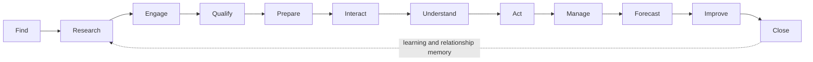
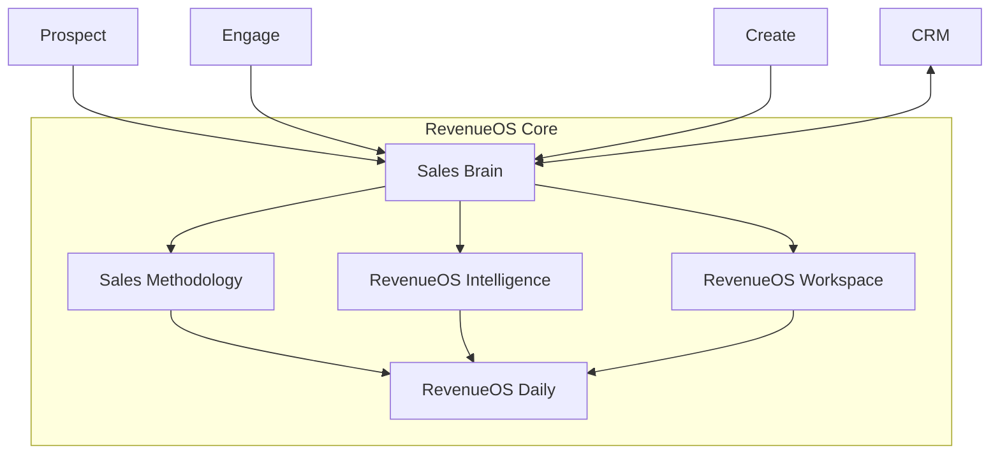
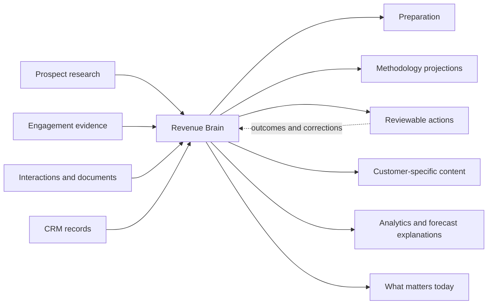

# End-to-end Sales Platform vision

- **Status:** Approved future direction from WO-023; implementation requires separate work orders
- **Current baseline:** RevenueOS through WO-022, with Sales Brain, Interaction Intelligence, Opportunity Workspace, Revenue Brain, reviewable Actions and simulation-only execution
- **Category:** The AI operating system for sales

## Product promise

RevenueOS helps salespeople find the right customers, understand the right people,
win better conversations, progress every opportunity and know what to do next.

Sales Brain remains the product's centre. Every future capability must do at least
one of the following:

1. improve Sales Brain;
2. feed Sales Brain with authorised evidence;
3. act on reviewed Sales Brain output;
4. help create opportunities for Sales Brain; or
5. help manage and forecast the revenue represented in Sales Brain.

RevenueOS must become more powerful without feeling more complicated. A new seller
should understand the next useful action within approximately 30 seconds, without
learning the internal architecture.

## The sales lifecycle

This is one connected loop, not a collection of tools. Prospecting creates
authorised research. Research supports relevant engagement. Engagement creates an
Interaction or opportunity. Validated Interaction evidence strengthens Revenue
Brain. Revenue Brain drives methodology, actions, management and forecasts. Outcomes
improve later targeting and coaching.

## Product architecture

Core is valuable enough to buy and keep independently. Prospect, Engage, Create and
CRM expand what Core can do; they do not remove essential Sales Brain behaviour from
Core. RevenueOS Complete bundles Core and all four add-ons.

## Revenue Brain is the centre

Revenue Brain is not one free-form model response or a mutable master record. It is
the source-aware, longitudinal interpretation of validated evidence. It preserves
origin, support, conflict, freshness, correction and deletion lineage. CRM values,
customer evidence, seller observations and AI interpretation retain distinct
authority.

## Current reality and future direction

| Capability   | Current through WO-022                                                                                                 | Future direction                                                               |
| ------------ | ---------------------------------------------------------------------------------------------------------------------- | ------------------------------------------------------------------------------ |
| Sales Brain  | Meeting and Interaction Intelligence, briefs, debrief, evidence, Opportunity Workspace and deterministic Revenue Brain | Complete before/during/after memory loop across the sales lifecycle            |
| Action       | Reviewable proposals plus explicitly confirmed simulations                                                             | Provider-backed, policy-bound execution with receipts and reconciliation       |
| Methodology  | No methodology projection engine                                                                                       | Core, evidence-aware projections for standard and safe custom methodologies    |
| Intelligence | Qualitative current-meeting and longitudinal signals; no forecast                                                      | Descriptive, diagnostic, target, forecast and coaching views with explanations |
| Workspace    | Opportunity and evidence surfaces exist; no general file workspace                                                     | Account/Opportunity working memory, bounded files and Deal Room experience     |
| Daily        | Dashboard placeholders                                                                                                 | Default action-oriented habit surface                                          |
| Prospect     | Not implemented                                                                                                        | Sourced account/person research, ICP and territory workflows                   |
| Engage       | Not implemented                                                                                                        | Reviewable personalised outreach, sequences and event follow-up                |
| Create       | Not implemented                                                                                                        | Template-constrained presentations, proposals and deterministic business cases |
| CRM          | Tenant-owned foundation records; no full native CRM or live connector                                                  | Optional minimum lovable native CRM, while external CRMs remain supported      |

Target documents do not authorise code, schema, provider or integration work.

## One experience, different roles

- **Salesperson:** sees today's work, target accounts, active opportunities,
  interactions, actions and target progress.
- **Manager:** uses the same Home, Pipeline and Insights areas with team forecast,
  evidence-backed deal attention and coaching views.
- **Administrator:** configures users, methodology, integrations, permissions,
  security, retention and entitlements in Settings rather than the sales workflow.

No separate manager product or giant CRM sub-application is required.

## Trust and simplicity contract

- One page primarily answers one user question.
- One primary action is obvious; advanced controls are disclosed when needed.
- Product copy uses salesperson language, not service, job or connector language.
- AI states what it believes, why, the supporting evidence, conflicts and freshness.
- Users can correct, reject, supersede or delete AI-supported interpretations.
- External communication and consequential writes remain approval-bound.
- Research is professional, relevant and sourced; private or sensitive profiling is
  prohibited.
- Forecasts are ranges or scenarios with assumptions, not arbitrary probability
  theatre.
- Manager views coach revenue execution; they do not rank people by activity or
  monitor keystrokes, clicks or private behaviour.
- Unavailable modules are discoverable only in relevant context and never interrupt
  the core workflow with aggressive upsells.

## Product boundaries

RevenueOS should not become generic project management, a SharePoint clone, a full
Salesforce clone, marketing automation, a social network, generic BI, a no-code
workflow engine, an unrestricted AI chatbot or employee-surveillance software.

Customer Success Brain and Recruitment Brain remain separate future products on the
shared identity, Interaction, Evidence, Intelligence, Brain and Action foundations.
A much later AI SDR may support bounded research, prioritisation and approved
outreach. Autonomous cold calling is explicitly deferred.

## Category and messaging

**Category:** RevenueOS is the AI operating system for sales.

**Core message:** RevenueOS Sales Brain understands every authorised customer
interaction, remembers the opportunity and helps you know what matters and what to
do next.

RevenueOS competes conceptually with parts of CRM, conversation intelligence, sales
engagement, prospecting, forecasting, enablement and content-generation categories.
Its advantage is the connected evidence-to-action loop, not the number of features.
No current-market factual claim is made by this blueprint.

## Related documents

- [RevenueOS Core](revenueos-core-product.md)
- [Commercial packaging](revenueos-commercial-packaging.md)
- [Information architecture](../02-design/revenueos-information-architecture.md)
- [End-to-end roadmap](../06-roadmap/end-to-end-sales-platform-roadmap.md)
- [ADR 0035](../08-decisions/0035-end-to-end-sales-os-architecture.md)
