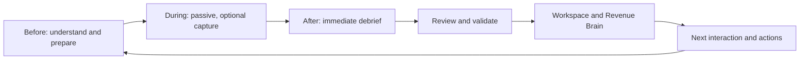

# Interaction Intelligence product blueprint

- **Status:** Approved product and architecture direction; future work requires a
  separate work order
- **Current baseline:** Meeting Intelligence, Opportunity Workspace, Revenue Brain,
  WO-009 private-beta controls and the WO-011–WO-014 Interaction foundation,
  preparation, reviewed debrief and browser-first visual evidence slices
- **Primary problem:** Reliable intelligence from face-to-face and online customer
  interactions without depending on recording or transcript upload

## Product outcome

RevenueOS is the AI operating system for customer interactions. It captures the
best possible evidence, converts it into trusted intelligence and helps a revenue
team act on that understanding across the life of a relationship.

The product follows the [Interaction Intelligence vision](interaction-intelligence-vision.md)
and has three stable layers:

| Layer        | Responsibility                                                                               | Human boundary                                                                 |
| ------------ | -------------------------------------------------------------------------------------------- | ------------------------------------------------------------------------------ |
| Capture      | Acquire authorised direct, reported, visual, document and metadata evidence                  | User controls whether and how capture occurs                                   |
| Intelligence | Reconcile evidence into attributable claims, gaps, changes and structured capability outputs | Uncertainty and conflicts remain visible; material outputs are reviewable      |
| Action       | Draft follow-up, tasks, proposed record changes and next-interaction preparation             | External communications and system writes require explicit approval by default |

## Lifecycle

### Before

- resolve the account, opportunity, likely attendees and interaction type;
- show current commitments, risks, questions, stakeholders and relationship changes;
- recommend a small number of objectives and questions;
- identify missing or disputed opportunity information; and
- prepare differently for a meeting, presentation, workshop or site visit.

### During

- remain passive by default;
- support optional authorised recording, quick markers and visual capture;
- avoid requiring continuous typing or intrusive live coaching;
- tolerate locked screens, interruptions and no signal where the chosen client can;
  and
- make a non-recording path equally legitimate.

### After

- prompt quickly and privately when the interaction is expected to have ended;
- offer voice, text, visual evidence or skip;
- ask only opportunity-aware questions about material gaps or changes;
- distinguish recollection from directly captured customer evidence;
- present a review screen before promotion to validated intelligence; and
- update the Opportunity Workspace, Revenue Brain and proposed actions through
  explicit, traceable state transitions.

## Capture portfolio

| Capability                    | Role in the product                                                                         | First delivery posture                                    |
| ----------------------------- | ------------------------------------------------------------------------------------------- | --------------------------------------------------------- |
| Live Recording                | Optional direct audio evidence for online or face-to-face work                              | Defer until the recording foundation; never gate debrief  |
| AI Companion                  | Lifecycle experience spanning preparation, low-friction capture and debrief                 | Begin with preparation and post-interaction orchestration |
| AI Debrief                    | Targeted interview about missing, changed or strategically important information            | First face-to-face MVP                                    |
| Visual Capture                | Photos and files represented as evidence with consent, retention and provenance             | Add after the first debrief loop                          |
| Context Awareness             | Platform capability that assembles authorised account, opportunity and relationship context | Incrementally expand; not a selectable mode               |
| Voice Journal                 | Natural spoken observation captured after an interaction                                    | First face-to-face MVP, with safe-driving guardrails      |
| Live Interaction Intelligence | Provisional signals during an authorised session                                            | Future; validate only after final evidence processing     |
| Documents and Emails          | Non-meeting customer evidence feeding the same intelligence and memory model                | Later adapter work, after evidence foundations            |

## Product concepts

An **Interaction** is a real-world customer-facing event with business context,
participants, time and lifecycle. Meetings, presentations, workshops, site visits,
calls, lunches and conference conversations are interaction types.

A **Capture Session** is a bounded attempt to acquire evidence before, during or
after an interaction. Recording, AI debrief, voice journal, visual upload and quick
capture are session types. A session may fail or be skipped without invalidating the
interaction.

**Evidence** is source material or an attributable observation. Binary assets,
transcripts, transcript segments, images and user responses are typed evidence, not
columns on Interaction.

**Interaction Intelligence** is a versioned set of claims and capability outputs
about one interaction, supported by evidence and explicit provenance.

**Opportunity Intelligence** reconciles validated interaction intelligence across
an opportunity. **Revenue Brain** preserves the longitudinal relationship narrative
and supported changes. **Actions** are reviewable proposals or internal tasks derived
from validated intelligence.

AI Debrief and Voice Journal are supporting Capture Sessions, not customer
interactions. Their answers are salesperson-reported evidence linked to the
customer interaction. Visual capture is evidence. This prevents the timeline from
pretending a private debrief was a customer event.

## Extensible taxonomy

Interaction has a stable top-level family plus an extensible type key:

- `meeting`: online meeting, face-to-face meeting, phone call;
- `presentation`: formal sales or technical presentation;
- `collaborative_session`: workshop or discovery session;
- `field_interaction`: site visit or inspection;
- `relationship_event`: executive lunch or authorised informal conversation;
- `event_interaction`: conference or trade-show conversation; and
- `digital_exchange`: future email or document exchange only when it represents a
  meaningful customer event, not every message or file.

New type keys are registry values with versioned behaviour and display metadata;
they do not require a database enum migration. `voice_journal`, `ai_debrief` and raw
capture methods belong to the Capture Session taxonomy. `manual_update` is an
internal observation/update source, not automatically a customer interaction.

## AI Companion boundaries

AI Companion is the product orchestration across the lifecycle:

- **before:** brief, objectives, stakeholders, risks, commitments, questions and
  relevant authorised material;
- **during:** passive state, optional recording, markers and visual capture; and
- **after:** debrief, gap detection, reconciliation, confirmation and proposed
  follow-through.

AI Debrief is the adaptive interview. Voice Journal is the user's free-form capture
channel. Live Recording is one evidence acquisition mechanism. Live Interaction
Intelligence is provisional processing during a session. None is a synonym for the
others.

## Face-to-face MVP

Build the standard non-recording office-meeting workflow first:

1. associate or create the planned interaction;
2. show a concise opportunity-aware brief;
3. mark the interaction complete or infer a candidate end from authorised calendar
   metadata;
4. offer “Let’s capture this while it is fresh”;
5. accept a natural voice journal or typed account;
6. ask at most a small number of high-value questions;
7. show a provenance-aware review;
8. create source-aware Interaction Intelligence; and
9. update Opportunity Workspace and Revenue Brain only after the required review
   boundary.

This provides value when recording is refused, unavailable or inappropriate. It
validates the hardest product behaviour—asking the right questions and earning
trust—before adding recording infrastructure.

## Walk-to-the-car flagship

The prompt should normally arrive within five minutes of an explicit interaction
end or a calendar end candidate, subject to organisation policy, quiet hours and
user notification preferences. It must reveal no customer details on a locked
screen unless the user has opted in.

The opening is natural: “How did it go?” RevenueOS then compares the response with
known objectives, risks, stakeholders, decisions, timeline and next steps. It asks
only about strategically material missing or changed information, allows stop/skip
at any point and produces a review screen.

The voice journal entry is labelled **Reported by you after the interaction**.
RevenueOS must show a persistent safety message and require the user to confirm
they are not driving before interactive capture. Car integrations and motion
detection may strengthen this later; they do not justify claiming that the system
can reliably determine driving state.

## Presentation mode

Presentation mode treats the prepared deck as salesperson-originated context, not
customer evidence. Before the interaction, RevenueOS prepares audience context,
objectives, likely questions and known objections. During it, capture remains
minimal. Afterwards, the debrief asks which sections caused discussion, who engaged,
which questions or objections arose, what material was requested, whether the
decision process changed and what was agreed next.

A product benefit appearing in the deck or spoken by the seller is not a buying
signal. Interest requires customer-attributable speech, questions, behaviour
reported by the seller, or corroborating customer evidence, with the origin shown.
See [Presentation mode](../02-design/presentation-mode.md).

## Interaction Intelligence capability evolution

| Current capability   | Target behaviour                                                                                                        |
| -------------------- | ----------------------------------------------------------------------------------------------------------------------- |
| Executive Summary    | Becomes interaction-generic; summarises only the available evidence and labels material gaps                            |
| Buying Signals       | Source-aware; customer direct versus salesperson-reported origin is mandatory; unavailable when no support exists       |
| Objections           | Aggregates compatible sources while preserving each objection's origin and conflict state                               |
| Stakeholders         | Separates observed attendance, reported influence and inferred role; avoids unsupported identity merging                |
| Decisions            | Requires attributable commitment language or explicit user confirmation; no decision from seller-only prepared material |
| Action Items         | Separates customer-confirmed, salesperson-confirmed and proposed actions                                                |
| Risks & Blockers     | Can use reported observation but must label it; no false customer confirmation                                          |
| Open Questions       | Works across sources and does not treat absence as resolution                                                           |
| Follow-up Email      | Composes only from validated, customer-safe intelligence and remains a draft                                            |
| Next Best Action     | Uses validated multi-source intelligence; advisory and non-executing                                                    |
| Unified Intelligence | Becomes a source-aware Interaction Intelligence view with partial and conflict states                                   |

When evidence is incomplete, a capability returns a valid empty or
`insufficient_evidence` state, identifies missing coverage and offers targeted
capture where useful. It does not fill gaps with plausible prose.

## Revenue Brain evolution

Revenue Brain moves from a meeting timeline to relationship intelligence. It should
consume validated structured intelligence and provenance references, not repeatedly
reread raw recordings, transcripts or documents.

Existing snapshots and insights remain immutable and retain Meeting references. New
interaction snapshots use a later schema version and may reference an Interaction
plus source-neutral validated artefacts. Historical meeting snapshots appear in the
Interaction Timeline through the Meeting-to-Interaction compatibility mapping. No
historical rewrite is required.

Revenue Brain must preserve:

- the source and validation state of commitments, risks, objections and changes;
- contradictions rather than a winner chosen by recency alone;
- user verification as a separate event;
- deletion impact through explicit source-to-derived lineage; and
- enough history to explain why a current relationship narrative changed.

## Interaction timeline

The primary timeline object is Interaction. Evidence and actions group beneath the
interaction that produced them; a debrief or voice journal is shown as an internal
capture activity, not as another customer event. Documents, emails, decisions and
insights may appear as separate timeline events when they have independent business
significance, otherwise they remain grouped.

Entries show type, localised date/time, account/opportunity, participants where
authorised, source badges, evidence strength, summary, linked actions and privacy
state. Filters include interaction type, customer/internal origin, evidence status
and opportunity. Storage remains UTC and rendering uses the user's timezone.

## Action layer and approval

Interaction Intelligence can propose follow-up email, tasks, reminders, stakeholder
or opportunity changes, CRM changes, manager attention, next-interaction preparation
and requested material. The default boundaries are:

- internal draft: create as a reviewable draft;
- internal accountable task: user accepts ownership and due date;
- CRM or external-system write: explicit field-level approval;
- customer communication: explicit content and recipient approval; and
- manager alert: explicit policy plus user-visible reason; never covert performance
  monitoring.

Approval is bound to the exact content version, destination and tenant. Changes
invalidate approval. Autonomous external action is out of scope for the Interaction
Platform beta.

## Delivery strategy

The recommended sequence is:

1. Interaction Domain Foundation;
2. AI Companion and Pre-Interaction Brief;
3. AI Debrief and Voice Journal;
4. Visual Evidence Capture;
5. Recording and Transcription Foundation;
6. Browser Face-to-Face Companion;
7. Online Meeting Capture;
8. Document and Email Evidence;
9. Live Interaction Intelligence; and
10. Interaction Platform Beta.

Kevin can first use RevenueOS for real face-to-face meetings without manually
uploading a transcript after **WO-013 — AI Debrief and Voice Journal**, subject to
the existing production-customer-data launch gates and the WO-013 acceptance
criteria.

## Explicitly not first

- meeting bots;
- live streaming transcription;
- advanced speaker diarisation;
- native background recording;
- live coaching;
- automatic CRM writes or email sending;
- arbitrary confidence percentages;
- a second datastore, message broker or microservice; and
- a big-bang rename or replacement of Meeting.

## Assumptions and unresolved questions

- Calendar access and push-notification policy will determine how reliably RevenueOS
  can infer an interaction end.
- Design-partner policy and jurisdiction will determine which recording paths can be
  piloted; the blueprint is not legal advice.
- The first native recording client should be selected after platform spikes confirm
  screen-lock, interruption, Bluetooth and offline behaviour.
- The first online platform integration should follow design-partner stack and
  enterprise acceptance, not theoretical market coverage.
- Evidence-strength language and review thresholds require user research and
  evaluation before they become automatic policy.

## Related documents

- [Interaction lifecycle and UX](../02-design/interaction-lifecycle-and-ux.md)
- [AI Companion and debrief](../02-design/ai-companion-and-debrief.md)
- [Interaction domain architecture](../03-engineering/interaction-domain-architecture.md)
- [Evidence and provenance model](../03-engineering/evidence-and-provenance-model.md)
- [Meeting migration strategy](../03-engineering/interaction-intelligence-migration-strategy.md)
- [Interaction Intelligence roadmap](../06-roadmap/interaction-intelligence-roadmap.md)

## WO-023 relationship

WO-023 places this lifecycle inside RevenueOS Core. Future Prospect, Engage, Create,
CRM, Daily, methodology and forecasting capabilities must reuse authorised Evidence,
Revenue Brain and human-review boundaries; they do not replace them or broaden
capture authority implicitly. See the
[End-to-End Sales Platform roadmap](../06-roadmap/end-to-end-sales-platform-roadmap.md).
