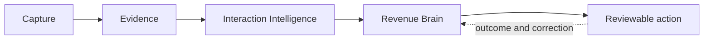

# Interaction Intelligence vision

- **Status:** Approved target direction; not implemented by this document
- **Primary product:** Sales Brain
- **Decision record:** [ADR 0026](../08-decisions/0026-interaction-intelligence-platform.md)
- **Delivery plan:** [Interaction Intelligence roadmap](../06-roadmap/interaction-intelligence-roadmap.md)

## North star

> RevenueOS captures the best possible evidence from every customer interaction,
> transforms that evidence into trusted intelligence, and helps sales teams build
> stronger customer relationships over time.

RevenueOS should never force a salesperson to remember important details hours
after a customer interaction. It should help capture, organise and validate those
details while they are still fresh, using the method that best fits the situation.

## Positioning

RevenueOS is **the AI operating system for customer interactions**. It complements
the CRM and communication systems already used by a revenue team; it does not
replace them.

RevenueOS is not merely a meeting recorder, transcript summariser, call bot,
transcription product or CRM note-taking tool. A recording is one possible source,
not the product boundary. The product works across three layers:

1. **Capture** collects the best available authorised evidence with graceful
   fallbacks.
2. **Intelligence** converts evidence into attributable, reviewable understanding.
3. **Action** helps people follow through while keeping consequential action under
   human control.

## The user promise

Before an interaction, RevenueOS explains what matters: the relationship history,
current opportunity, commitments, risks, stakeholders, unanswered questions and a
small number of useful objectives or questions.

During an interaction, RevenueOS is passive by default. It may record when that is
authorised, accept a quick marker or photo, or do nothing at all. The customer and
the salesperson's attention take priority over the software.

Immediately afterwards, RevenueOS offers: **“Let’s capture this while it is
fresh.”** The salesperson can speak naturally, type, add authorised visual evidence
or skip. An opportunity-aware debrief asks only about material gaps, changes and
uncertainty. RevenueOS then presents a reviewable account of what it believes, why
it believes it and what should happen next.

## Product principles

1. **Capture, not recording.** Success means useful authorised evidence, not the
   existence of audio.
2. **Recording is optional.** Refusal, policy, device failure and low connectivity
   must have first-class fallbacks.
3. **Prepare before the interaction.** Context and objectives improve the evidence
   captured afterwards.
4. **Capture while memory is fresh.** Prompt promptly without creating unsafe or
   intrusive behaviour.
5. **Passive during, intelligent after.** Do not make the seller operate a complex
   interface in front of a customer.
6. **Show provenance.** Customer evidence, salesperson recollection, external
   records and AI inference must never be visually conflated.
7. **Trust over false certainty.** “Unknown”, “reported” and “conflicting” are valid
   product states.
8. **Ask only high-value questions.** Do not request information already available
   in authorised context.
9. **Mobile-first for face-to-face work.** Design for one hand, interruption, low
   connectivity, locked screens and short attention windows.
10. **No forced CRM administration.** Reuse known context and propose changes
    rather than demanding duplicate entry.
11. **Review before automation.** Drafts and proposed updates remain reviewable;
    external communication and system writes are not autonomous by default.
12. **Privacy by design.** Consent, policy, retention, deletion and evidence access
    are part of the workflow, not legal text added later.
13. **Tenant ownership end to end.** Every interaction, evidence object, derived
    artefact, action and storage key belongs to one trusted organisation.
14. **Graceful degradation.** A missed recording should become a useful debrief,
    not a lost interaction.

## Experience priorities

The first priority is an ordinary face-to-face customer meeting where the seller
cannot or should not record. RevenueOS should prepare the seller, prompt an
immediate opportunity-aware debrief, structure a voice journal, support review and
feed validated results to Opportunity Workspace and Revenue Brain.

The next priorities are presentation-specific debriefing and visual evidence,
followed by durable recording/transcription and stronger mobile capture. Live
streaming intelligence, meeting bots and intrusive live coaching come later, only
after the simpler lifecycle proves useful and trustworthy.

## Trust model

RevenueOS presents intelligence as claims with supporting and conflicting evidence,
not as one opaque answer. It distinguishes:

- directly captured customer evidence;
- salesperson-reported evidence;
- system metadata;
- imported external evidence;
- AI inference;
- user-verified intelligence; and
- disputed, stale or superseded information.

User verification strengthens an interpretation but does not rewrite its origin. A
seller-confirmed recollection remains seller-reported; it does not become a
customer-confirmed statement. Customer confirmation requires attributable customer
evidence or an authoritative customer-facing record.

## Product success

The product succeeds when teams achieve better relationship continuity with less
administration and without sacrificing trust. Useful measures include:

- percentage of important interactions with usable intelligence;
- time from interaction end to first captured evidence;
- non-recording capture and debrief completion;
- user confirmation, correction and dismissal rates;
- proportion of material claims with usable provenance;
- reduction in preparation and follow-up time;
- completion of customer commitments and requested materials; and
- repeated use of validated intelligence in later preparation.

Recording hours, model calls and employee activity rankings are not success
measures. RevenueOS must not become an employee-surveillance product.

## Scope boundary

This vision describes future direction. The current repository remains centred on
deliberately supplied plain-text meeting transcripts and the implemented Meeting
Intelligence, Opportunity Workspace and Revenue Brain capabilities documented in
the [current architecture](../03-engineering/architecture.md). No capture mode,
mobile recorder, integration or generic Interaction domain is implemented by
WO-010.

## Related documents

- [Interaction Intelligence product blueprint](interaction-intelligence-product-blueprint.md)
- [Interaction lifecycle and UX](../02-design/interaction-lifecycle-and-ux.md)
- [Face-to-face interaction experience](../02-design/face-to-face-interaction-experience.md)
- [Interaction domain architecture](../03-engineering/interaction-domain-architecture.md)
- [Evidence and provenance model](../03-engineering/evidence-and-provenance-model.md)

## WO-023 relationship

The [End-to-End Sales Platform vision](end-to-end-sales-platform-vision.md) keeps
Interaction Intelligence as the Core capture-and-understanding engine. Future
modules reuse its consent, Evidence, provenance and review boundaries; WO-023 does
not broaden capture authority or change current behaviour.
