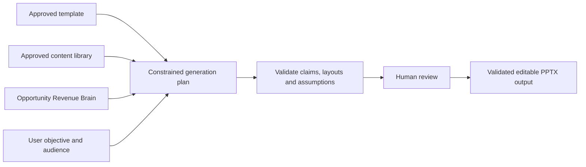

# RevenueOS Create

> **Oryntela consolidation — 4 September 2026:** Create remains a product
> capability rather than a customer plan. See the
> [Oryntela master product blueprint](oryntela-master-product-blueprint.md) and
> [packaging hypothesis](../04-commercial/oryntela-packaging-hypothesis.md).

- **Status:** WO-032/033 presentation and Business Case slice, hardened by WO-039B, behind the `create` organisation entitlement
- **Purpose:** Create customer-specific, reviewable PPTX material from approved company content and customer-safe context

## Current WO-032 boundary

Create is a separately entitled Sales Content Studio. It adds a desktop **Create >
Studio** destination and contextual Account and Opportunity entry points without
adding a fifth item to the compact mobile navigation. An entitled member can build a
presentation; an organisation administrator manages template uploads, slide
classification and immutable approval.

The current output is editable `.pptx` only. A canonical Account, audience,
objective and approved template version are required; an Opportunity and a bounded
focus instruction are optional. RevenueOS shows a deterministic, reorderable slide
plan before generation. Required and exact-text slides cannot be removed. Generated
text and every material claim stay reviewable until the seller explicitly approves
the exact structurally validated version, after which a short-lived, single-use,
authenticated private download is available.

The current composer is deterministic and makes no AI-provider call. It preserves
supported approved source-slide structures, replaces only administrator-authorised
text placeholders and strips notes, comments, hidden/unselected slides and source
metadata from the customer file. The saved PPTX is reparsed and checked against the
review/claim contract before approval. There is no blank-canvas editor.

## Product outcome

Create currently produces reviewable presentations and deterministic approved
Business Cases within an organisation's approved PPTX structure and claims.
Proposals and DOCX/PDF remain future work. Create is not a generic prompt-to-slide
tool.

## Guided creation

The primary action is **Create** followed by an output type. The flow asks for an
opportunity, objective, audience, duration/length, required sections, approved
template and optional content constraints. A blank prompt is secondary.

RevenueOS combines:

## Presentation generator — current

An administrator deliberately uploads an authorised PPTX template and attests that
the organisation may reuse it. Ingestion validates the ZIP/XML package, extracts a
structural slide and text-block manifest, identifies hidden/notes/internal-only
content, and reports unsupported structures. The administrator classifies every
slide as approved or excluded, selects locked/reuse-as-is/text-placeholder policy,
and marks required or exact approved text before publishing an immutable version.

Generation selects only approved slides. The typed context builder may read bounded
customer-direct Evidence, separately labelled seller-reported context and current
public Prospect observations. It excludes transcripts, raw notes, recordings,
financials, probability/forecast, internal risk/coaching, contactability and
suppression state. Approved company copy is the safe fallback; missing support is
shown rather than invented. The output never invents a case study, certification,
result or customer statement. Template review reports **Template ready**, **Template
needs attention** or **Template unsupported**. Editable policies require supported
standard placeholders; there is no security-validation bypass.

## Proposal generator — future

The proposal path uses an approved DOCX template and controlled sections for
situation, objectives, requirements, solution, scope, implementation, ROI, timeline,
pricing inputs, terms references and next steps. Pricing and terms come from explicit
authorised inputs or referenced approved content. Output is reviewed before DOCX/PDF
export and is not legal advice.

## Approved content library

Organisation administrators maintain versioned product descriptions, capabilities,
case studies, testimonials, certifications, implementation copy, diagrams, logos,
legal/disclaimer text and approved claims. Each item has status, owner, jurisdiction,
effective dates and permitted output types. Expired or unapproved content cannot be
selected for new output.

## ROI and Business Case — current WO-033 boundary

ROI is a deterministic value model. The organisation defines formulas and value
drivers such as labour/time savings, downtime reduction, revenue uplift, software
consolidation, risk reduction, energy savings and operational costs. The seller
enters customer assumptions. RevenueOS calculates current/proposed cost, benefit,
implementation cost, payback and ROI with units, currency and rounding visible.

AI may explain the calculation but may not create or alter numeric inputs. Every
output labels seller/customer assumptions and supports sensitivity scenarios.

## Experience, administration and limits

Create is a top-level desktop area because the user's question—**What should RevenueOS
create for me?**—is distinct. Account and Opportunity pages also offer contextual
Create actions. First-time users see a setup guide when no approved template exists.
The mobile experience supports presentation review and download but keeps template
administration desktop-first.

Private-beta limits are 50 MB and 100 source slides per PPTX, 500 media assets,
30 generated slides, 10 presentation generations per user per UTC day and 50 per
organisation per UTC day. Administrators may retain 20 active templates with 20
versions each. Limits are server-authoritative and fail closed.

Not purchased: existing Core workflows remain available and the Create API returns a
calm `not_in_plan` state. Create excludes generated images, logo scraping, pricing,
ROI calculations, unrestricted brand scraping, general document management,
fabricated claims, speaker-note generation, external sending and execution of Office
or embedded content. See the [PowerPoint trust and compatibility guide](create-powerpoint-trust-guide.md),
[Create experience](../02-design/create-presentation-proposal-experience.md),
[template architecture](../03-engineering/presentation-proposal-template-architecture.md)
and [security review](../03-engineering/create-security-privacy-review.md).

## Simplicity test

- **Where/first action:** Create > Studio; start a Presentation.
- **Navigation:** Create is permanent on desktop only when entitled; Account and
  Opportunity shortcuts remain contextual and mobile retains four primary items.
- **Hidden until needed:** Advanced sections, layout, assumptions, source manifest and
  version controls follow the guided essentials.
- **Mobile:** Review, approve and download; template administration and generation
  setup are desktop-first.
- **When not purchased:** Core drafts and manual files still work; relevant context may
  offer one calm Learn more path.
- **First-time/power user:** First-time users complete a wizard; power users reuse
  approved briefs, templates/content and version history.
- **AI/manual work:** AI removes blank-page effort inside constraints; users inspect
  sources, correct claims/assumptions and approve the exact output.

## WO-033 Business Case extension

Create now includes Business Cases alongside presentations and templates. An entitled
seller chooses an administrator-approved Value Model, enters or reviews every numeric
input, inspects deterministic outputs, scenarios, sensitivity and provenance, then
approves an exact immutable Business Case version. Only that approved version may be
selected for a new presentation. The source manifest pins its case/version/scenario,
material assumptions and disclaimer; generation, approval and download revalidate it.

This extension does not authorise AI-generated numbers, arbitrary spreadsheet or
Excel execution, FX conversion, tax/GST, NPV/IRR or Monte Carlo modelling. Negative
results remain visible and payback is explicitly unavailable when it cannot be
achieved. See the [implementation guide](roi-business-case-builder.md) and
[Create integration contract](business-case-create-integration.md).
