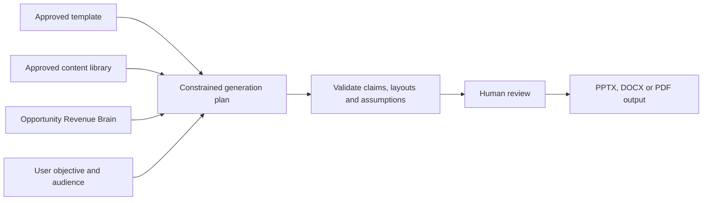

# RevenueOS Create

- **Status:** Future paid add-on; not implemented
- **Purpose:** Create customer-specific sales material from Revenue Brain and approved company content

## Product outcome

Create produces reviewable presentations, proposals, executive briefs, business
cases and ROI models within an organisation's real brand and approved claims. It is
not a generic prompt-to-slide tool.

## Guided creation

The primary action is **Create** followed by an output type. The flow asks for an
opportunity, objective, audience, duration/length, required sections, approved
template and optional content constraints. A blank prompt is secondary.

RevenueOS combines:

## Presentation generator

An organisation uploads an approved PPTX template. Ingestion validates the package,
extracts supported layouts, fonts, colours, logos, placeholders, footer/disclaimer
rules and reusable approved slides. Unsupported or ambiguous layouts are reported;
RevenueOS does not silently rebuild the brand.

Generation selects among approved layouts and combines customer-supported facts,
seller claims, explicit assumptions and approved corporate content. It never invents
a case study, certification, result or customer statement.

## Proposal generator

The proposal path uses an approved DOCX template and controlled sections for
situation, objectives, requirements, solution, scope, implementation, ROI, timeline,
pricing inputs, terms references and next steps. Pricing and terms come from explicit
authorised inputs or referenced approved content. Output is reviewed before DOCX/PDF
export and is not legal advice.

## Approved content library

Organisation administrators maintain versioned product descriptions, capabilities,
case studies, testimonials, certifications, implementation copy, diagrams, logos,
legal/disclaimer text and approved claims. Each item has status, owner, jurisdiction,
effective dates and permitted output types. Expired or unapproved content cannot be
selected for new output.

## ROI and business case

ROI is a deterministic value model. The organisation defines formulas and value
drivers such as labour/time savings, downtime reduction, revenue uplift, software
consolidation, risk reduction, energy savings and operational costs. The seller
enters customer assumptions. RevenueOS calculates current/proposed cost, benefit,
implementation cost, payback and ROI with units, currency and rounding visible.

AI may explain the calculation but may not create or alter numeric inputs. Every
output labels seller/customer assumptions and supports sensitivity scenarios.

## Experience and limits

Create is a top-level area because the user's question—**What should RevenueOS create
for me?**—is distinct. Opportunity pages also offer contextual Create actions.
First-time users follow a short wizard; power users can reuse briefs and approved
content. Mobile supports review/comment/download, not complex template administration.

Not purchased: existing Core follow-up and manual file workflows remain available.
Create excludes unrestricted brand scraping, generic document management, fabricated
claims and automatic customer delivery. See [Create experience](../02-design/create-presentation-proposal-experience.md)
and [template architecture](../03-engineering/presentation-proposal-template-architecture.md).

## Simplicity test

- **Where/first action:** Create; choose Presentation, Proposal, Business Case or ROI.
- **Navigation:** Create earns one permanent destination; template/content admin stays
  in Settings and Opportunity shortcuts remain contextual.
- **Hidden until needed:** Advanced sections, layout, assumptions, source manifest and
  version controls follow the guided essentials.
- **Mobile:** Review, comment and download; template administration and complex editing
  are desktop-first.
- **When not purchased:** Core drafts and manual files still work; relevant context may
  offer one calm Learn more path.
- **First-time/power user:** First-time users complete a wizard; power users reuse
  approved briefs, templates/content and version history.
- **AI/manual work:** AI removes blank-page effort inside constraints; users inspect
  sources, correct claims/assumptions and approve the exact output.
