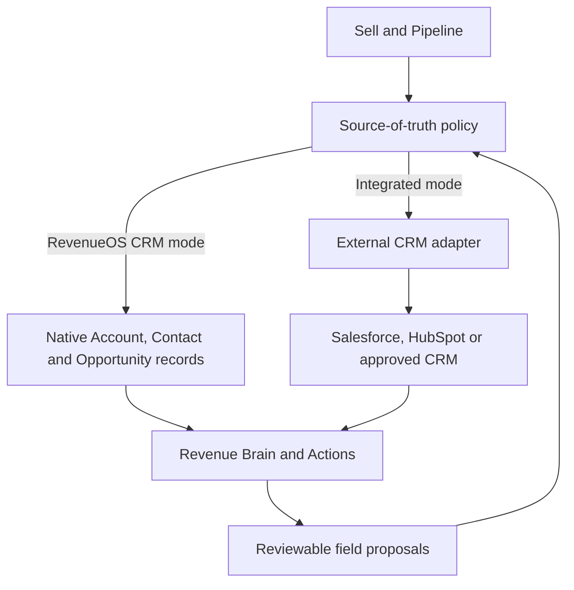

# RevenueOS CRM

- **Status:** Future paid add-on; not implemented
- **Principle:** RevenueOS works with your CRM—or it can be your CRM

## Product outcome

For enterprise and established teams, RevenueOS continues to complement Salesforce,
HubSpot or another approved system of record. For smaller organisations, RevenueOS
CRM provides the minimum lovable record and pipeline capabilities required to run the
sales workflow without buying a larger CRM.

CRM is not a separate top-level application. It enhances **Sell** and **Pipeline**.

## Minimum lovable CRM

- Leads where a genuine lead workflow is needed;
- Accounts and Contacts using the existing Company/Contact foundations;
- Opportunities with stages, value, close date, owner and history;
- Activities represented primarily by Interactions and approved external events;
- Tasks and accountable commitments;
- Products and simple opportunity-product association;
- list, board, filters and saved views;
- typed custom fields within controlled limits;
- CSV import/export with preview, validation and rollback reporting; and
- bounded workflow helpers only where a concrete sales need exists.

This scope excludes the breadth of Salesforce administration, general objects,
arbitrary code, deep quoting/CPQ, marketing automation and a generic Flow clone.

## CRM differentiator

Traditional CRM asks the seller to maintain fields. RevenueOS CRM proposes changes
from validated evidence:

> We updated what we learned from today's meeting.

The review shows fields such as Champion, Economic Buyer, Competitor and Next Step,
alongside source, current value, proposed value and conflict. The user accepts,
edits or rejects. Evidence remains separate from the record value and approval does
not silently mutate an external system.

## Pipeline experience

Pipeline supports list and board views with stage, value, close date, owner,
methodology gaps, risk, next action and latest Revenue Brain change. A card opens the
Opportunity Workspace rather than a dense edit form. Forecast and manager drill-down
share the same normalised opportunity and history events.

## Custom fields

Custom fields are typed (`text`, `number`, `currency`, `date`, `boolean`,
`single_select`, `multi_select` or approved entity reference), namespaced to the
organisation, versioned and bounded. They cannot replace core identifiers,
organisation ownership, stage history, evidence provenance, security policy or
system lifecycle. Formula/code fields and arbitrary JSON are deferred.

## Native and integrated modes

An organisation configures mode and field-level authority. External IDs and versions
remain scoped to one connection. Switching modes requires explicit mapping,
conflict review and rollback—not silent data copying.

## First-time, mobile and entitlement behaviour

- First-time native CRM users create/import an Account and Opportunity, then see the
  next recommended interaction or action.
- Power users use saved filters, board views, imports and field administration.
- Mobile prioritises opportunity summary, stage, next step, actions and quick
  Interaction capture; bulk editing is desktop-first.
- Without the add-on, Core relationship records and external CRM integrations still
  work. Locked native administration does not block existing evidence or Actions.

See [native CRM architecture](../03-engineering/native-crm-architecture.md) and
[Opportunity/Account UX](../02-design/opportunity-and-account-workspace-ux.md).

## Simplicity test

- **Where/first action:** Sell/Pipeline; create or import an Account and Opportunity.
- **Navigation:** No CRM destination; native capabilities enhance existing goal areas.
- **Hidden until needed:** Field administration, source authority, imports and bounded
  workflows live in Settings or contextual advanced views.
- **Mobile:** Review Opportunity, stage, next step and Actions; bulk/admin work is
  desktop-first.
- **When not purchased:** Core relationship records, Evidence, Workspace and approved
  external-CRM paths remain usable.
- **First-time/power user:** First-time users create one Account/Opportunity; power
  users gain saved views, boards, imports and controlled field administration.
- **AI/manual work:** Evidence-grounded proposals reduce manual updates; users inspect
  source/current/proposed values, then accept, edit, reject or resolve conflicts.
