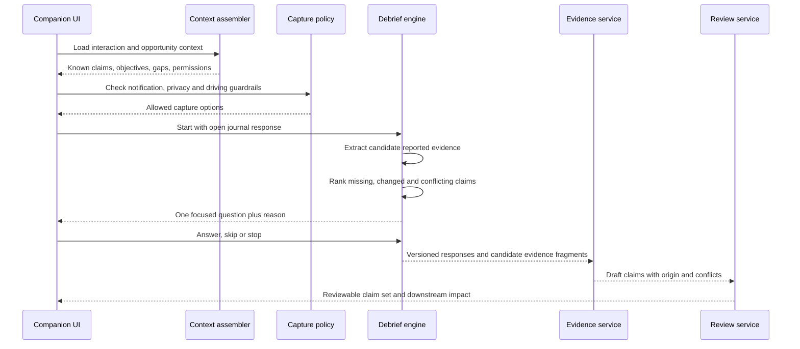

# AI Companion and debrief

- **Status:** WO-016 implements the responsive BEFORE/DURING/AFTER Companion by
  orchestrating the WO-012 brief, WO-013 debrief/Voice Journal, WO-014 visuals and
  WO-015 foreground recording foundations. Live intelligence remains target design.
- **First release:** concise preparation, explicitly chosen foreground recording or
  passive capture, then source-aware targeted debrief and review.

## Clear product boundaries

| Concept                       | Purpose                                                                          | Domain classification                                     |
| ----------------------------- | -------------------------------------------------------------------------------- | --------------------------------------------------------- |
| AI Companion                  | Orchestrates the before/during/after experience                                  | Product experience over several services and sessions     |
| AI Debrief                    | Asks opportunity-aware questions about missing, changed or important information | Capture Session producing reported evidence               |
| Voice Journal                 | Accepts a free-form spoken account after an interaction                          | Capture Session and evidence source                       |
| Live Recording                | Acquires direct audio evidence when authorised                                   | Capture Session producing recording evidence              |
| Live Interaction Intelligence | Produces provisional signals from incomplete live evidence                       | Future provisional processing mode, never final by itself |

The Companion is not a bot persona that must attend the meeting. Debrief and Voice
Journal do not become customer timeline entries; they are grouped beneath the real
interaction.

## Before: interaction brief

The brief is a versioned, source-aware composition from authorised context:

- account and opportunity narrative;
- meeting type, objectives and desired outcomes;
- expected and recently changed stakeholders;
- open commitments, risks, objections and unanswered questions;
- latest next best action and whether it remains relevant;
- recent documents or emails only after those connectors exist and permission
  allows;
- two or three recommended questions; and
- known information gaps.

The brief must distinguish current verified information, direct evidence, reported
information and recommendations. Opening the brief does not run Interaction
Intelligence or change Revenue Brain. Preparation feedback can be saved as a user
preference or dismissal, not silently promoted to relationship fact.

## During: passive companion

The implemented browser Companion stays quiet by default. It exposes an explicit
recording/passive choice, optional start/pause/resume/stop foreground recording,
metadata-only quick markers and visual capture. No default live coaching,
continuous prompts, dense transcript or screen attention is required. Phone calls
and online meetings use passive mode because browser microphone capture is not a
truthful same-device or system-audio solution. A future live-intelligence panel
must be explicitly enabled, visibly provisional and suppressible.

## After: debrief sequence

### Start condition

The user explicitly accepts the prompt and confirms they are not driving before
interactive voice use. The service resolves the interaction from trusted tenant
context and an existing association; the client cannot supply an arbitrary
organisation ID.

### Open prompt

Start with a natural question such as “How did it go?” The first response is not
forced into a rigid CRM form. The system structures it in the background and then
asks focused follow-ups.

### Question selection

Create candidate questions only for:

- an objective with no supported outcome;
- a possible stakeholder, timeline, decision-process or procurement change;
- a commitment, objection, risk, customer request or commercial signal mentioned
  without enough detail;
- a conflict with current Revenue Brain intelligence;
- an explicit quick marker; or
- a required attribution or owner that materially affects follow-through.

Rank by strategic importance, expected information gain, recency and question cost.
Do not use an arbitrary model confidence percentage as the ranking explanation. Show
a reason such as “You mentioned procurement; this is not in the current opportunity
history.”

Exclude questions whose answer exists in authorised context, repeated questions,
low-value field completion, sensitive topics blocked by policy and facts the user
has already skipped in the session. Use a configurable small cap for the MVP.

### Stop and recovery

Every question offers skip and stop. Persist completed answers as a draft session
without promoting them. Interrupted audio can resume if the source is intact or fall
back to text. A session that expires remains viewable and deletable but is labelled
unreviewed.

## Evidence semantics

Voice and text debrief responses are **salesperson-reported evidence**. Speech-to-text
is a derived representation of that evidence. User correction verifies the wording
and their report; it does not transform the report into direct customer evidence.

Candidate claims retain:

- response and fragment references;
- capture and interaction timestamps;
- user identity;
- the question/context version;
- extraction schema/model/prompt trace when AI is used;
- conflicts and missing attribution; and
- review decision.

The service must never fabricate a quotation from a paraphrased journal.

## Reconciliation with Revenue Brain

The debrief compares candidate claims against validated structured intelligence,
not all historical raw content. Outcomes are:

- **new:** no current supported equivalent;
- **consistent:** corroborates an existing claim;
- **changed:** later evidence supports a controlled transition;
- **conflicting:** cannot coexist with current evidence without resolution;
- **duplicate:** adds no useful support; or
- **insufficient:** lacks attribution or material detail.

Silence never proves resolution. Recency does not automatically overrule an
authoritative external record or direct customer evidence. The user reviews
material changes and conflicts before they affect the relationship narrative.

## Review and promotion

The review is grouped into:

1. what changed;
2. decisions and commitments;
3. risks, objections and unanswered questions;
4. stakeholder observations;
5. requested follow-up; and
6. omitted or conflicting items.

The user can edit the report, confirm the interpretation, dispute it, retain it as
unreviewed evidence or exclude it. The application assigns identifiers and enforces
same-tenant references after schema validation. Promotion creates or updates
versioned Interaction Intelligence; it does not alter raw evidence.

## Presentation-aware and interaction-aware interviews

Question templates are policy/registry configurations keyed by interaction family,
not a one-size-fits-all interview. Presentation debrief emphasises audience response
and requested material. Workshop debrief emphasises output ownership and consensus.
Site visits emphasise observations, constraints and required validation. Informal
conversations use a much shorter flow.

The model can select among allowed question intents and render natural wording, but
application policy owns the cap, prohibited topics, already-answered check and
session lifecycle.

## Safety and privacy

- no content in lock-screen notification text by default;
- explicit microphone permission and recording indicators;
- no interaction while driving encouragement;
- content-redacted logs and safe request IDs;
- tenant-scoped storage and retention from session creation;
- delete, exclude and export paths for source and derived data;
- clear warning that debrief is internal and may contain sensitive recollection;
- no user performance scoring from debrief completion; and
- no claim that a generic consent notice satisfies every jurisdiction or customer
  policy.

## Evaluation and release gates

Evaluate with synthetic and explicitly approved test cases:

- already-known questions are suppressed;
- material changes generate relevant follow-ups;
- customer evidence and reported evidence never change origin;
- unsupported quotes, commitments and identities are rejected;
- conflict and insufficient-evidence paths are usable;
- question count, duration and abandonment stay within the product target;
- user correction and dismissal are respected in downstream views;
- tenant isolation and deletion lineage pass; and
- no raw content appears in logs, analytics or notifications.

User tests should measure whether the interview captures material information with
less effort than writing CRM notes, not whether users answer every question.

## Explicitly deferred

- autonomous live coaching;
- continuous listening without an explicit session;
- background location tracking;
- emotion or personality inference;
- employee performance scoring;
- silent memory promotion; and
- automatic external action.

## Related documents

- [Interaction lifecycle and UX](interaction-lifecycle-and-ux.md)
- [Presentation mode](presentation-mode.md)
- [Evidence and provenance model](../03-engineering/evidence-and-provenance-model.md)
- [Interaction Intelligence migration strategy](../03-engineering/interaction-intelligence-migration-strategy.md)
