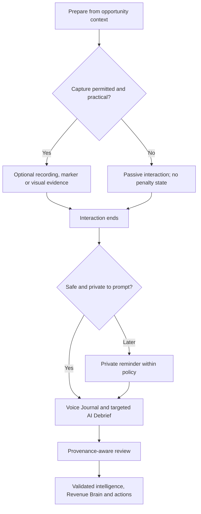

# Face-to-face interaction experience

**Implementation status:** WO-016 delivers the browser-first responsive Companion
for the core before/during/after loop. Foreground browser recording is optional and
labelled with its limitations; passive markers, visuals and debrief remain usable
without it. Native, background and offline-media capabilities below remain target
design only.

- **Status:** WO-012 implements responsive face-to-face preparation; capture,
  AI Debrief and Voice Journal remain target design
- **MVP:** Prepared, non-recording customer office meeting followed by immediate
  AI Debrief or Voice Journal

## Design posture

Face-to-face selling is the primary Interaction Intelligence problem. The experience
must work when recording is refused, the seller cannot type, the phone has no signal
or the interaction is too sensitive for active technology. Failure to capture audio
must never mean failure to capture useful evidence.

## Shared workflow contract

Every face-to-face flow follows these rules:

- the brief is useful without starting capture;
- the consent or policy state is decided before microphone/camera acquisition;
- during-interaction UI is passive and interruption-free;
- every capture path has a non-recording fallback;
- the post-interaction prompt is quick, private, skippable and safe;
- AI Debrief uses known context and asks only material questions;
- evidence origin remains visible through review and Revenue Brain;
- actions are drafts or proposals; and
- mobile failure exposes what was and was not saved.

## Workflow 1 — Standard customer office meeting

- **Preparation:** Confirm account, opportunity, attendees, objectives, commitments,
  risks and unanswered questions. Offer recording only when organisation policy and
  likely participant consent permit it.
- **Capture options:** Optional audio, quick markers, authorised photos, or no live
  capture.
- **Consent:** Ask before recording or photography and record the policy/notice
  outcome without storing unnecessary legal conclusions.
- **During:** Passive screen; one-tap markers only if the seller chooses.
- **Fallback:** End the meeting normally and use Voice Journal/debrief.
- **Post-interaction prompt:** Within five minutes of explicit or candidate end,
  respecting privacy and quiet-hour rules.
- **Debrief:** Compare the seller's account with objectives, open risks, timeline,
  stakeholders, decisions and next steps.
- **Evidence:** Direct recording/visual evidence when available; otherwise
  salesperson-reported responses and system metadata.
- **Intelligence:** Source-aware summary, decisions, actions, objections, signals,
  risks, questions, stakeholders and next best action.
- **Confirmation and Brain:** Review material claims; promote validated intelligence
  and append a versioned interaction snapshot without rewriting historical meetings.
- **Actions:** Follow-up draft, customer-requested material and accepted internal
  tasks.
- **Mobile and risks:** One-hand flow and reliable resume; key risks are notification
  delay, memory bias and confusing recollection with customer fact.

## Workflow 2 — Formal sales presentation

- **Preparation:** Attach or select the deck, identify audience and objectives,
  previous objections, likely questions and claims needing customer validation.
- **Capture options:** Optional recording, quick “question/objection/request” marker,
  authorised photos and later debrief.
- **Consent:** Separate permission for audio and images; prepared materials retain
  seller/document origin.
- **During:** No transcript or coaching by default; protect presenter focus.
- **Fallback:** Use section-aware post-presentation questions without recording.
- **Post-interaction prompt:** Ask which sections generated discussion while slide
  order remains fresh.
- **Debrief:** Engagement, questions, objections, requested evidence, resistant or
  influential stakeholders, decision-process change and next meeting.
- **Evidence:** Deck content, customer-attributed capture, markers and reported
  observation remain separate.
- **Intelligence:** Never classify seller-spoken benefits as customer buying signals.
- **Confirmation and Brain:** Review each customer interpretation; update relationship
  narrative only with origin attached.
- **Actions:** Requested materials, fact-checks, follow-up draft and next meeting.
- **Mobile and risks:** Presenter may use another device; risks are audience ambiguity,
  over-inference from engagement and confidential deck content.

## Workflow 3 — Workshop

- **Preparation:** Define intended outputs, facilitator/decision roles, agenda,
  consent plan and authorised artefact zones.
- **Capture options:** Optional room recording, timestamped markers, whiteboard and
  sticky-note-wall photos, participant-supplied documents.
- **Consent:** Group notice plus explicit handling of sensitive breakout material;
  late arrivals need an appropriate notice path.
- **During:** Allow batch visual capture and markers without forcing transcription.
- **Fallback:** Facilitator Voice Journal plus participant-confirmed workshop summary.
- **Post-interaction prompt:** Focus on outputs, unresolved decisions, owners and
  material that needs customer confirmation.
- **Debrief:** Reconcile artefacts, reported facilitation notes and known objectives;
  ask who agreed each decision/action.
- **Evidence:** Preserve image regions or transcript spans as fragments rather than
  treating OCR as source truth.
- **Intelligence:** Decisions and actions need attributable support; ambiguous sticky
  notes remain unverified.
- **Confirmation and Brain:** Facilitator review, with optional customer-confirmed
  output recorded as stronger separate evidence.
- **Actions:** Circulate draft summary, owners, open questions and requested artefacts.
- **Mobile and risks:** High image volume and poor room audio; risks include personal
  data on walls, OCR errors and unclear group agreement.

## Workflow 4 — Site inspection

- **Preparation:** Site safety, offline expectation, photo restrictions, technical
  objectives, equipment and relevant stakeholders.
- **Capture options:** Offline notes/voice, authorised photos, markers and later
  debrief; audio only if safe and permitted.
- **Consent:** Site owner policy controls photography and recording; visible signage
  and personal information require extra caution.
- **During:** Camera-first optional capture with minimal typing; never conflict with
  safety procedures.
- **Fallback:** Locally buffered observations or an immediate debrief outside the
  restricted area.
- **Post-interaction prompt:** Trigger on explicit end or restored connectivity, not
  repeated network failure.
- **Debrief:** Technical findings, constraints, customer requests, safety exclusions,
  decision impact and required validation.
- **Evidence:** Photos and user observation with time/location only when authorised.
- **Intelligence:** Distinguish visible direct evidence from the seller's technical
  interpretation.
- **Confirmation and Brain:** Review sensitive visuals and delete/exclude before
  intelligence promotion.
- **Actions:** Technical follow-up, validation request, materials and internal expert
  task.
- **Mobile and risks:** Offline encrypted buffer and resumable upload; risks are
  device loss, unsafe use, restricted imagery and incomplete upload.

## Workflow 5 — Executive lunch

- **Preparation:** Concise relationship brief, executive interests, commitments and
  sensitive topics; default to no recording.
- **Capture options:** No live capture, discreet private marker only if appropriate,
  then Voice Journal.
- **Consent:** Never assume a social setting removes recording rules or expectations.
- **During:** Product stays out of view unless the user explicitly chooses otherwise.
- **Fallback:** Delayed private debrief, with reduced evidence strength as time passes.
- **Post-interaction prompt:** After likely departure, with no customer details on the
  lock screen.
- **Debrief:** Relationship changes, executive priorities, commitments, concerns and
  follow-up tone.
- **Evidence:** Primarily salesperson-reported; do not generate direct quotes.
- **Intelligence:** Conservative; label interpretation and avoid sensitive personal
  profiling.
- **Confirmation and Brain:** User review required for material commitments or
  stakeholder stance.
- **Actions:** Personalised follow-up draft and explicit commitments.
- **Mobile and risks:** Discreet, short flow; risks are social intrusion, memory bias
  and overclaiming informal comments.

## Workflow 6 — Informal customer conversation

- **Preparation:** Usually none; provide rapid account/opportunity association after
  the event.
- **Capture options:** Quick note or later Voice Journal; recording is inappropriate
  unless deliberately agreed.
- **Consent:** Do not turn ambient conversation into implicit capture.
- **During:** No default product interaction.
- **Fallback:** Manually create or associate an Interaction and record an observation.
- **Post-interaction prompt:** User-triggered “Capture a conversation”.
- **Debrief:** Ask only context, material change, commitment and follow-up.
- **Evidence:** Salesperson-reported observation with uncertain participants allowed.
- **Intelligence:** Do not infer formal decision or commitment from casual wording.
- **Confirmation and Brain:** Explicit review before material relationship change.
- **Actions:** Lightweight reminder or follow-up draft.
- **Mobile and risks:** Creation in seconds; risks are wrong account association and
  false formality.

## Workflow 7 — Conference or trade-show interaction

- **Preparation:** Event context, target accounts, concise objectives and existing
  relationship cues.
- **Capture options:** Quick voice/text note, badge/business-card image with permission,
  business card entry or later batch debrief.
- **Consent:** Explain image/contact-data use where required; recording noisy public
  spaces is not the default.
- **During:** Rapid association and one-tap marker; no mandatory form.
- **Fallback:** Queue an unassociated private note for later tenant-scoped matching.
- **Post-interaction prompt:** Batch reminders should avoid notification flooding.
- **Debrief:** Identity, expressed interest, request, next step and uncertainty; keep
  it short.
- **Evidence:** Reported notes and authorised contact image; OCR remains derived.
- **Intelligence:** Low-context, conservative, with duplicate-person resolution held
  for review.
- **Confirmation and Brain:** Do not create a new stakeholder/contact silently.
- **Actions:** Follow-up draft or research/association task.
- **Mobile and risks:** Fast offline queue; risks are misidentification, personal-data
  capture, noise and dozens of low-value reminders.

## Workflow 8 — Recording refused

- **Preparation:** Always present a clear **Continue without recording** path.
- **Capture options:** Non-recording markers only if appropriate, then Voice Journal
  and debrief.
- **Consent:** Record refusal/decline as policy metadata, not customer content; do not
  ask repeatedly during the same interaction.
- **During:** Microphone remains off and the UI confirms that state.
- **Fallback:** Full non-recording workflow with no reduced-product warning.
- **Post-interaction prompt:** Private and prompt.
- **Debrief:** Target the most important gaps while acknowledging reported origin.
- **Evidence:** System consent outcome plus salesperson-reported evidence.
- **Intelligence:** No invented customer quotes or speaker attribution.
- **Confirmation and Brain:** Review material claims; retain refusal policy only as
  long as necessary.
- **Actions:** Same reviewable actions as any other interaction.
- **Mobile and risks:** Make microphone state unambiguous; primary risk is accidental
  capture or a dark pattern that pressures consent.

## Workflow 9 — No mobile signal

- **Preparation:** Warn when the chosen capture mode cannot work offline and preload
  only the minimum authorised brief.
- **Capture options:** Client-supported encrypted local buffer, offline quick notes,
  photos or no capture.
- **Consent:** Offline status does not change consent obligations.
- **During:** Show local-save state and available device capacity.
- **Fallback:** Post-interaction journal when connectivity returns.
- **Post-interaction prompt:** Local notification if supported; server reminder after
  reconnect without duplication.
- **Debrief:** Use locally known context and reconcile with fresher server context on
  upload.
- **Evidence:** Device-captured items retain original capture timestamps and upload
  timestamps.
- **Intelligence:** Processing waits for complete synchronisation unless explicitly
  labelled partial.
- **Confirmation and Brain:** Review after upload and duplicate reconciliation.
- **Actions:** Stay pending until required evidence and context are available.
- **Mobile and risks:** Encrypted buffer, quota and resumable upload; risks are device
  loss, clock drift, duplicate prompts and partial media.

## Workflow 10 — Long meeting with locked screen

- **Preparation:** Explain whether the installed client and OS support background
  capture; responsive web must not claim reliability it cannot provide.
- **Capture options:** Native background recording only after implemented and tested;
  otherwise no long-running recording guarantee.
- **Consent:** Persistent OS/recording indicators and a clear stop path.
- **During:** Chunked local buffer, interruption recovery and battery/storage status.
- **Fallback:** Preserve completed chunks, report gaps and start a debrief.
- **Post-interaction prompt:** On explicit finalisation or safe OS callback.
- **Debrief:** Ask about gaps caused by interruptions and material changes.
- **Evidence:** Recording chunks, gap markers and reported responses with source
  alignment.
- **Intelligence:** Provisional until final transcript and gap assessment complete.
- **Confirmation and Brain:** Never promote provisional live results as final.
- **Actions:** Generate after final/reviewed intelligence unless clearly labelled
  draft.
- **Mobile and risks:** Background policies, calls, battery, thermal limits and OS
  termination are major risks.

The WO-016 browser Companion does not satisfy a screen-lock continuity requirement.
Its wake lock is best effort while the page is visible, unuploaded chunks are held
only in memory, and the user is told to keep the page open and device awake.

## Workflow 11 — Multiple customer speakers

- **Preparation:** Collect likely attendees but allow unknown or late participants.
- **Capture options:** Audio with diarisation later, participant markers, seating
  prompt after the event or non-recording debrief.
- **Consent:** All participants follow the applicable notice/consent approach.
- **During:** Do not require live manual speaker assignment.
- **Fallback:** User reports the statement with an unknown/role-level source rather
  than guessing a person.
- **Post-interaction prompt:** Ask attribution only for decisions, commitments,
  objections and requests where it materially matters.
- **Debrief:** Present candidate speakers as uncertain and correctable.
- **Evidence:** Transcript segments preserve diarisation labels separately from
  contact identity.
- **Intelligence:** No identity merge without support; group consensus is not inferred
  from one speaker.
- **Confirmation and Brain:** User may verify attribution, but direct customer source
  remains distinct from identity certainty.
- **Actions:** Use role/unknown safely when recipient or owner is not confirmed.
- **Mobile and risks:** Audio quality and cross-talk; risks are misattribution and
  treating attendance as agreement.

## Workflow 12 — Sensitive or confidential content

- **Preparation:** Show organisation policy, restricted topics and capture controls;
  allow a no-retention or no-capture path where policy supports it.
- **Capture options:** No capture, redacted note, bounded secure capture or later
  high-level debrief.
- **Consent:** Participant notice is necessary but may not be sufficient; contract,
  policy, privilege and jurisdiction require customer legal review.
- **During:** Fast pause/exclude control and visible recording state.
- **Fallback:** Record only the existence of a restricted topic and approved next
  step, not the content.
- **Post-interaction prompt:** Privacy-preserving wording and no sensitive lock-screen
  detail.
- **Debrief:** Do not pressure the user to restate restricted content; support “cannot
  capture”.
- **Evidence:** Classification, access and retention metadata apply from creation;
  sensitive raw content is minimised.
- **Intelligence:** Restricted evidence cannot leak into broad summaries, prompts or
  notifications.
- **Confirmation and Brain:** Promotion follows purpose- and role-based policy;
  deletion/exclusion propagates to derived results.
- **Actions:** Customer-safe outputs use only approved evidence projections.
- **Mobile and risks:** Device loss and screen exposure; risks include privilege,
  confidentiality, unauthorised processing and overbroad access.

## Operational acceptance for the first workflow

The first face-to-face release is usable only when:

- the seller can complete the loop without recording or transcript upload;
- the interaction, capture session and evidence remain tenant-isolated;
- the prompt is controllable and safe-driving language is tested;
- every material claim shows origin and review state;
- skip, offline, permission-denied, partial and deletion paths work;
- Workspace and Revenue Brain update only from eligible validated intelligence;
- no customer content enters logs or notification previews; and
- production use still satisfies the separate WO-009 launch and customer-data gates.

## Related documents

- [Interaction lifecycle and UX](interaction-lifecycle-and-ux.md)
- [AI Companion and debrief](ai-companion-and-debrief.md)
- [Mobile companion strategy](mobile-companion-strategy.md)
- [Browser Face-to-Face Companion guide](browser-face-to-face-companion-guide.md)
- [Evidence and provenance model](../03-engineering/evidence-and-provenance-model.md)
- [Interaction platform risk register](../03-engineering/interaction-platform-risk-register.md)
