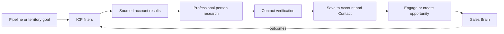

# Find and Prospect experience

- **Status:** WO-026 Account Research, WO-027 Person Intelligence and WO-028 Target Markets implemented
- **Question:** Who should I target?

## Current WO-027 person path

The researched-company page now contains **People worth understanding**. Discovery
is an explicit company-scoped action and returns a bounded, unranked set of public
professional identities with relevant function and cautious rationale. Selecting a
person opens a separate sourced brief; no photo, personality signal, lead score or
outreach action appears.

The brief keeps buying roles labelled as hypotheses, presents contact trust per
field, states that permission is not assessed and handles unknown/partial/departed
states without guessing. **Add to Sales as Contact** opens explicit duplicate review.
The canonical Contact links back to separately labelled public research. See
[Person Research UX](person-research-ux-implementation.md),
[Buying Committee UX](buying-committee-ux.md) and the
[mobile simplicity review](prospect-person-mobile-simplicity-review.md).

## Find landing

The current entitled Prospect landing leads with saved Target Markets and a guided
create action while preserving “Which company are you looking for?” for direct
company name/domain search and recent research. Non-entitled users receive a
restrained module explanation. The detailed
implemented flow is in
[Find and Account Research UX](find-account-research-implementation.md).

The bounded ICP/territory alternative is implemented as a single Target Market; broad
person search remains target design:

The first action is a search field with guided alternatives:

- search Accounts or people;
- discover from an ICP;
- explore a territory; or
- resume saved research.

When Prospect is not purchased, Find still searches authorised existing Accounts,
Contacts and opportunities. Discovery results are replaced with a concise module
explanation, not an advertisement wall.

## Discovery flow

The current WO-026 flow is:

1. Search a company name or domain.
2. Choose one candidate when identity is ambiguous.
3. Run and inspect versioned sourced Account Research.
4. Refresh deliberately when needed.
5. Confirm Add to Sales, linking an exact-domain Company or creating one.

Steps 1–4 are current across WO-026–028; reviewed outreach remains future WO-029 scope:

1. Select or create a bounded ICP/territory.
2. Review explainable account matches and missing data.
3. Open an account research result with source links and dates.
4. Review a buying-committee hypothesis and person research.
5. Verify contact status and permitted-use state.
6. Save the organisation/person into the existing Account/Contact workflow.
7. Create a reviewed outreach Action, Interaction or opportunity only when useful.

## Results

Account result cards show name, location, segment, matched ICP criteria, public
trigger, source coverage and whether an Account/opportunity already exists. They do
not display a mysterious lead score.

Person cards show public professional role/context, Account relationship, source
date and contact status. `Verified`, `Provider supplied`, `Inferred` and `Unknown`
are textual badges with explanations. No sensitive or irrelevant personal detail is
shown.

## Research detail

Level 1 answers **Why might this account be relevant?** Level 2 shows company facts,
initiatives, triggers, people and gaps. Level 3 shows source-by-source claims,
retrieval date, provider status and corrections.

Users can mark a finding incorrect/stale, exclude a source, resolve a duplicate or
save selected facts. Saving never upgrades an inference to verified evidence.

## ICP and territory administration

The current four-step form supports provider-advertised industry, country/region,
minimum employee band, organisation type, preferred business characteristics and
explicit exclusions. Revenue and technology filters are not exposed because the
active adapter does not support them. Prioritisation is categorical, deterministic
and explainable; there is no arbitrary weighting or predictive black box. See the
[implemented Target Market experience](target-market-experience.md).

## First-time, power-user and mobile

- First-time: choose one example ICP or enter industry, geography and size; review
  ten or fewer results.
- Power user: saved views, territory coverage, bulk shortlist and deduplication.
- Mobile: search, read sources, save and create next action. ICP builder, territory
  mapping and bulk review are desktop-first.

## Safety states

- Source unavailable: retain other findings and label the gap.
- Contact unverified: disable direct send and offer a manual verification path.
- Duplicate Account: open or merge-review the existing record; never create silently.
- Restricted/prohibited source: exclude it and record only safe metadata.
- Unsupported request: explain why sensitive-trait or private-person research is not
  available.

The explicit responsible-research rules are in
[Prospect research architecture](../03-engineering/prospect-research-evidence-architecture.md).
