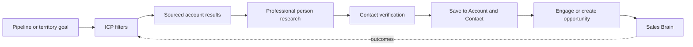

# Find and Prospect experience

- **Status:** Future Prospect experience; not implemented
- **Question:** Who should I target?

## Find landing

The first action is a search field with guided alternatives:

- search Accounts or people;
- discover from an ICP;
- explore a territory; or
- resume saved research.

When Prospect is not purchased, Find still searches authorised existing Accounts,
Contacts and opportunities. Discovery results are replaced with a concise module
explanation, not an advertisement wall.

## Discovery flow

1. Select or create a bounded ICP/territory.
2. Review explainable account matches and missing data.
3. Open an account research result with source links and dates.
4. Review a buying-committee hypothesis and person research.
5. Verify contact status and permitted-use state.
6. Save the organisation/person into the existing Account/Contact workflow.
7. Create a reviewed outreach Action, Interaction or opportunity only when useful.

## Results

Account result cards show name, location, segment, matched ICP criteria, public
trigger, source coverage and whether an Account/opportunity already exists. They do
not display a mysterious lead score.

Person cards show public professional role/context, Account relationship, source
date and contact status. `Verified`, `Provider supplied`, `Inferred` and `Unknown`
are textual badges with explanations. No sensitive or irrelevant personal detail is
shown.

## Research detail

Level 1 answers **Why might this account be relevant?** Level 2 shows company facts,
initiatives, triggers, people and gaps. Level 3 shows source-by-source claims,
retrieval date, provider status and corrections.

Users can mark a finding incorrect/stale, exclude a source, resolve a duplicate or
save selected facts. Saving never upgrades an inference to verified evidence.

## ICP and territory administration

Guided forms support industries, size, geography, revenue, employee count, permitted
technology characteristics, business problems and exclusions. Show example results
before save. Advanced weighting is bounded, explainable and initially deterministic.
No arbitrary code or predictive black box is provided.

## First-time, power-user and mobile

- First-time: choose one example ICP or enter industry, geography and size; review
  ten or fewer results.
- Power user: saved views, territory coverage, bulk shortlist and deduplication.
- Mobile: search, read sources, save and create next action. ICP builder, territory
  mapping and bulk review are desktop-first.

## Safety states

- Source unavailable: retain other findings and label the gap.
- Contact unverified: disable direct send and offer a manual verification path.
- Duplicate Account: open or merge-review the existing record; never create silently.
- Restricted/prohibited source: exclude it and record only safe metadata.
- Unsupported request: explain why sensitive-trait or private-person research is not
  available.

The explicit responsible-research rules are in
[Prospect research architecture](../03-engineering/prospect-research-evidence-architecture.md).
