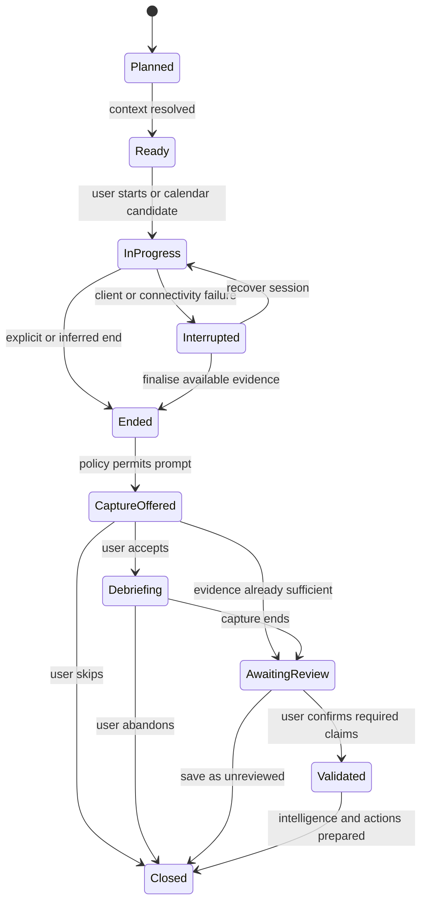
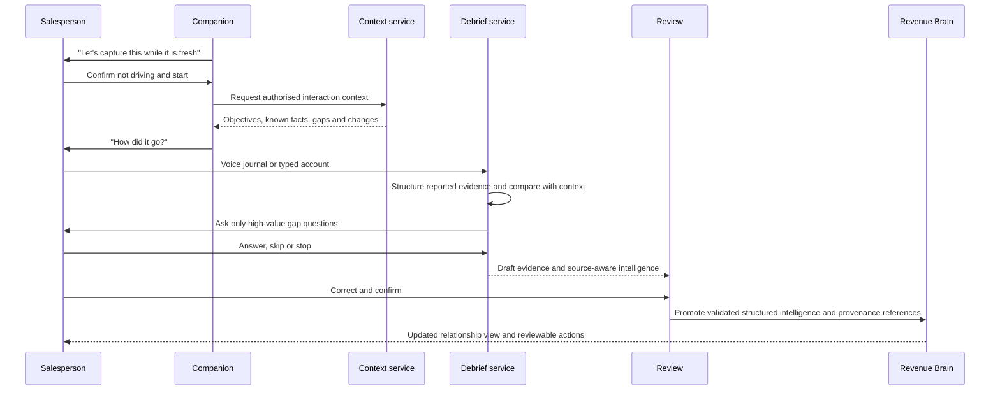

# Interaction lifecycle and UX

WO-018 applies this lifecycle to online meetings with safe Open Meeting navigation,
a passive During state and capability-driven post-meeting import/debrief choices.

WO-025A makes the shared customer sequence explicit as Prepare → Capture → Review →
Follow through. Planned face-to-face capture stays in Companion; additional completed
source options use progressive disclosure.

- **Status:** WO-016 implements the responsive browser Companion across the
  persisted planned, in-progress and completed Interaction lifecycle. The richer
  product-state diagram below remains a target model, not a database enum. WO-017
  applies the same lifecycle to ordinary phone calls with controlled outcomes.
- **Primary surfaces:** responsive web first; PWA or native capture remains a later,
  separately authorised decision where reliability evidence justifies it.

## Lifecycle model

These are product states, not approved database enums. Capture sessions and
processing jobs have their own state machines so a failed recording does not make
the interaction itself fail.

## Before the interaction

The AI Companion opens on a concise brief rather than a dashboard. It should show:

1. interaction type, time, location and known participants;
2. opportunity stage and the relationship narrative;
3. commitments due or recently changed;
4. unresolved risks, objections and questions;
5. stakeholder changes and missing roles;
6. the previous next best action and whether it occurred;
7. two or three recommended objectives; and
8. a short list of questions linked to the reason each matters.

Each item has a source or is labelled as a recommendation. The brief must not expose
sensitive customer details in a push notification or on a locked screen. Users can
correct the association, dismiss a recommendation or start a capture mode. They are
never required to complete a preparation checklist before meeting the customer.

### Type-specific preparation

| Type                   | Preparation emphasis                                                                                 |
| ---------------------- | ---------------------------------------------------------------------------------------------------- |
| Standard meeting       | commitments, current risks, decision path and unanswered questions                                   |
| Presentation           | audience, prepared material, claims needing validation, likely questions and known objections        |
| Workshop               | intended outputs, facilitation roles, open decisions, artefacts to photograph and participant notice |
| Site visit             | safety constraints, authorised photo zones, technical questions and offline expectation              |
| Executive lunch        | relationship context and a discreet non-recording default                                            |
| Conference interaction | rapid account matching, badge/business-card permission and very short objectives                     |
| Phone call             | Contact/role, purpose, commitment, objection/timeline, recent change and desired next step           |

## During the interaction

The during state is deliberately quiet. The default surface shows only:

- interaction title and privacy state;
- recording status when recording is active;
- one-tap marker controls configured for the interaction type;
- camera access for authorised visual evidence;
- a clear stop control; and
- connection/buffering status without technical detail.

There is no default live coaching panel, scrolling transcript or requirement to
identify every speaker in real time. Important status cannot depend on colour alone.
Recording indicators remain visible whenever the browser is foregrounded and are
reinforced by the browser/OS microphone indicator where available.

### Quick capture

Quick markers are low-information evidence such as “follow up”, “question”,
“objection” or “decision”. They contain timestamp, author and interaction context;
they are not the decision or objection itself. After the interaction, the debrief
uses the marker to ask a focused question.

### Offline and interruption

When the client supports offline capture, it shows the amount safely buffered on the
device and whether upload is pending. When it does not support a requested capture
reliably, it says so before the interaction and recommends a non-recording fallback.
On interruption, preserve completed chunks, never silently claim a complete
recording, and move to an explicit recover/finalise/debrief choice.

## After the interaction

### Prompt timing

Preferred triggers, in order, are:

1. explicit **End interaction**;
2. completion of an active capture session;
3. an authorised calendar event end plus a short configurable delay; or
4. a user-created reminder.

The default prompt window is within five minutes, with a gentle reminder later the
same day if the first prompt is ignored. Quiet hours, travel time, notification
preferences and organisation policy apply. Repeated reminders stop after dismissal
or expiry; a stale debrief remains possible but its recency is visible.

### Walk-to-the-car flow

Before voice capture, the user must confirm they are stationary and safe to interact.
The safety message remains available during capture. The app does not encourage
screen use, manual review or follow-up while driving.

### Debrief question policy

The debrief begins open-ended, then ranks candidate questions using:

- conflict with current validated intelligence;
- a material change to timeline, decision process, stakeholder, risk or commercial
  commitment;
- an objective that remains unresolved;
- an explicit marker or incomplete direct evidence; and
- expected action value.

It excludes questions whose answer is already supported, trivia, broad CRM data
collection and repeated low-value prompts. The user can see why a question is being
asked, skip it or end the interview. The initial product should impose a small
question cap and measure whether users voluntarily continue.

## Review screen

The review screen is organised by claim, not raw model output. Each item shows:

- plain-language claim;
- origin badge such as **Customer evidence**, **Reported by you**, **Imported
  record** or **AI inference**;
- supporting and conflicting evidence count;
- affected intelligence capability;
- edit, confirm, dispute or omit controls; and
- downstream impact, such as “updates timeline” or “included in follow-up draft”.

Confirmation strengthens validation but preserves origin. Omitting an item prevents
promotion to validated intelligence; it does not delete the source evidence unless
the user separately deletes it. Conflicts are resolved explicitly or left visible.

## Interaction timeline UX

The account and opportunity timeline groups information by real customer
interaction. A primary entry contains its summary, evidence strength, validation
state and actions. Internal capture sessions appear inside the entry. This avoids
showing “meeting”, “voice journal” and “AI debrief” as three customer interactions.

Independent emails, documents or customer confirmations can appear as their own
event when material. Filters use text labels for type, source, validation and
privacy. Times are stored in UTC and rendered in the user's selected timezone;
ambiguous historical timezone data is labelled rather than guessed.

## State, accessibility and mobile rules

Every step needs loading, empty, permission-denied, offline, partial, failed,
expired and deleted states. Completed evidence remains usable when another source
fails. Retry is bounded and explicit.

- use semantic headings, form labels, live regions and native controls;
- make start/stop and recording state screen-reader clear;
- provide captions/transcripts when available and a text debrief alternative;
- support visible focus, large touch targets and one-handed operation;
- do not rely on audio, vibration or colour as the only status cue;
- honour reduced motion and OS text scaling; and
- provide an accessible way to review visual evidence descriptions and correct AI
  extraction.

## Analytics without surveillance

Measure lifecycle utility through aggregate, tenant-governed events:

- brief opened before interaction;
- capture method selected or declined;
- time to first post-interaction evidence;
- debrief started/completed/skipped and duration band;
- questions asked, answered and skipped by category;
- claims confirmed, edited, disputed or omitted;
- usable intelligence produced; and
- reviewable action accepted or dismissed.

Do not measure keystrokes, continuous location, private conversation duration as a
performance proxy, individual rankings or covert employee activity.

## Implemented browser Companion

WO-016 maps `planned`, `in_progress` and terminal lifecycle states to BEFORE,
DURING and AFTER on `/interactions/{interactionId}/companion`. Start and complete
are explicit and idempotent. During capture stays intentionally sparse: recording
status when chosen, metadata-only quick markers, visual evidence and one clear End
interaction action. Active recording or queued chunks block completion. AFTER shows
what was captured and reuses the existing source-aware debrief/review flows.

The browser stores pending audio chunks only in memory for the open page. Stable
idempotency keys and bounded retry protect duplicate upload, but reload, device lock
or OS termination can still lose an unuploaded chunk. The UI never describes the
screen wake lock as a background-recording guarantee.

## Implemented visual capture and review

Interaction detail now offers browser-native camera/file/drop capture for
non-cancelled interactions. A preview remains local until the user supplies
type, ownership and authority confirmation. Upload and analysis have semantic
progress, restore/list states, safe errors and bounded retry. Review cards
require accept/edit/reject decisions for every suggestion before intelligence
updates. Saved visuals retain explicit ownership and AI/user-review labels.

## Implemented phone-call lifecycle

WO-017 keeps normal calls passive: **Start call** records only an Interaction start,
and end controls record `connected`, `no_answer`, `voicemail` or `cancelled` plus an
optional elapsed Interaction duration. The browser does not dial, request the
microphone, inspect device call logs or show **Record phone call**. Connected calls
open **Capture this call while it’s fresh**; missed/voicemail/cancelled calls remain
timeline events and cannot create customer Interaction Intelligence.

See [Phone Call Intelligence](phone-call-intelligence-guide.md) and
[Browser phone-call workflow](browser-phone-call-workflow.md).

## Related documents

- [Face-to-face interaction experience](face-to-face-interaction-experience.md)
- [AI Companion and debrief](ai-companion-and-debrief.md)
- [Browser Face-to-Face Companion guide](browser-face-to-face-companion-guide.md)
- [Presentation mode](presentation-mode.md)
- [Mobile companion strategy](mobile-companion-strategy.md)
- [Interaction security, privacy and consent](../03-engineering/interaction-security-privacy-and-consent.md)

## Action review after final intelligence

Once final validated intelligence exists, an opportunity can produce review-only
Actions. Provisional DURING signals never feed this step. The user reviews and may
revise, approve or reject; approval is visibly not execution. Pending and approved
Actions can inform the next BEFORE brief, while rejected, superseded and manually
completed Actions are excluded.
