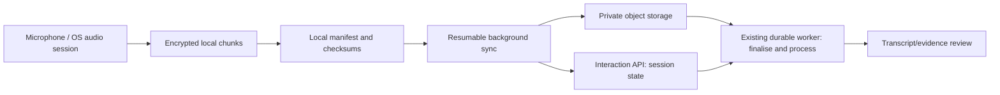

# Mobile companion strategy

- **Status:** Target strategy; no mobile application, PWA or recording capability is
  implemented by WO-010
- **Recommendation:** responsive web for the debrief MVP, a constrained PWA for
  convenience/offline experiments, then a cross-platform native capture client only
  when background recording requirements are validated

## Capability comparison

| Client                      | Strengths                                                                           | Critical limits                                                                          | Recommended role                                                                    |
| --------------------------- | ----------------------------------------------------------------------------------- | ---------------------------------------------------------------------------------------- | ----------------------------------------------------------------------------------- |
| Responsive web              | Fastest reuse of current Next.js experience; no store review; strong forms/review   | Unreliable long background capture, screen-lock and OS integration                       | First brief, typed/foreground voice debrief, review and visual-upload prototype     |
| PWA                         | Installable shell, cached UI, limited offline/push support by platform              | Background audio, push, storage and lifecycle remain inconsistent; not native-equivalent | Convenience layer and bounded offline draft experiment, not promised long recording |
| Cross-platform native       | Background tasks, local encrypted storage, push, camera/mic and shared product code | Native modules, OS policy, QA matrix and store operations remain substantial             | Preferred first durable capture client after platform spikes                        |
| Separate native iOS/Android | Maximum platform control                                                            | Highest cost and duplicated delivery                                                     | Only if cross-platform spikes cannot meet recording/accessibility requirements      |
| Desktop companion           | Stable desktop audio paths and online meeting context                               | Does not solve face-to-face mobile use; OS audio permissions are complex                 | Later online-capture option                                                         |
| Browser extension           | Page/meeting context and browser capture in allowed contexts                        | Platform policy, browser audio limits and enterprise extension approval                  | Later selected online workflows, never universal capture                            |

## Required capability assessment

| Capability                        | Responsive web/PWA                                                | Native client                                                           |
| --------------------------------- | ----------------------------------------------------------------- | ----------------------------------------------------------------------- |
| Foreground microphone             | Generally viable with permission and browser caveats              | Viable with platform permission                                         |
| Long-running/background recording | Not reliable enough to promise                                    | Possible with OS-specific modes, indicators and store-policy compliance |
| Screen lock                       | Browser session may pause/terminate                               | Supported only with correct native audio session and OS policy          |
| Interrupted calls                 | Browser behaviour varies and recovery is weak                     | Detectable and recoverable, still platform-specific                     |
| Offline mode                      | Bounded cached drafts possible; storage quotas vary               | Encrypted database/files and explicit sync queue                        |
| Resumable upload                  | Viable after foreground returns                                   | Viable through managed background transfer with limits                  |
| Bluetooth microphone              | Browser/device behaviour inconsistent                             | Better control, still requires device matrix testing                    |
| Camera/visual capture             | Good foreground support                                           | Strong control and metadata handling                                    |
| Push notification                 | Platform and install dependent                                    | First-class after permission, token and policy work                     |
| Local encrypted buffering         | Web storage guarantees are insufficient for sensitive long media  | OS keychain/keystore plus encrypted files                               |
| Remote wipe                       | Cannot guarantee device-wide wipe; revoke and delete on next sync | Revoke access and app data on next contact; MDM is customer-controlled  |
| Accessibility                     | Strong if semantic web is maintained                              | Requires separate native screen-reader, scaling and switch-control QA   |

“Remote wipe” means revocation and best-effort deletion when the app reconnects; it
must not be sold as a guarantee for an offline lost device unless enforced by the
customer's mobile-device management.

## Staged recommendation

### Stage 1 — Responsive Companion

Deliver the pre-interaction brief, manual association, foreground Voice Journal or
typed debrief, review and visual selection in responsive web. Keep the voice session
short and foreground. State clearly that closing/locking the browser may interrupt
capture. This is sufficient to validate the face-to-face value proposition and does
not require native code.

### Stage 2 — PWA convenience and offline spike

Add install guidance, bounded cached brief, local draft state and notifications only
where platform support is verified. Use synthetic content to evaluate storage
eviction, permission recovery and offline synchronisation. Do not use a PWA to claim
long background recording reliability.

### Stage 3 — Cross-platform native capture

After WO-015 defines recording/session APIs, build a constrained native companion
focused on:

- long-running foreground/background audio where lawful and permitted;
- screen-lock continuity;
- encrypted chunk buffering;
- interruption, battery, storage and Bluetooth handling;
- resumable upload and explicit partial-session finalisation;
- camera evidence;
- push notifications; and
- the same server-side tenant, evidence and review policies.

React Native is a reasonable starting hypothesis because the team already uses
TypeScript, but it is not selected by WO-010. A time-boxed iOS/Android spike must
prove background audio, calls, OS termination, Bluetooth, encryption, accessibility
and store-policy compliance before the framework decision.

### Stage 4 — Desktop or extension only for selected online needs

Evaluate after platform recording import/native integrations. Do not build both by
default.

## Native capture architecture

The server remains authoritative for session state and tenant policy. The device is
authoritative only for unuploaded local chunks. Each chunk has a stable session ID,
sequence, checksum and idempotency key. The user sees gaps, pending bytes and final
status.

## Offline and synchronisation rules

- preload only the minimum authorised context and expire it;
- encrypt media and drafts with keys protected by OS facilities;
- use per-session quotas and warn before storage exhaustion;
- preserve original capture time, device monotonic sequence and upload time;
- deduplicate by session/sequence/checksum;
- never silently merge conflicting interaction associations;
- pause upload on policy/network conditions where configured;
- remove local content after verified server receipt and retention policy allows;
- revoke tokens immediately and delete cached keys/content on next reconnect; and
- provide explicit **Delete local capture** and **Discard session** flows.

## Battery, calls and device behaviour

The native spike and QA matrix must include:

- one-, two- and four-hour sessions;
- screen lock/unlock and app background/foreground;
- incoming/outgoing phone and VoIP calls;
- OS process termination and device restart;
- low battery, thermal pressure and storage exhaustion;
- loss/restoration of Wi-Fi and cellular data;
- common Bluetooth headsets and external microphones;
- permission revocation mid-session; and
- clock/timezone changes.

The UX should prefer preserving partial evidence over aggressive continuous upload
that drains battery. A partial recording is labelled partial and can be supplemented
by a debrief.

## Store and enterprise requirements

Before public distribution, confirm Apple App Store and Google Play microphone,
background-use, privacy-label/data-safety, account deletion and subscription rules
against current official policies. They change and require a release-time review.
Enterprise customers may also require managed app distribution, MDM controls,
certificate pinning decisions, data residency, penetration testing and a documented
mobile threat model.

## Decision gates

Build native capture only if user evidence shows that:

- the responsive debrief loop is useful and repeated;
- a meaningful share of interactions need direct recording;
- background/screen-lock reliability materially affects coverage;
- consent and enterprise policy permit the target scenarios; and
- recording/transcription costs and retention can be supported.

## Related documents

- [Face-to-face interaction experience](face-to-face-interaction-experience.md)
- [Recording and transcription architecture](../03-engineering/recording-and-transcription-architecture.md)
- [Interaction security, privacy and consent](../03-engineering/interaction-security-privacy-and-consent.md)
