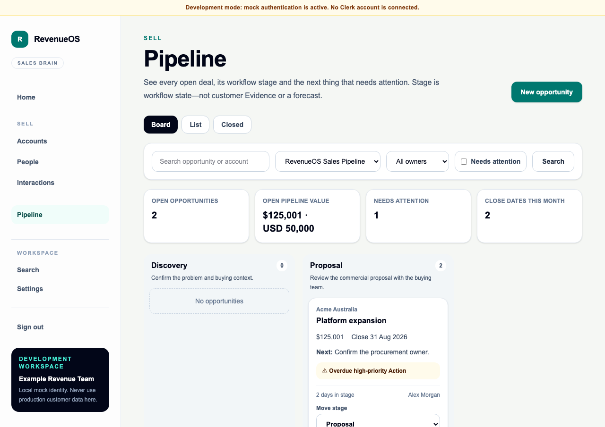

# Native Pipeline UX and simplicity review

**Status:** current WO-035 desktop and mobile experience.

## Board and list

Pipeline opens on a short header, Board/List/Closed switch, one bounded filter row and
four descriptive summary cards. Desktop board columns contain active open stages only.
Cards link directly to the Opportunity workspace and use a labelled `Move stage`
select, so keyboard and screen-reader users do not depend on drag and drop.

List uses eight purposeful concepts: Opportunity/Account, stage, amount, close date,
owner, time in stage and attention/outcome. Closed uses the same compact list and
labels outcome reasons `seller reported`. Empty, loading, safe-error and retry states
are present.

## Card and attention hierarchy

Cards contain only:

- Account and Opportunity;
- amount with its original ISO currency;
- salesperson-entered expected close date;
- next open Action or `No next Action`;
- at most two deterministic reasons;
- time in current stage and owner;
- the accessible move control when RevenueOS has stage authority.

No probability, score, methodology matrix, forecast, inline amount editing or provider
detail competes with the decision to open the Opportunity.

## Stage change and closure

Open-stage movement is one explicit select action and gives a safe stale-state error if
another user moved the Opportunity. Final stages are not offered in that control.
`Mark Won` and `Mark Lost` open labelled modal forms. Lost asks a bounded, non-blaming
question and requires a controlled reason; Won's reason is optional. Both label the
note/reason as seller reported and keep expected versus actual close dates distinct.

Reopen is explicit, requires an open target stage and explains that earlier closure
history remains. A failed request keeps the modal and user input open.

## Stage history

The Opportunity workflow panel shows current stage and reliable time in stage. Its
disclosure lists actor/time, exact from/to snapshot names and seller-reported closure
outcomes. A migration baseline says earlier history is unavailable and never displays
a made-up interval.

## Settings

Only admins see Pipeline Settings. The page is a short ordered list, not a workflow
canvas: rename, move up/down, add open stage, set default and archive. Stage types are
visibly Open, Won or Lost and cannot be edited. In-use counts explain why archive may
be blocked. External mode states that HubSpot owns configuration and removes mutation
controls.

## Mobile and accessibility review

At 390 pixels the board becomes vertically grouped stage cards; there is no horizontal
kanban. The same select provides stage movement. The list table is desktop-only while
mobile cards retain the same information. Controls have labels, visible focus inherits
the shared control system, state is not colour-only, dialogs have names and native
details/select elements retain keyboard semantics. Playwright verifies no page-level
horizontal overflow.

## Simplicity gate result

The view answers where deals are, how much current open pipeline exists, what needs
attention and what closed without training or an opaque score. It is intentionally
simpler than a general CRM pipeline: no colour picker, probability column, stage gate,
automation builder, saved-view builder or board inline editing. The screenshot review
confirmed that the headline, summaries, workflow columns and Opportunity link remain
the dominant hierarchy.

