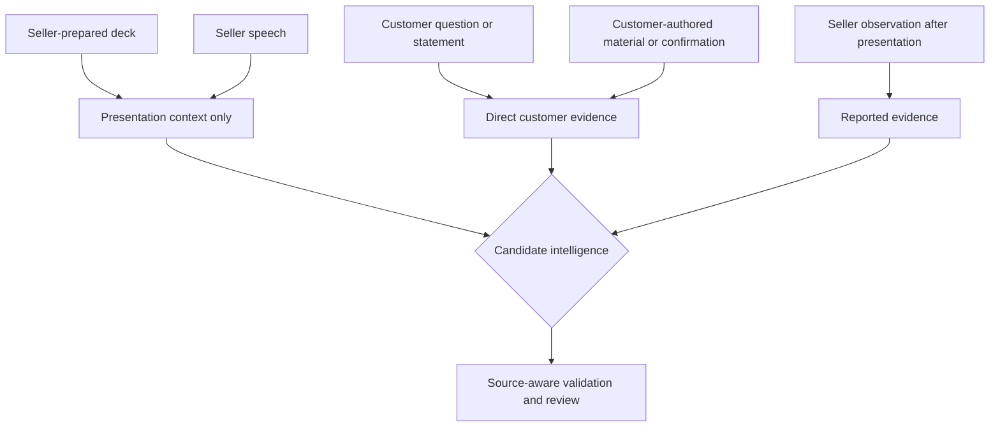

# Presentation mode

**Implementation status:** WO-014 implements the browser-first preparation,
visual capture/review and bounded presentation debrief described here. Live
coaching, slide authoring, recording and native mobile remain future scope.

- **Status:** WO-012 implements presentation-specific preparation guidance and
  WO-014 implements browser-image capture, review and a bounded debrief; full
  deck ingestion and live presentation assistance remain target design
- **Principle:** Prepared seller content is context, not evidence of customer intent

## Why presentation mode is distinct

A presentation has an asymmetric evidence problem. Much of the speech and material
comes from the seller. A generic transcript summariser can easily turn product
claims repeated by the presenter into false buying signals or decisions. RevenueOS
therefore models the deck, speaker role and audience response explicitly.

## Before

The salesperson selects authorised presentation material or links an existing
document evidence item. RevenueOS prepares:

- audience and stakeholder context;
- interaction and opportunity objectives;
- previous objections, risks and open questions;
- likely customer questions;
- claims or proof points likely to require customer validation;
- material previously requested by the customer; and
- desired outcomes such as a technical workshop, validation step or agreed decision
  meeting.

The deck remains `seller_prepared` document evidence. Analysis of its contents is
derived context. It cannot support a customer decision, signal, commitment or
objection by itself.

## During

The product remains passive. Optional controls are:

- authorised audio recording;
- one-tap markers for question, objection, request, decision or slide/section;
- authorised photos of audience-created materials; and
- a visible stop/pause control.

The user should not need to operate the phone while presenting. If slide alignment
is later available, it remains approximate unless timestamps or presenter events
support it.

## After

The debrief asks only questions not already answered by direct evidence:

1. Which sections generated meaningful discussion?
2. Which customer stakeholders were most engaged, and what did they do or say?
3. What questions were asked, and by whom if known?
4. What objections or concerns arose?
5. What evidence, proof or material was requested?
6. Did the decision process, timeline or procurement involvement change?
7. Was a next meeting or validation step agreed?
8. Did any stakeholder appear resistant, and what supports that observation?
9. Which claims still need customer validation?

Engagement observations are reported evidence unless supported by customer speech
or a customer-authored source. RevenueOS must avoid converting eye contact,
attendance or generic politeness into inferred purchase intent.

## Evidence separation

| Input                       | May support                                                 | Must not support alone                        |
| --------------------------- | ----------------------------------------------------------- | --------------------------------------------- |
| Prepared deck               | topic, section, claim and question context                  | buying signal, customer decision or objection |
| Seller speech               | what was presented                                          | customer interest or agreement                |
| Customer statement/question | attributed signal, objection, request or decision candidate | another attendee's agreement                  |
| Seller observation          | reported engagement or resistance                           | customer-confirmed fact                       |
| Customer-authored follow-up | corroboration or confirmation                               | unrelated participants or opportunities       |

## Review screen

Group results into:

- audience questions and requests;
- objections and concerns;
- decisions, commitments and next steps;
- engagement observations;
- claims still requiring validation; and
- follow-up actions.

Each item shows whether it came from direct customer evidence, reported observation,
prepared material or inference. The user can correct attribution and remove prepared
material from downstream processing without deleting the interaction.

## Intelligence rules

- Buying signals require customer-attributable or explicitly reported response;
  deck content never qualifies.
- Stakeholder role and stance remain cautious; attendance is not influence.
- Decisions require attributable agreement or user verification of a reported
  agreement.
- Questions stay questions until later evidence answers them.
- Requested evidence becomes a reviewable action with an owner and destination.
- Follow-up drafts use only customer-safe validated intelligence, not internal risk
  commentary or speculative engagement inference.

## Consent, privacy and accessibility

Presentation files may contain confidential strategy, customer logos or third-party
content. Apply classification, access, retention and external-processing policy at
ingestion. Obtain separate authority for room audio and photography. Do not expose
the deck or customer details in notifications.

Support keyboard and screen-reader preparation/review, accessible slide/section
labels, text alternatives for audio capture and editable descriptions for visual
evidence.

## Failure and fallback

- If the deck cannot be processed, present it as an attached source and continue the
  debrief.
- If recording fails, use markers and the presentation-specific Voice Journal.
- If slide alignment is missing, do not guess section attribution.
- If speaker identity is uncertain, use customer/seller/unknown rather than assign a
  contact.
- If evidence conflicts, preserve the conflict for review.

## Success measures

- presentation debrief completion and time;
- customer questions/requests captured and later confirmed;
- correction rate for customer-versus-seller attribution;
- requested material turned into accepted actions;
- false buying-signal dismissal; and
- use of presentation outcomes in the next interaction brief.

Slide count, presentation duration and individual presenter rankings are not success
metrics.

## Related documents

- [AI Companion and debrief](ai-companion-and-debrief.md)
- [Face-to-face interaction experience](face-to-face-interaction-experience.md)
- [Evidence and provenance model](../03-engineering/evidence-and-provenance-model.md)
