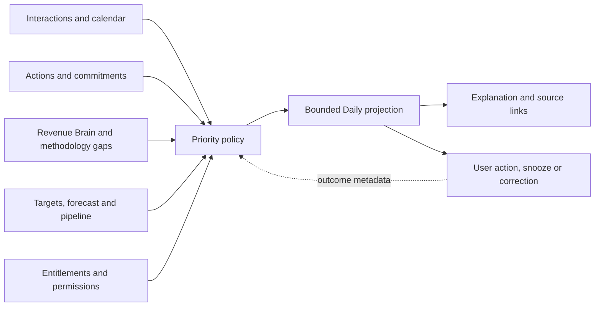

# RevenueOS Daily experience

- **Status:** Future Core experience; not implemented
- **Question:** What matters today?

## Experience contract

Daily is the default signed-in destination. It turns authorised current state into a
short, action-oriented day plan. It is not a dashboard of every available metric.

Priority order is deterministic and explainable: time-critical Interaction,
customer/commitment deadline, approved/action-required work, materially at-risk deal,
then target/pipeline focus. Users can snooze or dismiss a recommendation with a
reason; that choice is not silently promoted to customer fact.

## Desktop concept

```text
Good morning Kevin                         Search or ask RevenueOS

FOCUS NOW
Prepare for Qantas security workshop                      Prepare →
Starts 10:30 · Security decision criteria still unknown   Why this?

TODAY                        ACTIONS
3 customer interactions      5 need attention
Next: Qantas, 10:30           2 customer-facing · 3 internal

DEALS NEEDING ATTENTION
Qantas — procurement owner unknown                         Open deal →
Acme — close date conflicts with legal timeline            Review conflict →

TARGET          FORECAST        PIPELINE
$158K / $200K   $175K–$195K     3.4× qualified coverage
You may need approximately $110K additional qualified pipeline.
Find opportunities →

LATER TODAY
Four bounded upcoming or due items                         View day →
```

The first card has one primary action. Summary tiles are textual and secondary.
Charts appear only after opening Insights.

## Mobile concept

```text
Today

[ Focus now ]
Prepare for Qantas
10:30 · 8 min
[Prepare]

2 actions need attention
[Review]

1 deal needs help
[Open Qantas]

Target $158K / $200K
Forecast $175K–$195K

Today   Interactions   Actions   Search
```

Mobile shows one focus item and collapsed counts. A contextual card takes priority:
**Meeting in 10 minutes → Prepare** or **Meeting finished → Debrief**. No horizontal
pipeline or full manager table is shown.

## Sections

- **Focus now:** one recommendation, time/reason and primary action.
- **Today's Interactions:** chronological, with phase-specific Prepare/Start/Debrief.
- **Actions:** overdue, approval required, failed execution or due soon.
- **Deals needing attention:** at most three material, evidence-backed exceptions.
- **Target/forecast/pipeline:** compact headline, range and one explanation.
- **Suggested focus:** bounded prospecting, coaching or content action after higher
  priority work.

## First-time, empty and failure states

- First-time: explain Sales Brain in one sentence and offer **Add your next
  interaction**. Do not show a grid of empty charts.
- No work today: confirm there is no urgent work, then offer recent Accounts or one
  useful pipeline-building action.
- Partial source failure: retain available sections, timestamp last-known data and
  disable only unsafe actions.
- No target/forecast: show **Set a target** or explain that an administrator owns it;
  do not invent progress.
- No add-on: retain the pipeline-gap explanation and replace the Prospect action with
  a calm learn-more link.

## Explainability and control

**Why this?** opens Level 2 with the rule, evidence, dates and conflicts. **Show
evidence** opens Level 3. The user can correct associations, snooze, dismiss or open
the source. Daily never hides the underlying due date, risk or forecast assumption.

## Data flow



Application policy owns ranking and caps. AI may phrase a supported explanation but
does not choose hidden priorities, expand permissions or create facts.

## Success measures

Measure priority opened/resolved, preparation/debrief completion, commitment
follow-through, time to first useful action and dismiss/correction reasons. Do not
measure keystrokes, screen time or constant presence.
