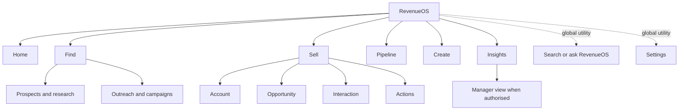

# RevenueOS information architecture

- **Status:** Current shell includes Core Insights with Overview/Targets and the
  entitlement-aware desktop Prospect/Find slice; other target areas remain staged
- **Design rule:** Organise around seller goals, not entities or implementation boundaries

## Permanent desktop navigation

The implemented shell is Home; conditional Prospect with Find; Sell with Accounts,
People and Interactions; Pipeline; Search; and Settings. The Prospect group appears
only after server-confirmed entitlement. Mobile remains exactly Today, Interactions,
Actions and Search while the Find route itself is responsive. The remainder of the
six-area table below is still the entitlement-aware target.

| Area     | User question                                | Primary contents                                                             | Entitlement behaviour                        |
| -------- | -------------------------------------------- | ---------------------------------------------------------------------------- | -------------------------------------------- |
| Home     | What should I do today?                      | RevenueOS Daily, priorities, interactions, actions, deal attention, pipeline | Core                                         |
| Find     | Who should I target?                         | Account/person search, research, ICP, territory, outreach entry              | Prospect/Engage with calm unavailable states |
| Sell     | What am I actively working on?               | Accounts, opportunities, people, interactions and actions                    | Core; CRM adds native administration         |
| Pipeline | Where are my deals and what needs attention? | List/board, stage movement, methodology, forecast drill-down                 | Core; CRM adds record-management depth       |
| Create   | What should RevenueOS create for me?         | Presentation, proposal, business case and ROI guided flows                   | Create add-on                                |
| Insights | How am I performing and why?                 | Targets, funnel, forecast, manager and coaching views                        | Core                                         |

Global **Search or ask RevenueOS** and **Settings** are utilities, not primary areas.
This produces six primary areas rather than a growing list of Leads, Contacts,
Accounts, Calls, Meetings, Documents, Campaigns, Tasks and internal AI concepts.

WO-037 implements **Overview · Targets · Funnel · Activity · Win / loss** inside
Insights. Forecast/manager/coaching remain future. Targets does not add a new top-level
navigation item, and RevenueOS Daily/mobile bottom navigation remain unchanged.

## Why this model

- **Account** and **Opportunity** are destinations inside Sell, not primary
  navigation competitors.
- **Pipeline** remains primary because portfolio management and forecast inspection
  answer a distinct question from working one relationship.
- **CRM** does not appear in primary navigation; it changes the depth of Sell and
  Pipeline.
- **Manager** is a role-aware mode of Home, Pipeline and Insights, not a second app.
- **Meetings**, calls, presentations and site visits are Interaction types.
- **Tasks** and AI-generated proposals converge as Actions, surfaced contextually and
  through Home/Sell.
- **Assistant** becomes the global search/ask entry rather than an empty destination.

## Page-question map

| Page         | Primary question                         | Obvious first action                                  |
| ------------ | ---------------------------------------- | ----------------------------------------------------- |
| Home         | What matters today?                      | Open the highest-priority item                        |
| Find         | Who should I target?                     | Search or choose an ICP/territory                     |
| Sell         | What am I actively working on?           | Resume an Account, Opportunity, Interaction or Action |
| Account      | What is happening with this customer?    | Open the next relationship action                     |
| Opportunity  | How do I win this deal?                  | Resolve the most important gap/action                 |
| Interaction  | How do I prepare, capture and follow up? | Continue the current lifecycle phase                  |
| Pipeline     | Where are my deals?                      | Review the highlighted exception or filter            |
| Create       | What should RevenueOS create for me?     | Choose an output type                                 |
| Insights     | How am I performing and why?             | Open the most material change                         |
| Manager view | Where does my team need help?            | Open the highest-impact deal/coaching exception       |
| Settings     | How is RevenueOS configured?             | Choose the relevant personal/admin area               |

## Sell hierarchy

The Sell landing page is a bounded resume surface: recent Accounts, active
Opportunities, upcoming/recent Interactions and unresolved Actions. It is not a
second Daily. Filters and explicit **View all** links lead to entity lists.

Account is the long-lived relationship context. Opportunity is the central deal
workspace. Interaction is a time-bound before/during/after workflow. An Action is
reviewable work with source and consequence. Each object links to the others without
recreating their entire content.

## Search or ask RevenueOS

The global control supports three routed intents:

1. **Navigate:** exact/fuzzy authorised Account, Contact, Opportunity, Interaction,
   Action and file lookup.
2. **Filter:** structured requests such as “Deals closing this month”.
3. **Answer or create:** evidence-grounded questions and explicit commands such as
   “What did Qantas say about security?” or “Create presentation for Qantas”.

Routing is server-authoritative and permission-scoped. If evidence-backed answering,
Prospect research or Create is unavailable, the system returns a useful navigation
result and explains the missing capability. Search never broadens access.

### Future search architecture

A typed server request declares `auto`, `navigate`, `filter`, `answer` or `create`;
the client never chooses permission scope or organisation. A search service inside
the modular monolith queries authorised canonical repositories and optional
organisation-scoped indexes, then returns typed results with destination, entity,
matched field, freshness and availability state. PostgreSQL text search is the
default starting option; embeddings or another index need measured need and a later
decision, and never become the source of truth.

`auto` resolves obvious entity/navigation matches first, then supported structured
filters. Evidence-grounded answers require cited authorised Evidence and an explicit
answer capability; create commands open a reviewable guided flow rather than execute.
Ambiguous intent presents choices. Research queries route to Prospect only when
available. Logs store safe timing/result-count/routing metadata, not query or answer
content. Cache/index keys include organisation and permission-sensitive versioning;
deletion and permission changes invalidate derived search state.

## Command bar

An optional `Cmd/Ctrl+K` surface exposes Create opportunity, Add call, Research
account, Find prospect, Generate proposal, Create presentation and Start campaign.
It uses the same routes and permissions as visible UI. Beginners never need it.

## Role adaptation

- **Salesperson:** Home opens the implemented personal Daily; Pipeline and Insights default to owned
  work.
- **Manager:** Home adds team priorities; Pipeline/Insights default to authorised
  team scope and coaching exceptions.
- **Administrator:** sales navigation stays relevant; Settings exposes users,
  integrations, methodology, permissions, security and billing according to role.

Role adaptation changes defaults and access, not the meaning of a page.

## Module discovery

Purchased modules add capabilities to an existing goal area. They do not create
locked navigation clutter. Direct navigation to an unavailable module shows its
outcome, current alternatives and who can enable it. Contextual discovery is limited
to one relevant inline suggestion.

## Migration from the current navigation

The `/dashboard` compatibility route now renders Home / RevenueOS Daily and the shell
label is **Home**. Getting started, Companies, Contacts, Opportunities, Interactions,
Meetings, Tasks, Assistant, Feedback and Settings remain the truthful implementation
surface. Later areas should migrate route by route with redirects and preserved deep
links:

- Dashboard → Home (implemented without changing the compatible route);
- Companies/Contacts/Opportunities/Interactions/Meetings/Tasks → Sell children;
- Assistant → Search or ask RevenueOS;
- Getting started and Feedback → contextual/help/settings destinations.

Do not rename routes or remove current deep links in WO-023.

## Current WO-025B Ask placement

`/assistant` now defaults to deterministic Search and exposes **Ask RevenueOS** as a
second mode. Opportunity and Account workspaces deep-link to that same utility with an
explicit scope. Desktop/mobile top-level navigation remains unchanged. The scope label
persists through each independent question, while source details and follow-ups use
progressive disclosure. Ask is a Core utility, not Prospect or a new product area.
