# Create PPTX trust, security and output-integrity architecture

- **Status:** implemented by WO-039B
- **Profile:** code-deployed `CREATE_PPTX_PROFILE_VERSION = 1`
- **Migration:** `0049_create_trust`
- **Production renderer:** deterministic in-process `python-pptx`; no Office process, network fetch or cloud renderer

## End-to-end trust contract

```mermaid
flowchart LR
    A["Admin authority attestation"] --> P["Bounded ZIP/XML/media preflight"]
    P --> C["Compatibility + slide review"]
    C --> T["Immutable template approval"]
    T --> G["Typed source snapshot + deterministic compose"]
    G --> M["Claim/structured-manifest equality"]
    M --> R["Controlled placeholder render"]
    R --> V["Safe package round-trip validation"]
    V --> H["Human claim and final review"]
    H --> D["One-time authenticated download"]
```

The generated bytes, their SHA-256 digest and validation profile/time are committed
to one `CreatePresentationVersion`. No version is reviewable/approvable or downloadable
unless output validation succeeds. Pre-approval edits clear validation/approval and
rerender the draft version; once approved, the version is immutable. A new plan or
regeneration flow creates a new version. Existing approved templates whose stored
validation profile is not current cannot start or complete generation.

## Supported profile and compatibility gate

Profile v1 supports standard transitional OOXML `.pptx`, native title/subtitle/body
placeholders, common shapes, safe embedded PNG/JPEG/GIF, normal Unicode and selected
source master/layout/theme relationships. Self-contained tables/charts and other
complex slide content are retained only under approved locked/reuse-as-is semantics;
they are not structurally edited or fidelity-guaranteed. Embedded workbooks/packages,
external relationships and unsupported media remain prohibited.

Template processing records `compatibility_state`, bounded detail codes,
`validation_profile_version` and `validated_at`. Processing begins as
`needs_attention`; a security/parser failure becomes `unsupported`; only completed
slide review plus a writable title/audience mapping and valid editable content roles
can become `compatible`. An editable slide may not retain any non-empty unmapped text
shape; it must be converted to supported placeholders or locked/reused so stale source
copy cannot sit outside the claim/output contract. Title-only/reuse-only templates
cannot pretend to support customer-specific generation. A source/file hash change is already a new template
version; policy edits clear compatibility time and approval remains explicit.

The full user-facing feature matrix and authoring rules are in the
[compatibility guide](../01-product/create-powerpoint-trust-guide.md).

## Hostile-package threat model and limits

The file is attacker-controlled until the whole preflight completes. Inspection is
in memory; no archive entry is extracted to a user-derived path. All XML parts are
bounded before `ElementTree` or `python-pptx`; no XML or relationship target is
fetched. Production never invokes Microsoft Office, LibreOffice, shell commands,
converters or external scanners.

| Bound                         |                 Profile v1 value | Enforcement/rationale                                                   |
| ----------------------------- | -------------------------------: | ----------------------------------------------------------------------- |
| Source bytes                  |                            50 MB | Reject before ZIP work; matches private-beta upload envelope.           |
| Slides                        |                              100 | Checked from parts and reopened presentation.                           |
| ZIP entries                   |                            2,000 | Reject before entry reads.                                              |
| Total expanded bytes          |                           250 MB | Sum central-directory sizes before expensive parse.                     |
| Aggregate compression ratio   |                            100:1 | Covers many individually smaller bomb entries.                          |
| Large-entry compression ratio |      200:1 for entries over 1 MB | Conservative exception for small normal XML; stops a single large bomb. |
| Media assets                  |                              500 | Bounded count before image processing.                                  |
| One media asset               |                            10 MB | Checked from directory and actual bytes.                                |
| One XML/relationship part     |                             5 MB | Checked before parse.                                                   |
| Extracted visible characters  |                          250,000 | Bounded across source slides.                                           |
| XML nesting                   |                128 elements deep | Iterative post-parse walk.                                              |
| XML elements                  |                 100,000 per part | Iterative post-parse walk.                                              |
| Relationships                 |  1,000 per part / 10,000 package | Bounded before target resolution.                                       |
| Package path                  | 255 characters / 200 per segment | Reject ambiguity/path-resource abuse.                                   |
| Generated slides              |                               30 | Existing private-beta output limit.                                     |

The ZIP envelope must begin with a local header, contain one valid bounded end-of-
central-directory record and have no trailing polyglot payload. ZIP64 and encrypted
entries are unsupported. Compression is stored/deflate only. Duplicate names are
rejected case-insensitively so `zipfile`, XML and Office cannot select different
bytes.

Paths reject NUL, backslashes, absolute/drive-letter paths, dot/dot-dot segments,
overlong components and non-NFC Unicode. Relationship targets are percent-decoded,
normalised relative to the owning part, forbidden from escaping, and required to
resolve to an existing canonical entry.

Every XML byte is scanned for DTD/entity declarations before parsing; XInclude,
excessive depth/elements and malformed XML fail closed. External relationships are
all rejected, so profile v1 has no hyperlink allowlist and cannot perform hidden
network/resource access. Relationship types and paths additionally reject macros,
ActiveX, OLE, embedded packages/workbooks, external links and embedded fonts.

Media beneath `ppt/media` must have a matching PNG, JPEG or GIF extension and magic
signature. SVG/EMF/WMF/audio/video and converters are not enabled. Structural safety
validation is not a general malware/antivirus guarantee.

## Output and claim integrity

Before writing storage metadata, the worker proves:

1. every non-removed body claim has the same text and plan-item association as the
   structured generated slide, and every structured body block has a claim;
2. edited title claims match the structured title;
3. all actual shape replacements—title, Account/Opportunity where mapped, audience,
   body and Business Case statements—exist in the saved PPTX;
4. slide count/order, required slides, titles/body blocks and exact locked/legal shape
   text match the render expectation;
5. the entire output reparses through the same safe package preflight and
   `python-pptx`;
6. notes, note masters, comments, custom XML/properties and thumbnails are absent;
7. external/active/embedded/unsafe relationships and media remain absent; and
8. organisation, presentation, version, template and source UUIDs are absent from
   customer-facing package XML.

Source IDs and exact approved Business Case version/scenario/currency/inputs,
assumptions, outputs and disclaimer remain in the internal manifest, not visible
citations. The service revalidates source lifecycle before approval and grant issue;
Business Case supersession blocks a new grant. Deterministic calculations are not
recomputed by the PPTX renderer.

The renderer replaces text only in supported mapped shapes, uses controlled text APIs
(never raw XML), preserves authored paragraph font name/size/emphasis/colour where
directly available, shape bounds and selected source relationships, resets safe core
properties, then removes notes/comments/custom properties/thumbnail and unselected
slide relationships. Unicode/XML-reserved characters are escaped by `python-pptx`.
Customer-specific text remains actual editable OOXML text. “Locked” is a RevenueOS
generation rule, not DRM.

The overflow checker is intentionally conservative: it estimates line capacity from
shape width/height and text density. It can emit
`text_overflow_review_recommended`; it does not know exact PowerPoint glyph metrics,
table cell layout or footer collision and never applies an automatic tiny font.

## Secure download architecture

Migration `0049_create_trust` adds tenant-owned, forced-RLS
`create_download_grants`. The API returns a credential-free application path plus a
256-bit-class random URL-safe secret in a JSON response. Only SHA-256 of the secret is
stored. The row binds organisation, active membership user, exact presentation
version, expiry and an approval fingerprint over profile-v1 version ID, approval time
and generated checksum.

The browser POSTs the secret in a JSON body over the authenticated application
endpoint. It never appears in the URL, browser history, Referer or normal path/query
access logs. The endpoint rechecks membership via the normal auth dependency, tenant,
entitlement, current version, current compatible template, output validation,
approval fingerprint, source lifecycle, expiry, revocation and file checksum. It
reads private storage server-side; Create no longer returns a direct S3-presigned URL.

Consumption is one conditional `UPDATE … WHERE consumed_at IS NULL AND revoked_at IS
NULL AND expires_at > now RETURNING id`; concurrent replay allows at most one commit.
Bytes are read and checksum-verified before consume. Missing/corrupt storage leaves
the grant unused for safe recovery; after successful consume, a response-stream
failure requires a newly issued grant. Responses use the fixed PPTX MIME, sanitised
ASCII filename, `Content-Disposition: attachment`, `private, no-store` and `nosniff`.

The success audit is metadata-only: actor from tenant context, presentation/version
IDs, event type/time and `result=success`. Token, filename, Account/customer text,
file size/body, claims and storage key are excluded. Expired rows are tenant-scoped
and removed in bounded batches by existing retention maintenance; membership,
presentation/version or organisation deletion cascades grants.

## File and database lifecycle

Upload preflight happens before storage. If storage succeeds but the template
database commit fails, the exact object is deleted. Generation renders and validates
in memory, writes one immutable version key, then commits availability/checksum; a
commit failure immediately attempts exact-object cleanup and logs only IDs/safe code.
The existing reconciliation reports missing and orphaned Create keys without bytes or
URLs. Organisation deletion remains object-first and stops database erasure on a
storage failure. No production temporary files are used.

Generated missing/corrupt objects return safe 409 errors rather than a storage key or 500. Wider operational proof of retention scheduling, backup/restore and offboarding
belongs to WO-039C; the Create-specific code path and deletion ordering are unchanged.

## Deterministic file and visual evidence

The synthetic evidence under [`docs/07-sprints/assets/wo-039b`](../07-sprints/assets/wo-039b/)
contains four legitimate source/generated pairs and one safely rejected source:

| Fixture                 | Structural result           | Local LibreOffice visual inspection | Notable proof                                                                 |
| ----------------------- | --------------------------- | ----------------------------------- | ----------------------------------------------------------------------------- |
| Simple corporate        | PASS                        | PASS                                | title/audience and editable body; no clipping                                 |
| Brand-heavy             | PASS                        | PASS                                | dark brand background/bar, direct white title style and embedded PNG retained |
| Multi-layout            | PASS                        | PASS                                | title, section header and content layouts/order retained                      |
| Exact legal             | PASS                        | PASS                                | exact legal text retained; source internal note absent from output            |
| External linked content | UNSUPPORTED (`unsafe_pptx`) | Deliberately not rendered           | rejected before `python-pptx` and no external fetch                           |

[`inspection-manifest.json`](../07-sprints/assets/wo-039b/inspection-manifest.json)
records hashes, byte/slide counts, editable text-shape counts, extracted synthetic
text, warning codes and absence of notes/comments/external relationships/internal
marker. Source/generated PDFs and PNG pages are test-only LibreOffice/Poppler views;
they are not production dependencies or proof of every PowerPoint version.

## Security codes and operator boundary

Primary safe codes include `malformed_pptx`, `unsafe_pptx`, `unsupported_pptx`,
`pptx_limit_exceeded`, `generated_validation_failed`,
`template_revalidation_required`, `invalid_download_grant`,
`presentation_file_unavailable` and `presentation_file_integrity_failed`. UI maps
upload codes to plain remediation; logs never contain raw XML/text or token.

WO-039C retains production identity/RLS-role evidence, backup/restore, retention-job
scheduling proof, deletion/offboarding operations, real tenant provisioning, support/
incident operations, native import/dedupe/merge and real-data beta runbooks. WO-039B
adds no provider, external mutation, paid scanner, DOCX, Google Slides, mailbox,
Apollo, Gmail or WO-040 capability.

See [ADR 0063](../08-decisions/0063-create-versioned-pptx-validation-and-download-grants.md),
the [security review](create-security-privacy-review.md),
[operator runbook](create-operator-runbook.md) and
[retention/export/deletion](create-retention-export-deletion.md).
