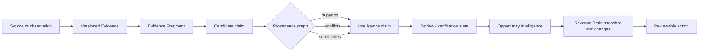

# Evidence and provenance model

- **Status:** Approved target model; WO-011 implements only the metadata envelope
  subset documented in the
  [Evidence foundation implementation guide](evidence-foundation-implementation.md)
- **Goal:** Let RevenueOS explain what it believes, why, what conflicts and how the
  conclusion was validated without pretending every source is equally authoritative

## Model overview

## Evidence envelope

Every evidence item should carry:

| Concern          | Target fields or relation                                                                              |
| ---------------- | ------------------------------------------------------------------------------------------------------ |
| Ownership        | tenant, author/origin organisation, access classification                                              |
| Business context | account, optional opportunity, optional Interaction, Capture Session                                   |
| Source           | source type, capture method, external system/object identity where applicable                          |
| Origin           | direct customer, salesperson reported, system metadata, imported external, seller prepared, AI derived |
| Time             | observed/captured time or range, received time, original timezone/clock quality                        |
| Storage          | object/storage reference or content record, checksum, encryption/key class, region                     |
| Governance       | retention class, policy/consent reference, legal/customer restriction labels                           |
| Processing       | received, processing, available, partial, failed, excluded, superseded or deleted                      |
| Validation       | unreviewed, verified wording, verified interpretation, disputed or not applicable                      |
| Lineage          | derived-from, supports, conflicts-with, corroborates and supersedes edges                              |
| Deletion         | source deletion state, downstream invalidation state, tombstone metadata                               |

Storage locations and signed URLs are internal. Product responses expose safe access
tokens/commands only when authorised and never log them.

## Source types

The taxonomy initially needs:

- online/mobile live recording;
- uploaded audio/video/transcript;
- live or final transcript;
- AI Debrief response;
- Voice Journal;
- user observation or quick marker;
- whiteboard/workshop/photo/diagram/business-card visual;
- presentation/proposal/RFP/contract/technical document;
- email or customer confirmation;
- CRM field or record snapshot;
- calendar metadata; and
- customer- or salesperson-confirmed action.

Type keys live in a versioned registry with allowed origin classes, retention
requirements, fragment locators and processing paths. A new source does not require
making every type equivalent.

## Typed evidence boundaries

### Recording

Recording is binary evidence with a session/chunk manifest, duration, codec and
completion/gap state. It is not a transcript. A recording may produce several
transcript versions.

### Transcript and segment

Transcript is text evidence that is either directly supplied or derived from a
recording. It retains source alignment, language, provisional/final state and
version. Transcript Segment is an Evidence Fragment with time/character locators,
diarisation label, optional verified participant and correction state. A diarisation
label is not a Contact identity.

### Visual and document evidence

Visual Evidence is an image/video asset with authorised capture context. OCR,
captions and object extraction are derived representations. Document Evidence has
document type, source, version/page structure and authority. A seller-prepared deck
cannot support customer intent merely because it was used in an interaction.

### User observation

User-entered text, Voice Journal and debrief responses are reported evidence. Store
the author, interaction relation and recency. Verification can confirm the user's
report or an interpretation; it cannot turn it into customer-authored evidence.

### System and imported evidence

Calendar/CRM metadata retains provider, external record version and field-level
authority. Imported evidence does not silently outrank a later user correction or
direct customer confirmation; precedence depends on the claim and configured source
ownership.

## Evidence Fragment

A fragment is the smallest citeable source region:

- audio/video time range;
- transcript segment or character range;
- image bounding region;
- document page/paragraph/range;
- email message/quoted portion;
- debrief question-response turn;
- quick marker timestamp; or
- structured external record and field.

Locators are typed/versioned rather than an unvalidated free-form JSON convention.
Fragments retain the source version so correction or deletion can invalidate exact
dependants.

## Claims and provenance edges

An intelligence claim is atomic enough to validate: a decision, objection,
stakeholder role candidate, requested item, timeline change or risk state—not an
opaque summary paragraph. A claim records capability/type, normalised subject,
value/state, valid time, current status and version.

Provenance edges have controlled semantics:

- `supports`: evidence is consistent with the claim;
- `corroborates`: an independent source supports an existing claim;
- `conflicts_with`: evidence supports an incompatible claim/state;
- `derived_from`: representation or candidate came from a source;
- `verified_by`: a user/customer verification event confirms wording or
  interpretation;
- `supersedes`: a later eligible version replaces an earlier one without erasing
  history; and
- `invalidated_by_deletion`: source loss prevents current use.

Every edge carries actor/process, timestamp, policy/version and optional bounded
explanation code. Free-form model rationale is not the authority for the edge.

## Confidence without false precision

Do not collapse confidence to one arbitrary percentage. Use separate explainable
axes:

### Origin class

- `direct_customer`: captured or customer-authored evidence;
- `salesperson_reported`: user recollection or observation;
- `system_metadata`: calendar/device/application facts;
- `imported_authoritative`: configured external source of truth;
- `seller_prepared`: seller-authored material; and
- `ai_inferred`: model/application interpretation only.

### Support class

- `single_source`;
- `corroborated` by an independent compatible source;
- `conflicting`;
- `unsupported` candidate; or
- `not_assessed`.

### Validation class

- `unreviewed`;
- `user_verified_wording`;
- `user_verified_interpretation`;
- `customer_confirmed` with attributable evidence;
- `disputed`; or
- `policy_rejected`.

### Freshness class

- `current` under capability policy;
- `stale`;
- `superseded`; or
- `deleted_source`.

The UI can combine these into language such as “Reported by you, corroborated by a
customer email, verified interpretation” while retaining each axis. Provider
probabilities, transcription confidence and speaker-match confidence remain
component signals and are never presented as a deal-win probability.

## From evidence to trusted intelligence

1. **Receive:** authenticate tenant, validate source/capture policy and create an
   immutable evidence version.
2. **Process:** create derived representations through idempotent jobs with bounded
   retries.
3. **Extract:** produce strict candidate claims with exact fragment citations.
4. **Validate:** application code checks schema, identifiers, source eligibility,
   same-tenant ownership and claim-specific constraints.
5. **Reconcile:** compare with current supported claims and mark new, consistent,
   changed, duplicate, conflicting or insufficient.
6. **Review:** obtain required human confirmation/correction without changing source
   origin.
7. **Promote:** select only eligible final claims for Interaction/Opportunity
   Intelligence and Revenue Brain.
8. **Act:** generate reviewable actions from validated customer-safe projections.

No source automatically grants action authority. Direct customer evidence can still
be ambiguous or out of date; reported evidence can still be useful when labelled.

## Conflict handling

Conflicts are first-class. The current claim may remain `disputed` with two branches
of support. Resolution requires one of:

- authoritative source precedence for the specific field;
- explicit user correction with retained origin/history;
- attributable customer confirmation;
- later evidence that explicitly supersedes the earlier state; or
- policy deciding that the claim remains unknown.

Newest does not always win. Absence does not mean resolution. An AI model cannot
resolve a factual conflict merely by choosing the more plausible statement.

## WO-013 reviewed reported evidence

AI Debrief and Voice Journal persist each deliberately supplied answer as unreviewed
`salesperson_reported`/`reported` Evidence plus a content-bearing Evidence Fragment.
Strict extraction creates candidates only. Complete user review promotes accepted or
edited candidates into new verified Evidence while retaining Capture Session,
fragment, original statement and reviewer/time lineage. Rejected candidates stay
rejected. Derived Interaction/Revenue Brain snapshots reference accepted Evidence IDs
and keep the visible label “Reported by you”; they never upgrade recollection to
customer-direct support. See [Candidate evidence and review](candidate-evidence-review.md).

## User verification

Verification is an append-only event bound to claim and evidence versions, user,
tenant, scope and meaning:

- wording/transcript correction;
- attribution confirmation;
- interpretation confirmation;
- dispute;
- exclusion; or
- customer-confirmation recording with its evidence reference.

Changing a claim creates a new version and invalidates dependent approvals. A user
cannot verify a cross-tenant source or a source they cannot access.

## Source deletion and retention

Maintain a source-to-derived dependency graph. On exclusion/deletion:

1. stop serving the source immediately;
2. mark dependent representations/claims ineligible;
3. invalidate current intelligence and approvals that require them;
4. recompose from remaining eligible evidence only when useful and authorised;
5. delete binary/content records according to the approved workflow;
6. retain only content-minimised audit/tombstone metadata allowed by policy; and
7. propagate provider/object-storage deletion and record outcome.

Backups, legal/customer holds and connector copies require documented, separately
reviewed behaviour. WO-010 does not provide legal advice.

## Revenue Brain boundary

Revenue Brain snapshots reference validated claim/artefact versions and their
evidence lineage. It does not copy all raw content or repeatedly reread raw sources.
A snapshot remains historically traceable; when a source is deleted, the product
must stop presenting unsupported content as current and show the deletion impact
under the approved immutable-history policy.

## Observability and evaluation

Safe measures include processing state, duration, size buckets, fragment/citation
coverage, validation outcome, correction category, conflict rate, deletion
completion and source-type adoption. Logs contain no evidence content or signed
locations.

Evaluate citation accuracy, source-class preservation, conflict recognition,
unsupported-claim rejection, cross-tenant isolation, deletion propagation and
customer-versus-seller attribution before a capability can promote claims.

## Related documents

## WO-014 reviewed visual evidence

Visual source ownership is now persisted separately from origin:
`customer_created`, `salesperson_created`, `jointly_created` or
`unknown_origin`. Provider candidates remain `ai_inferred`, initially
`unreviewed`, and use `direct`, `observed` or `context` support. User acceptance
creates verified Evidence without rewriting origin or ownership.

Seller-created presentation material is context only; business-card contact
details do not enter current intelligence; site photos use observed support.
Deleting a source suppresses derived current Opportunity/Revenue Brain reads.
See [Visual provenance rules](visual-provenance-rules.md).

- [Interaction domain architecture](interaction-domain-architecture.md)
- [Recording and transcription architecture](recording-and-transcription-architecture.md)
- [Interaction security, privacy and consent](interaction-security-privacy-and-consent.md)
- [AI system blueprint](../04-ai/ai-system-blueprint.md)
