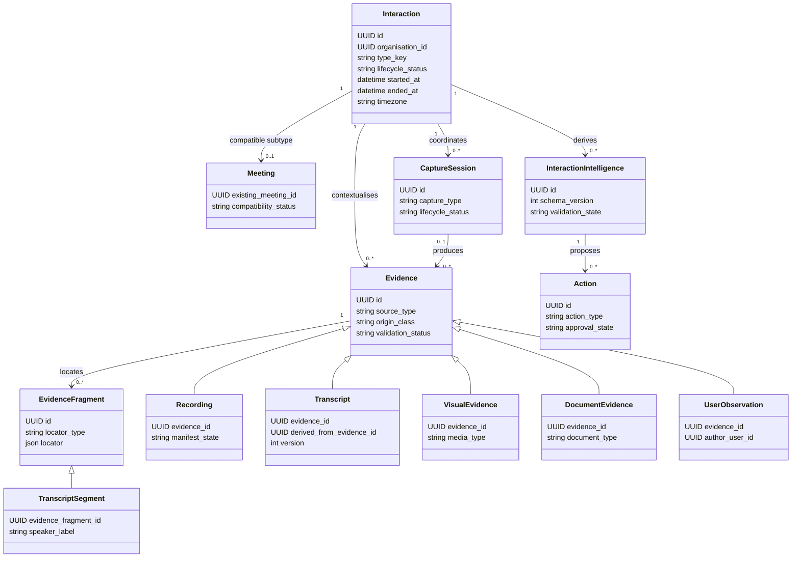

# Interaction domain architecture

- **Status:** Approved target architecture; WO-011 implements Interaction/Meeting
  compatibility and the Evidence/Capture Session foundation, WO-012 adds preparation,
  WO-013 executes reviewed AI Debrief/Voice Journal, WO-014 visual evidence and
  WO-015 consented recording/batch transcription. See the
  [current implementation guide](interaction-domain-implementation.md) and
  [AI Debrief guide](ai-debrief.md)
- **Decision:** Interaction is the source-neutral parent for future customer events;
  Meeting remains a compatible subtype aggregate during an additive migration
- **Architecture:** Extend the existing modular monolith, PostgreSQL, durable worker
  and provider ports

## Architectural recommendation

Add an Interaction domain rather than rename or generalise every Meeting table.
Interaction owns the customer-event lifecycle, type, time, account/opportunity
context and timeline identity. Meeting continues to own its current participant,
plain-text transcript and Meeting Intelligence contracts. A one-to-one compatibility
link makes each eligible Meeting one Interaction subtype without changing its public
ID.

New capture and evidence capabilities depend on Interaction. Existing Meeting paths
continue through adapters until their contracts can safely expose an optional
Interaction reference. This is a logical parent with an additive physical rollout,
not a big-bang inheritance hierarchy or a permanent adjacent silo.

WO-013 follows this boundary: debriefs are Capture Sessions owned by completed
Interactions, answers/fragments are Evidence, accepted candidate review produces
source-aware Interaction Intelligence, and an additive subtype extends the existing
Revenue Brain without changing Meeting Intelligence.

## Domain boundaries

This diagram is conceptual. Implementation work orders must choose exact models,
constraints and API contracts through migrations and ADRs.

## Aggregate responsibilities

### Interaction

Owns:

- tenant, account and optional opportunity context;
- extensible interaction type and type-version;
- lifecycle and planned/actual time range;
- timezone/display context;
- customer-facing participant references at a generic level;
- privacy/consent policy reference and restricted state;
- origin and external correlation identifiers; and
- soft deletion and metadata-only audit.

It does not own raw audio, transcript text, image bytes, document bodies, AI output or
external action authority.

### Meeting

Retains current Meeting metadata, participants, transcript and Meeting Intelligence
services/APIs during migration. Meeting-specific states and rules remain in the
Meeting domain until a separately approved work order generalises them. Existing
Meeting IDs remain stable and user-facing links do not change.

### Capture Session

Owns a bounded acquisition attempt:

- `recording`, `voice_journal`, `ai_debrief`, `visual_capture`, `quick_capture`,
  `transcript_upload`, `document_import` or another registry type;
- session lifecycle, device/client identity class, start/end and interruption state;
- policy/consent snapshot used for the attempt;
- idempotency key and expected capture parts;
- recover, finalise, abandon and delete transitions; and
- content-minimised operational telemetry.

AI Debrief is a Capture Session. Its questions/responses are evidence. Voice Journal
is a Capture Session producing reported evidence. Neither is a customer Interaction.

### Evidence and Evidence Fragment

Evidence is a source-neutral envelope. Typed detail records describe recording,
transcript, visual, document or observation properties without filling one wide
nullable table. Evidence Fragment identifies the exact source span: time range,
transcript offsets/segment, image region, document page/range, response turn or
metadata field.

Visual Capture belongs to Evidence and may be produced by a Capture Session. It does
not belong directly on Interaction. Recording is binary evidence plus a chunk
manifest. Transcript is evidence derived from recording or directly supplied. A
Transcript Segment is a fragment carrying timestamps and speaker/identity state.

### Interaction Intelligence

Interaction Intelligence groups independently versioned capability artefacts for one
Interaction and eligible evidence set. Existing `AIJob`/`AIArtifact` infrastructure
should be extended rather than replaced. New source-neutral artefacts reference an
Interaction and evidence-set fingerprint while existing artefacts retain Meeting and
transcript references.

Each capability has explicit source eligibility, schema, validation policy and
partial behaviour. The aggregate is a read model; it does not collapse independent
artefact persistence or provenance.

### Opportunity Intelligence and Revenue Brain

Opportunity Intelligence is a read/reconciliation boundary across validated
Interaction Intelligence. It should not become a second mutable fact store. Revenue
Brain stores immutable or append-only versioned compositions and supported changes,
with evidence references. New snapshot versions may reference Interaction; old
meeting snapshots remain unchanged.

### Action

Action represents an internal task, draft, proposal or approved external execution.
It consumes validated intelligence references. Approval remains version-, tenant-,
actor- and destination-bound. The AI provider never assigns authority.

## Interaction taxonomy

Use a code/registry-controlled `type_key` plus stable `family`, not a database enum
that requires migration for every product experiment.

| Family                  | Initial type keys                                      | Generic behaviour                     | Specialised behaviour                          |
| ----------------------- | ------------------------------------------------------ | ------------------------------------- | ---------------------------------------------- |
| `meeting`               | `online_meeting`, `face_to_face_meeting`, `phone_call` | time, participants, evidence, debrief | Meeting compatibility, platform/phone metadata |
| `presentation`          | `sales_presentation`, `technical_presentation`         | audience, evidence, review            | deck context and seller/customer separation    |
| `collaborative_session` | `workshop`, `discovery_workshop`                       | participants, outputs, actions        | visual artefacts and consensus/owner review    |
| `field_interaction`     | `site_visit`, `site_inspection`                        | location label, offline capture       | safety/photo restrictions                      |
| `relationship_event`    | `executive_lunch`, `informal_conversation`             | minimal customer event                | discreet no-recording default                  |
| `event_interaction`     | `conference_interaction`, `trade_show_interaction`     | fast association                      | event context and duplicate handling           |
| `digital_exchange`      | future `email_exchange`, `document_exchange`           | meaningful customer event             | adapter and authoritative-source rules         |

The registry defines label, allowed lifecycle, compatible capture modes, required
fields and product capabilities by version. Unknown future keys are rejected until
the deployed registry supports them; historical keys remain readable.

## Conceptual invariants

- Every tenant-owned row and storage key includes `organisation_id`.
- Every relationship uses a composite tenant foreign key where PostgreSQL can
  enforce it.
- Runtime queries carry explicit organisation predicates and forced RLS remains
  defence in depth.
- Account, opportunity, participants, evidence, artefacts and actions must belong to
  the same tenant as the Interaction.
- A Meeting links to at most one Interaction; a Meeting-type Interaction links to at
  most one existing Meeting.
- An Interaction can exist without capture or intelligence.
- A Capture Session can fail or be abandoned without changing the Interaction to a
  failed state.
- Evidence is immutable in identity; corrections append a new version and
  supersession relation.
- Derived evidence and intelligence cannot outlive or remain retrievable after
  source deletion unless a documented policy explicitly permits retained
  content-minimised metadata.
- User verification never changes evidence origin.
- Provisional intelligence cannot be selected as final Revenue Brain input.
- External action requires an eligible, current approval.

## Lifecycle separation

Suggested conceptual states:

- Interaction: `planned`, `ready`, `in_progress`, `ended`, `closed`, `cancelled`,
  `deleted`;
- Capture Session: `created`, `capturing`, `interrupted`, `uploading`, `finalising`,
  `complete`, `partial`, `abandoned`, `failed`, `deleted`;
- Evidence: `received`, `processing`, `available`, `partial`, `failed`, `excluded`,
  `superseded`, `deleted`;
- Intelligence: `not_requested`, `queued`, `processing`, `provisional`,
  `review_required`, `validated`, `disputed`, `superseded`, `failed`, `deleted`; and
- Action: existing proposal/approval/execution semantics extended as required.

Implementation must define deterministic allowed transitions and idempotency. The
same string need not become one shared enum across aggregates.

## API evolution

Introduce versioned `/api/v1/interactions` endpoints only in WO-011. Keep all
`/api/v1/meetings` endpoints and response shapes. Meeting responses may later add an
optional additive `interactionId`; Interaction responses can expose an optional
`meetingId` compatibility link. No route redirects or ID substitution are needed.

New capture routes are nested under Interaction or Capture Session, not Meeting,
for example conceptually:

- create/read/update an Interaction;
- begin/finalise/abandon a Capture Session with an idempotency key;
- register/upload/finalise Evidence;
- review Interaction Intelligence; and
- read the Interaction Timeline.

FastAPI/Pydantic/OpenAPI remains canonical and `packages/shared` changes with each
approved contract. Browser requests never choose a tenant ID.

## Persistence and services

Stay in the modular monolith. Add focused repositories and services inside the API
and reuse the existing PostgreSQL durable worker for bounded asynchronous stages.
Object storage is required only when binary capture begins; it belongs behind a
tenant-aware storage port. A message broker, Redis, microservice or streaming stack
is not required for the debrief MVP.

Likely modules in later work include Interaction service/repository, Capture Session
service, Evidence service/repository, provenance/reconciliation policy and
Interaction Intelligence adapter. These are architecture boundaries, not authorised
implementation names.

## Observability

Log/request telemetry may contain tenant-scoped identifiers, source type, byte/time
counts, state, duration, retry class and request ID. It must not contain recordings,
transcripts, images, documents, debrief responses, prompts, output content, signed
URLs, customer names or participant names.

Audit source receipt, policy/consent snapshot, state transitions, review,
verification, exclusion, supersession, deletion, action approval and external
execution using content-minimised metadata.

## Explicitly not in WO-011 by default

- recording/transcription;
- new AI capability prompts or schemas;
- live intelligence;
- mobile code;
- integrations;
- historical Meeting artefact rewriting;
- Revenue Brain snapshot rewriting; and
- removal or renaming of Meeting tables/APIs.

## Related documents

## Implemented WO-014 visual capture

`visual_capture` is now an implemented Capture Session type. Its source Evidence
owns the visual envelope; `VisualAsset` owns private-storage metadata and
source ownership; `VisualCandidateEvidence` owns strict AI interpretation and
review state. Accepted candidates may create schema-version-2 Interaction
Intelligence snapshots. Current consumers reject snapshots whose source
Evidence is deleted, excluded or no longer verified.

This implementation retains the planned separation between Capture,
Intelligence and Action. It does not authorise a general media aggregate.

## Implemented WO-015 recording capture

`live_audio_recording`, `uploaded_audio_recording` and
`imported_audio_recording` are implemented Capture Session types. The focused
Recording Session owns consent/lifecycle and the private chunk manifest; a final
transcript Evidence record owns the usable source. Immutable Transcript Versions
and Segments preserve source/time trace while the current Meeting Transcript stays
the compatibility read model for existing intelligence. Recording remains optional
and adds no new customer Interaction subtype, native client, bot or telephony path.

- [Evidence and provenance model](evidence-and-provenance-model.md)
- [Interaction Intelligence migration strategy](interaction-intelligence-migration-strategy.md)
- [Recording and transcription architecture](recording-and-transcription-architecture.md)
- [ADR 0026](../08-decisions/0026-interaction-intelligence-platform.md)
## Implemented WO-019 document and email sources

Documents and emails use `CaptureSession` and `Evidence` without fabricating a
Meeting or Interaction: `interaction_id` is nullable for these two deliberate
source imports. `DocumentSource`/`DocumentFragment` and `EmailSource` own source-
specific data; `SourceCandidateEvidence` separates AI interpretation from source
origin; immutable `RevenueBrainSourceSnapshot` rows carry only reviewed evidence
references downstream.

Every source must still attach to at least one real tenant-owned account,
opportunity or optional Interaction. Composite tenant foreign keys and explicit
repository predicates prevent cross-organisation attachment. Documents use the
existing private-storage adapter; email content remains in PostgreSQL. Neither
path changes the Meeting compatibility model.
