# Interaction Intelligence migration strategy

- **Status:** Approved migration direction; its WO-011 foundation is implemented in
  `0021_interaction_domain_foundation` and documented in
  [migration and compatibility notes](interaction-migration-and-compatibility.md)
- **Decision:** Add Interaction as the logical parent, preserve Meeting IDs/APIs and
  transition through compatibility links and adapters

## Why an additive migration

The current Meeting domain, ten intelligence capabilities, Opportunity Workspace and
Revenue Brain snapshots are implemented and tenant-safe. Renaming every Meeting
table, route, schema, prompt and UI surface would create a large correlated failure
and rollback surface without delivering face-to-face value. Keeping Interaction as a
permanent adjacent silo would instead duplicate timelines, intelligence and memory.

The safe path is additive: introduce the source-neutral parent and evidence model,
link current meetings, then move consumers one boundary at a time.

## Staged transition

```mermaid
flowchart LR
    S0["Stage 0: Meeting remains current source"] --> S1["Stage 1: add Interaction + compatibility link"]
    S1 --> S2["Stage 2: new Meeting creates linked Interaction"]
    S2 --> S3["Stage 3: backfill historical links in bounded batches"]
    S3 --> S4["Stage 4: Interaction Timeline reads both through adapter"]
    S4 --> S5["Stage 5: new capture/intelligence uses Interaction"]
    S5 --> S6["Stage 6: Meeting APIs remain compatibility surface"]
    S6 --> S7["Later: deprecate only proven redundant internals"]
```

Each implementation stage requires its own migration, regression suite and rollback
plan. WO-010 authorises none of them.

## Target compatibility relation

Create an `Interaction` for each eligible Meeting and a tenant-safe one-to-one
relation. The exact physical form—nullable `meetings.interaction_id` or a dedicated
link table—must be chosen in WO-011 after assessing lock/backfill and downgrade
behaviour. In either case enforce:

- same `organisation_id` on both sides through composite foreign keys;
- one Interaction per Meeting and at most one Meeting per Interaction;
- interaction family/type compatible with Meeting;
- soft-delete visibility consistent across the adapter; and
- deterministic, idempotent creation/backfill.

A dedicated link table minimises modification of the mature table and supports
incremental backfill; a nullable Meeting foreign key makes the target parent easier
to query. WO-011 should prefer the smallest option that preserves forced RLS and
portable migration tests.

## What remains unchanged

- Meeting UUIDs and `/api/v1/meetings` routes;
- Meeting participants and plain-text Transcript domain;
- current Meeting Intelligence job/artefact schemas and endpoints;
- current Opportunity Workspace response contract and latest-meeting selection;
- current Revenue Brain snapshot/insight rows and their immutable references;
- provider, prompt and worker behaviour;
- current forced RLS, audit and retention behaviour; and
- migration `0020_private_beta_readiness` as the pre-Interaction head.

## What becomes generic

Only after separate work orders:

- customer-event lifecycle and timeline identity;
- planned/actual time and interaction type;
- capture sessions;
- source-neutral evidence and fragments;
- post-interaction review;
- Interaction Intelligence aggregation;
- preparation brief inputs; and
- future Revenue Brain snapshot composition.

## What remains Meeting-specific

- existing Meeting CRUD and status semantics;
- current participant aggregate until a generic participant model is proven;
- current singular pasted transcript contract;
- current transcript-revision-bound capability artefacts;
- Meeting Detail workspace; and
- platform-specific online meeting metadata added by later integrations.

## Deprecation posture

Nothing is removed in WO-011. Deprecation begins only after:

- every active Meeting has a trustworthy Interaction link;
- all current API clients use an additive contract safely;
- the timeline and Workspace read paths are equivalent under tenant and deletion
  tests;
- rollback no longer needs the old path; and
- an approved ADR/work order names the exact contract and support window.

“Meeting” remains a valid product term and subtype even after generic Interaction
APIs exist. The goal is not to erase meetings.

## Write strategy

Avoid uncontrolled long-term dual-write. In the first stage, one domain service owns
the transaction that creates a new Meeting and its Interaction/link. Existing
Meeting writes continue to the Meeting model; the adapter projects only shared
fields. When Interaction becomes authoritative for a generic field, switch that
field through a versioned migration and single write owner with reconciliation
telemetry.

For older application versions during deployment, nullable/additive schema and
server defaults must keep writes valid. Do not make an Interaction link mandatory
until all writers and historical rows are ready.

## Historical backfill

Backfill in bounded, restartable batches with an idempotency key derived from tenant
and Meeting ID. Copy only generic metadata; do not copy transcript text or artefact
content. Preserve Meeting dates/timezone knowledge and label unknown timezone rather
than infer it. Record counts and safe IDs, never content.

Validation compares:

- eligible active/deleted meeting counts and link counts by tenant;
- account/opportunity/participant metadata projection;
- chronological ordering and timezone display;
- soft-deletion visibility;
- cross-tenant rejection; and
- idempotent rerun.

Rollback can ignore/remove links and new Interaction rows while leaving Meeting,
artefacts and snapshots untouched, subject to a documented decision about new
Interaction-only customer data created after activation.

## API compatibility

Existing Meeting routes accept and return Meeting IDs. Add `interactionId` only as
an optional response field when approved. Interaction routes return their own ID and
may include an optional `meetingId`. UI links continue to use Meeting routes for
historical/current Meeting Detail.

Do not alias IDs, redirect one UUID namespace to another or accept a Meeting ID where
an Interaction ID is required without an explicit adapter. Safe errors remain
content-minimised and cross-tenant identifiers return the established safe response.

## AI artefact compatibility

Existing AI artefacts retain `meeting_id`, transcript identity/version, prompt and
schema trace. New Interaction Intelligence does not mutate them. A source-neutral
aggregate adapter can treat each eligible current Meeting artefact as supporting one
linked Interaction.

New source-neutral capability execution uses an Interaction ID plus an immutable
evidence-set fingerprint and evidence references. If a later artefact schema reuses a
current capability meaning, it receives a new schema/prompt version and migration
adapter. It does not rewrite the current row or pretend reported evidence came from a
transcript.

## Opportunity Workspace continuity

Opportunity Workspace continues selecting and showing the latest associated Meeting
exactly as it does today. Add an Interaction Timeline beside or beneath that surface
only after its adapter is proven. Later, “latest interaction” and “latest meeting”
can coexist because a presentation or site visit may be newer than the latest
Meeting.

Generic opportunity intelligence should aggregate validated Interaction
Intelligence through a new read model. It must not silently reinterpret the current
latest-meeting fields. API additions use new named fields or endpoints.

## Revenue Brain continuity

Current `RevenueBrainSnapshot` and `RevenueBrainInsight` rows remain immutable and
Meeting-based. Historical snapshots appear under linked Interaction timeline entries
through a read adapter.

A future snapshot schema version can reference Interaction and source-neutral
artefact/claim versions. Longitudinal reasoning selects compatible versions or uses
an explicit version bridge. It never rewrites historical content. Comparisons across
old and new snapshot versions require a separately tested normalised capability
projection and must preserve origin/provenance differences.

Deletion uses the approved source-to-derived graph. Removing an Interaction link
must not orphan or expose a Meeting snapshot across tenants.

## Read transition and reconciliation

Use staged reads:

1. Meeting-only current read;
2. shadow Interaction projection compared in telemetry/tests, not exposed;
3. combined Interaction Timeline with Meeting adapter;
4. Interaction-first generic read with explicit Meeting detail links; and
5. eventual removal of redundant internal projection only after an approved gate.

Do not return different data nondeterministically by feature flag. Server flags gate
whole, tested surfaces and fail closed. Reconciliation logs contain counts/states,
not customer content.

## Rollout gates

- PostgreSQL migration upgrade/downgrade/re-upgrade and Alembic head check;
- forced RLS and non-bypass runtime role tests;
- cross-tenant relation and storage-key tests;
- old-client/new-schema and new-client/old-feature-state compatibility tests;
- historical backfill idempotency and bounded locking;
- Meeting CRUD/participants/transcript/intelligence regression suite;
- Opportunity Workspace exact current-behaviour regression;
- Revenue Brain immutable-history regression;
- deletion/retention/export propagation; and
- measured query count and performance.

## Explicitly rejected

- renaming all Meeting tables/routes/classes in one migration;
- copying every Meeting artefact into a new Interaction artefact table;
- rewriting historical Revenue Brain snapshots;
- indefinite two-way dual-write with no owner;
- database inheritance or one giant nullable activity table;
- generic “activity” records that conflate capture sessions with customer events; and
- removal of Meeting terminology from the product.

## Related documents

- [Interaction domain architecture](interaction-domain-architecture.md)
- [Evidence and provenance model](evidence-and-provenance-model.md)
- [Opportunity Workspace](opportunity-workspace.md)
- [Revenue Brain foundation](revenue-brain-foundation.md)
- [ADR 0026](../08-decisions/0026-interaction-intelligence-platform.md)
