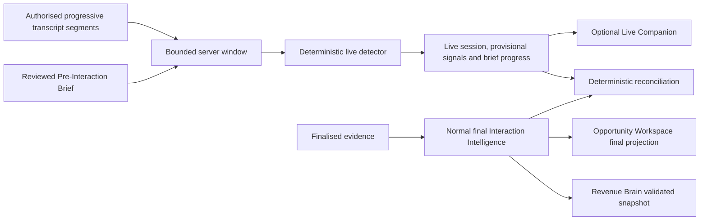

# Live Intelligence provisional-versus-final architecture

## Decision boundary

WO-020 introduces a separate tenant-owned live aggregate. It deliberately does not
extend `InteractionIntelligenceSnapshot`, `RevenueBrainInteractionSnapshot` or the
Opportunity Workspace final read model with provisional state.

There is no edge from the live aggregate to Opportunity Workspace final intelligence
or Revenue Brain. Reconciliation annotates the live record; it does not promote a
live statement into either final store.

## Live aggregate

`LiveInteractionSession` owns the source reference, server cursor, processing counts,
status, retention expiry and optional final-intelligence reconciliation reference.
It has one set of `LiveProcessingWindow` records, `ProvisionalSignal` records and
`LiveBriefProgress` items. All carry organisation scope and forced PostgreSQL RLS.

The state sequence is:

`active → processing → active`, then `stopped → completed`, with safe `failed` and
retention-driven `expired` states. Interaction completion locks and freezes an
active/processing session in the same transaction as the lifecycle change.

## Final hand-off

After completion, the existing authorised evidence workflow finalises the recording,
transcript, imported source or reviewed debrief. Existing normal intelligence paths
remain responsible for final validated snapshots and their downstream read models.
When a final snapshot exists, explicit reconciliation classifies every eligible live
signal as `confirmed`, `revised`, `unsupported` or `unresolved`.

Final evidence wins. The live statement and its outcome remain available for trust,
gap-fill and audit until retention expiry. A dismissed or superseded result is not
silently converted into a final claim.

## Provider boundary

The current `LiveSignalProvider` is a deterministic, no-network adapter with strict
typed input/output. The external-live-AI flag is separately default-off and start
fails safely because no external adapter is configured. This prevents a general AI
or streaming-provider integration from being implied by the interface.

See [ADR 0032](../08-decisions/0032-separate-polled-live-intelligence-aggregate.md).
