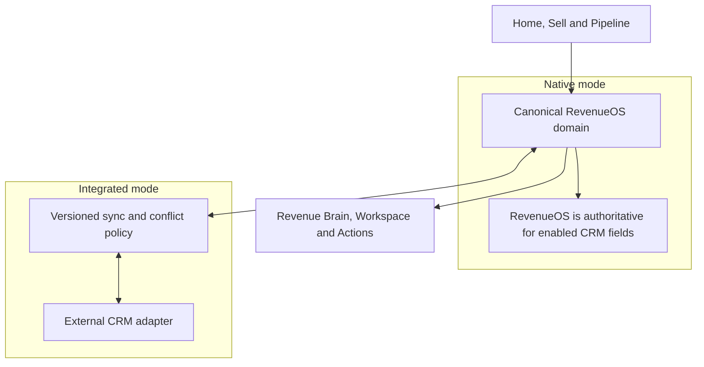

# Native CRM architecture

- **Status:** Proposed RevenueOS CRM add-on architecture; not implemented
- **Product decision:** CRM enhances Sell and Pipeline; it is not a separate top-level app

## Purpose

RevenueOS CRM is the minimum relationship and pipeline system of record needed by a
team that chooses to run natively. It reuses Sales Brain rather than placing a second
CRM database beside it. Teams with an external CRM use integrated mode, where source
authority and sync policy are explicit.

## Reused canonical foundation

CRM must reuse Organisation, User/membership, Company, Contact, Opportunity, Task,
Meeting/Interaction, Evidence, AI artefact/Revenue Brain projections and Action
concepts. It must not fork `CRMCompany`, `CRMContact` or a second Opportunity model.
Existing APIs and routes remain backward compatible.

## Future domain additions

| Concept                 | Purpose and boundary                                                                                       |
| ----------------------- | ---------------------------------------------------------------------------------------------------------- |
| `Lead`                  | An assigned pursuit before qualification; links to a Company/Contact or staged prospect, never copies them |
| `Product`               | Organisation sales-catalogue item with stable identity; not inventory or billing                           |
| `OpportunityProduct`    | Opportunity line association, quantity/value and source; not full CPQ                                      |
| `StageDefinition`       | Versioned organisation pipeline stages and transition policy                                               |
| `StageHistory`          | Effective stage movement, actor/source and correction history                                              |
| `CustomFieldDefinition` | Typed, scoped extension metadata with limits and lifecycle                                                 |
| `CustomFieldValue`      | Validated value attached to an approved entity type                                                        |
| `ImportJob`             | Idempotent CSV/provider import lifecycle, mapping version and safe error report                            |
| `SyncBinding`           | External system/record identity, authority policy, cursor/version and sync health                          |

These concepts are planning vocabulary. Tenant isolation requires organisation scope
on every row, unique constraint, query, import and sync identifier.

## Minimum lovable CRM

The first useful add-on should include:

- simple lead acceptance/qualification into canonical Company, Contact and Opportunity;
- configurable but bounded stages, list/board pipeline, filters, owner, value, close
  date, next action, risk and methodology summary;
- Company, Contact and Opportunity create/edit with duplicate handling;
- Opportunity products sufficient for value composition;
- stage history and core field history;
- reviewed Revenue Brain proposals that reduce manual updates;
- CSV import with dry run, mapping, validation and rollback/recovery plan;
- basic role/permission and source-authority controls.

It excludes marketing automation, service desk, billing, inventory, unrestricted
objects, formula language, page-layout builder and Salesforce Flow parity.

## Source authority modes

Native mode makes RevenueOS authoritative for the enabled CRM fields. Integrated mode
assigns authority by field family: external-authoritative, RevenueOS-authoritative or
reviewed bidirectional. Authority must be visible in edit and error states.

Sync uses provider adapters, stable external IDs, cursors/webhooks as appropriate,
idempotent upsert, tombstone/deletion policy, retries and reconciliation. Conflicts
are never silently last-write-wins for consequential fields. Existing Action review
and execution contracts govern outbound updates. Provider availability does not block
read-only Core access to the last safely stored state.

## Typed custom-field boundary

Supported types begin with short/long text, number, currency, date, boolean, single
select, multi-select and a bounded entity reference. A definition declares entity
type, stable key, label, help, requiredness, options, sensitivity and lifecycle.
Limits apply per organisation and entity; indexed/filterable fields need an explicit
policy. Published keys are stable and type changes use migration/version rules.

Custom fields cannot execute code, alter tenant scope, create arbitrary joins,
replace canonical semantics, contain secrets, modify authorisation or become a
general schema/no-code engine. Core fields remain first-class and normalised.

## Limited workflows

Only evidence-backed, bounded workflows should be considered: stage-entry checklist,
required review, task/Action proposal, reminder and approved field update. Triggers,
conditions and effects come from a small typed catalogue. Every consequential effect
uses the Action/Execution safety model. No arbitrary scripts, loops, HTTP calls or
unbounded recursive automation.

## UX and entitlements

CRM does not appear in permanent navigation. Enabled capabilities enrich Sell and
Pipeline; configuration lives in Settings. Without CRM, users retain the current
Core relationship/Opportunity experience and external-system links. A contextual
module explanation may appear where a CRM-only edit or pipeline capability is
relevant, without repeated ads or dead navigation.

## Security and operation

Derive organisation from verified auth, apply RLS defence in depth and test every
relationship/import/sync operation across tenants. Imports require size/type limits,
malware-safe handling where relevant, duplicate preview and downloadable safe error
reports without leaking other rows. Sync credentials use secret managers and never
enter application rows/logs.

Observability records connector, entity class, counts, cursor/version, latency and
safe error codes—not record contents or provider payloads. Audit source, actor,
authority and before/after metadata for consequential changes without copying
sensitive content.

## Long-term possibilities, not commitments

Deeper forecasting fields, richer product catalogues, governance, advanced imports
and selected enterprise connectors may follow evidence. RevenueOS should not become a
full Salesforce clone; the durable advantage remains the connected Evidence → Brain
→ Action workflow.
