# Outreach, campaign and event architecture

- **Status:** WO-029 individual outreach and WO-030 bounded Campaign subset implemented; Event subset remains future
- **Boundary:** Human-governed business outreach, not autonomous bulk messaging

## Relationship to current foundations

Engage should build on the Action Layer's review-first proposal lifecycle and the
Execution Foundation's durable, idempotent provider boundary. Research findings can
inform a draft, but only accepted canonical Company/Contact context, authorised
sources and applicable outreach policy may support execution.

```mermaid
flowchart LR
    F["Find and research"] --> V["Verify sources and contact point"]
    V --> S["Save or link Company and Contact"]
    S --> D["Draft person-specific outreach"]
    D --> R["Human review and exact approval"]
    R --> X["Policy and suppression checks"]
    X --> E["Idempotent provider execution"]
    E --> I["Interaction and provider receipt"]
    I --> O["Qualify or create Opportunity"]
    O --> B["Revenue Brain"]
```

## Conceptual model

| Concept                        | Responsibility                                                              |
| ------------------------------ | --------------------------------------------------------------------------- |
| `Campaign`                     | Organisation-scoped objective, audience policy, owner, state and limits     |
| `Sequence` / `SequenceVersion` | Immutable ordered communication plan and published version                  |
| `SequenceStep`                 | Channel, delay, content policy, stop rule and approval requirement          |
| `Enrolment`                    | Contact/Lead participation, consent basis, current step and terminal reason |
| `OutreachMessage`              | Exact proposed content, recipient, sender/channel and source context        |
| `SuppressionEntry`             | Do-not-contact, unsubscribe, bounce, complaint or policy block              |
| `DeliveryAttempt`              | Idempotency key, provider reference, status and safe receipt metadata       |
| `SalesEvent`                   | Organisation-managed event purpose, date, authority and lifecycle           |
| `EventAttendee`                | Authorised attendee association, invitation/contact status and provenance   |

WO-030 implements Campaign, CampaignVersion, SequenceStep, explicit audience,
enrolment and enrolment-step records. Membership, uniqueness, idempotency and all
reads are organisation-scoped. Canonical Contact is required; snapshots support
audit/history and live Contact references may be nulled on privacy deletion. Event
concepts remain future planning only.

## Sequence lifecycle

`draft/ready → active ↔ paused → completed/stopped`, with `needs_attention` as a
fail-closed halt. Publishing freezes CampaignVersion, audience and sequence with
database immutability guards; privacy reference scrubbing and approved retention
deletion are the explicit exceptions.

The default individual flow is draft → review exact recipient/content/channel →
approve → preflight → execute → receipt. Campaigns may allow an authorised approver
to approve a bounded batch only when every message is rendered, inspectable and still
passes policy at execution. Material personalisation or recipient changes invalidate
approval.

Stop conditions include reply, unsubscribe, invalid contact, complaint, hard bounce,
Opportunity creation, manual stop, policy breach, campaign limit or expired purpose.
Pause and stop are immediate control-plane operations; queued work must re-check them.

## Execution boundary

Use the existing simulation-first, provider-agnostic execution architecture:

- a proposal stores exact reviewed input and expiry;
- approval records actor and version without acting by itself;
- execution checks tenant, membership, entitlement, permission, unchanged content,
  suppression, frequency, sender configuration and idempotency;
- the adapter receives only the minimum required provider payload;
- safe receipts record provider reference/status, not full message or credentials;
- reconciliation handles uncertain outcomes before retrying.

Retries may never duplicate a send. Test mode and production mode are visibly
distinct. Missing identity, contact authority or provider state fails closed.

## Responsible outreach policy

The organisation must establish lawful basis and jurisdiction-specific requirements;
product design is not legal advice. Policy supports opt-out/unsubscribe, suppression,
do-not-contact, frequency caps, quiet hours, sender/domain reputation limits, valid
sender identity, complaint/bounce stops, approved geography/channel and retention.

RevenueOS must not:

- treat a verified address as permission to contact;
- treat public information or event attendance as blanket marketing consent;
- send unbounded autonomous campaigns;
- fabricate personal familiarity or conceal AI involvement where disclosure applies;
- evade provider, platform, anti-spam or privacy requirements;
- optimise for send volume at the expense of legitimate conversations.

Suppression is checked during audience construction, approval and immediately before
execution. Unsubscribe or do-not-contact changes propagate to every active enrolment.

## Event Intelligence

Before an event, Engage can support an authorised attendee import, duplicate/link
review, account/person research, meeting goals and a bounded outreach plan. During
the event it can offer fast notes, business-card/contact review and follow-up markers.
Afterward it can draft person-specific follow-up, capture Interaction Evidence and
propose Lead/Opportunity creation.

Attendee files require documented authority, minimisation, retention and deletion.
An attendee is not silently promoted to a Contact or enrolled in a sequence. Badge,
location or attendance data must not become employee or person surveillance.

## Service and API boundaries

An Engage module owns campaign/sequence/enrolment policy. The Action service owns
proposal and approval invariants. The execution service owns dispatch, idempotency
and receipts. Provider adapters isolate email/calendar/communication APIs. Interaction
and Opportunity services own accepted outcomes. Future resources should expose
explicit lifecycle transitions rather than generic state mutation.

Observability uses safe counts, transition/error codes, latency, suppression reasons
and provider receipt categories. It excludes recipient details, message content,
research, prompts and credentials. Tests cover cross-tenant isolation, version
invalidation, stop races, suppression propagation, idempotent retry and uncertain
provider outcomes.

## Explicitly out of scope

WO-030 implements only the bounded Campaign subset documented in
[Campaign domain architecture](campaign-domain-architecture.md). Generic marketing
automation, Event Intelligence, inbound suites, purchased-list blasting, arbitrary
workflows, autonomous cold calling and an AI SDR remain out of scope.
