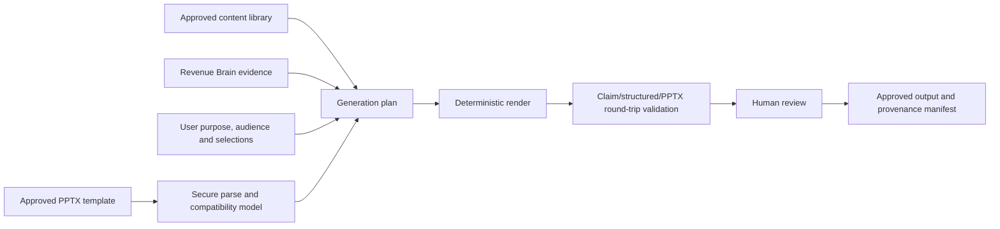

# Presentation, proposal and template architecture

- **Status:** WO-032/033 PPTX and Business Case slice; WO-039B profile/output/download hardening implemented; DOCX/proposal remain future
- **Output direction:** Approved-template-constrained editable PPTX

## Architecture principle

Create combines approved organisation assets with bounded authorised Account context.
The current implementation uses a deterministic planner/composer and makes no AI
provider call. It must not invent customer facts, commercial terms, pricing or ROI
inputs.

## Conceptual model

| Concept                                    | Responsibility                                                                |
| ------------------------------------------ | ----------------------------------------------------------------------------- |
| `CreateTemplate` / `CreateTemplateVersion` | Tenant template and immutable uploaded/approved version                       |
| `CreateTemplateSlide`                      | Structural manifest, policy, safety and administrator review per source slide |
| `CreateApprovedContentItem`                | Approved reusable text materialised from an approved source slide             |
| `CreatePresentation`                       | Account-bound brief, deterministic plan and current lifecycle                 |
| `CreatePresentationVersion`                | Immutable source context, claim manifest, render state and private PPTX key   |
| `CreateDownloadGrant`                      | Hashed one-time user/tenant/version/approval-bound download authority         |
| `CreateUsageCounter`                       | Atomic UTC-day generation reservations for organisation and user scopes       |

Migration `0041_create_studio` owns these tables. Every row, unique key, relationship
and storage path includes organisation scope. Explicit repository predicates and
forced PostgreSQL RLS apply defence in depth; the worker sets trusted transaction-local
tenant context and claims bounded work through a `SECURITY DEFINER` eligibility
function that returns opaque organisation IDs only.
Migration `0049_create_trust` adds current-profile validation metadata and the
tenant-owned forced-RLS download-grant table without changing this modular-monolith
boundary.

## Template ingestion

1. Validate declared type, `.pptx` extension, checksum, size and ZIP signature.
2. Reject unsafe names, duplicate entries, encryption, unsupported compression,
   decompression bombs and bounded entry/XML/media/character limits before parsing.
3. Reject executable content, macros, external relationships,
   embedded packages and unsupported active objects.
4. Reject embedded fonts, SVG and unrecognised media signatures; allow bounded
   PNG/JPEG/GIF only.
5. Parse supported PPTX structures into typed slide/text-block metadata; do not
   execute Office, scripts, links or embedded content.
6. show structural text, hidden/notes warnings and review controls;
7. require an authorised human to publish an immutable template version.

The repository does not include an antivirus service. The strict format parser is a
defence boundary, not a malware-scanner claim; target deployment may add an approved
scanner before object persistence without changing the domain contract.

Raw uploads and generated files stay in private object storage with short-lived
authorised access. Metadata lives in PostgreSQL; Alembic remains the future schema
authority. Processing is idempotent and follows the existing job lifecycle rather
than introducing a separate service by default.

## Approved content library

Content items have type, title, body/asset reference, permitted use, product/region,
audience, owner, review/expiry dates and version. They may include corporate facts,
case studies, product descriptions, biographies, proof points, approved pricing
language, disclosures and brand assets. Expired or withdrawn items are excluded from
new generations without erasing older manifests.

This is a bounded sales-content library, not a generic document-management system.
Folder trees, collaborative authoring and enterprise records management remain out of
scope unless later evidence justifies a separate decision.

## Generation contract

The guided request requires an Account, objective, audience and approved template;
Opportunity and focus are optional. A structured planner assigns every material
statement to visible source classes:

1. **Customer Evidence** — cited Revenue Brain Evidence;
2. **Approved corporate content** — cited content-item version;
3. **User input** — supplied and confirmed for this request;
4. **User edited** — bounded seller text that becomes a pending reviewed claim.

The `customer_safe_presentation_context_v1` builder reads an allow-list only. It never
passes raw database rows or serialises transcripts, notes, recordings, opportunity
financials, probability/forecast, methodology scores, internal risks/coaching,
contactability or suppression. Current public Prospect observations remain labelled
`prospect_public`; customer Evidence remains source-labelled and lifecycle checked.

The deterministic `deterministic_pptx_v1` renderer selects current-profile-compatible
approved source slides,
keeps source masters/layouts/media, replaces only explicitly editable text shapes,
and writes a new PPTX. It removes every unselected slide relationship plus notes,
comments, custom properties, thumbnails and source-derived application-property title
lists; it resets customer-visible core properties. It does not run LibreOffice or
Microsoft Office in production. Structural review is the product preview; it
explicitly does not claim pixel identity. The actual saved file is reparsed through
profile v1 and checked for every replacement, required/exact text, manifest equality,
unsafe relationship/metadata absence and internal identifiers. Local deck rendering
is a development-only visual QA step.

The claim manifest records exact claim text, content type, origin, support state,
customer-safe classification, source IDs/labels, freshness, paraphrase permission,
exact-text requirement and review state. Approval revalidates every referenced source.
Regeneration/editing creates a new version and cannot overwrite an approved version.

## Proposals, pricing and ROI

Proposal generation follows the same architecture with stronger controls around
scope, legal text, price and approval. Pricing must come from an authorised product
or user-supplied input and remain distinguishable from generated narrative. Create
does not become a CPQ or contract-signing system in the initial scope.

ROI models contain named inputs, units, source (`customer_evidence`,
`approved_default`, `user_input`), formula version, assumptions and sensitivity
ranges. Calculations are deterministic and reproducible. AI may explain the result or
identify a missing input; it cannot invent the numbers or conceal assumptions.

## Security, privacy and operation

- Validate tenancy at metadata lookup and object access; Create uses authenticated
  one-time application downloads with a separately returned secret hashed at rest,
  never a query secret or direct presigned object URL.
- Treat all uploaded/generated content as confidential customer information.
- Prevent template instructions or embedded text from overriding system policy.
- Include source and derived binaries plus metadata in export v22; organisation
  deletion removes objects before database rows and stops on object-store failure.
- Record safe job/version/status metadata, not document bodies, prompts or customer
  facts, in logs and audit events.
- Test hostile files, decompression/resource exhaustion, external links, tenant
  isolation, deterministic rendering, citation coverage and deletion propagation.

## Quotas, idempotency and operation

The server atomically reserves 10 generations per user/day and 50 per organisation/
day (UTC). It limits active templates to 20, versions per template to 20, uploaded
PPTX to 50 MB/100 slides/500 media and generated plans to 30 slides. Idempotency keys
cover creation and generation. The existing durable worker claims template and render
work, uses bounded leases and records safe failure codes; retries are capped at three.
`API_FEATURE_CREATE_ENABLED` and the tenant `create` entitlement are both required.

See [operator runbook](create-operator-runbook.md), [security review](create-security-privacy-review.md)
and [retention/export/deletion](create-retention-export-deletion.md). The complete
profile, hostile limits, output contract and evidence are in the
[WO-039B trust architecture](create-pptx-trust-architecture.md).

## Explicitly out of scope

DOCX/proposals/PDF, speaker-note generation, generated images, logo/website scraping,
free-form design software, a DAM replacement, external sending, electronic signature,
full CPQ, pricing/ROI, Office execution and unsupported numeric claims are not
authorised by WO-032.

## WO-033 approved Business Case source

WO-033 narrowly supersedes the earlier ROI exclusion: a presentation brief may pin
one approved tenant-scoped `CreateBusinessCaseVersion` and request its base scenario
or all approved scenarios. The typed context contains only customer-facing outputs,
material assumptions, cautious model language and the approved disclaimer. The claim
manifest retains the exact case/version/scenario source. Source deletion, staleness,
supersession or review expiry blocks generation, approval and download grants.

Templates still cannot execute formulas or accept output overrides. The deterministic
engine runs only in the Business Case service, and an unapproved case never enters
Create.
