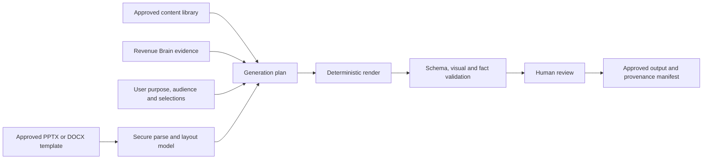

# Presentation, proposal and template architecture

- **Status:** Proposed Create architecture; not implemented
- **Output direction:** Template-constrained PPTX and DOCX first

## Architecture principle

Create combines approved organisation assets with authorised Opportunity context.
Generative systems may propose narrative and layout choices inside explicit schemas;
they must not invent customer facts, commercial terms, pricing or ROI inputs.

## Conceptual model

| Concept                             | Responsibility                                                                    |
| ----------------------------------- | --------------------------------------------------------------------------------- |
| `AssetTemplate` / `TemplateVersion` | Organisation-scoped presentation/proposal template and immutable approved version |
| `LayoutDefinition`                  | Supported page/slide masters, slots, constraints and reading order                |
| `BrandRuleSet`                      | Fonts, colours, logos, spacing, imagery and accessibility constraints             |
| `ApprovedContentItem`               | Versioned reusable text, image, proof point, disclaimer or legal/commercial block |
| `GenerationRequest`                 | Opportunity, purpose, audience, chosen template and user inputs                   |
| `GenerationPlan`                    | Ordered structured sections with source class and placement                       |
| `GeneratedAsset`                    | Private output, status, versions, expiry/retention and owner                      |
| `ProvenanceManifest`                | Evidence/content/input references for each material statement                     |
| `ROIModel` / `ROIRun`               | Versioned deterministic formula, labelled inputs, output and sensitivity          |

These concepts are not implemented tables. Every asset, key and storage path includes
organisation scope; access uses verified membership and least privilege.

## Template ingestion

1. Validate declared type, extension, size and actual file signature.
2. Malware-scan in an isolated boundary before parsing.
3. Reject encrypted files, executable content, macros, external relationships,
   embedded packages and unsupported active objects.
4. Parse only supported PPTX/DOCX structures with bounded resources.
5. extract masters/styles, theme, placeholders, geometry, reading order and permitted
   images into a typed layout model;
6. show unsupported or accessibility issues and a visual preview;
7. require an authorised human to publish an immutable template version.

Raw uploads and generated files stay in private object storage with short-lived
authorised access. Metadata lives in PostgreSQL; Alembic remains the future schema
authority. Processing is idempotent and follows the existing job lifecycle rather
than introducing a separate service by default.

## Approved content library

Content items have type, title, body/asset reference, permitted use, product/region,
audience, owner, review/expiry dates and version. They may include corporate facts,
case studies, product descriptions, biographies, proof points, approved pricing
language, disclosures and brand assets. Expired or withdrawn items are excluded from
new generations without erasing older manifests.

This is a bounded sales-content library, not a generic document-management system.
Folder trees, collaborative authoring and enterprise records management remain out of
scope unless later evidence justifies a separate decision.

## Generation contract

The guided request chooses output type, Opportunity/account, purpose, audience and
template before optional advanced controls. A structured planner assigns every
material statement to one of four visible source classes:

1. **Customer Evidence** — cited Revenue Brain Evidence;
2. **Approved corporate content** — cited content-item version;
3. **User input** — supplied and confirmed for this request;
4. **Generated suggestion** — clearly marked for human review and prohibited from
   asserting new customer, price, legal or performance facts.

The renderer accepts a schema-validated plan and deterministic slot constraints. It
must not rewrite masters or silently overflow content. Validation checks missing
citations, unsupported facts, truncation/overlap, broken assets, page/slide order,
heading structure, contrast, alt text and declared brand rules. Failure returns an
actionable issue rather than a plausible-looking broken file.

The final review shows source class and citation for consequential claims, warnings,
preview and an explicit approval/download action. Regeneration creates a new version;
it does not overwrite an approved asset.

## Proposals, pricing and ROI

Proposal generation follows the same architecture with stronger controls around
scope, legal text, price and approval. Pricing must come from an authorised product
or user-supplied input and remain distinguishable from generated narrative. Create
does not become a CPQ or contract-signing system in the initial scope.

ROI models contain named inputs, units, source (`customer_evidence`,
`approved_default`, `user_input`), formula version, assumptions and sensitivity
ranges. Calculations are deterministic and reproducible. AI may explain the result or
identify a missing input; it cannot invent the numbers or conceal assumptions.

## Security, privacy and operation

- Validate tenancy at metadata lookup and object access; signed URLs are short-lived
  and never logged.
- Treat all uploaded/generated content as confidential customer information.
- Prevent template instructions or embedded text from overriding system policy.
- Apply retention, export, legal-hold and erasure policy to source and derived assets.
- Record safe job/version/status metadata, not document bodies, prompts or customer
  facts, in logs and audit events.
- Test hostile files, decompression/resource exhaustion, external links, tenant
  isolation, deterministic rendering, citation coverage and deletion propagation.

## Explicitly out of scope

WO-023 adds no upload, parser, generator, storage or download feature. Free-form
design software, a general DAM/SharePoint replacement, electronic signature, full
CPQ, unrestricted website scraping and unsupported numeric claims are not authorised.
