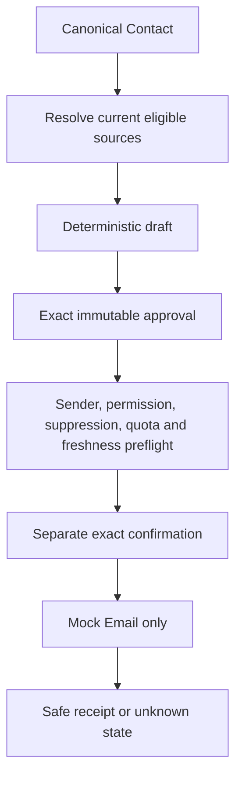

# Prospect and Engage foundation review

- **Status:** Checkpoint 2 architecture, security and provider assessment
- **Baseline:** WO-026–031 implemented; Alembic head `0040_event_intelligence`
- **Decision:** Foundation is sufficient for WO-032 Create; production providers and
  target-environment launch evidence remain separate gates

## Architectural decision

No Prospect or Engage domain re-architecture is required before Create.

The modular-monolith boundaries are well placed:

- Prospect owns staged Research Targets, runs, sources, observations, professional
  people, buying-role hypotheses, business-contact observations and explicit
  promotion provenance;
- Core owns canonical Company, Contact, Opportunity, Interaction, Evidence,
  Methodology and Revenue Brain state;
- Engage owns Outreach, source snapshots, contactability/suppression policy,
  Campaign/version/step/enrolment state and Event-local attendee/planning state;
- Action/Execution owns exact approval, confirmation, idempotency, provider-neutral
  dispatch and safe receipts; and
- provider payloads remain outside the domain.

The same Company/Contact and Evidence boundaries can support Create without importing
Prospect or Engage implementation concepts into the Create domain.

## Tenant isolation and authorisation

The reviewed architecture uses the repository’s established defence-in-depth pattern:

- organisation comes from verified authentication/membership context;
- every tenant row and uniqueness rule includes organisation scope;
- repositories apply explicit organisation predicates;
- relationships use same-organisation composite foreign keys;
- tenant tables use forced PostgreSQL RLS and a transaction-local trusted setting;
- worker jobs re-establish tenant context; and
- audits/logs contain identifiers and safe states, not research, attendee rows,
  contact addresses or message content.

WO-026–031 sprint records describe cross-organisation read/write/link tests and RLS
coverage for each new domain. The current migration chain has a single head at
`0040_event_intelligence`.

This is repository evidence, not target-environment proof. Real customer-data use
still requires verified production Clerk configuration, least-privilege PostgreSQL
runtime role/RLS tests, private storage where applicable, backup/restore, retention,
export/erasure, monitoring and incident evidence.

## Source, truth and identity boundaries

### Research trust

Prospect stores atomic run-scoped sources and observations with four deterministic
states: `verified`, `provider_supplied`, `inferred` and `unknown`. Verified requires an
allowed primary/official/regulatory source; a structured provider record alone cannot
be upgraded. Inference requires cited support and cautious language. Unknown is a
first-class result.

Provider output is untrusted input. URL/source type, claim category, source linkage,
sensitive-field exclusion, recency and bounded text are validated before persistence.
Full pages, active HTML, raw provider payloads and private/social scrape results are
not retained.

### Canonical promotion

Research identity and relationship identity remain separate. Promotion is explicit,
duplicate-safe and provenance-preserving. A Person cannot be promoted before its
Company, and neither promotion creates downstream commercial truth. This order is an
important invariant even though its UI recovery needs refinement.

### Evidence

Prospect observations, seller-approved copy, Event-list fields and seller-reported
encounters are not customer-direct Evidence. An authorised, deliberately captured
Interaction is the route into Evidence and Revenue Brain. This is the key Create
foundation: source class survives movement through the product.

## Engage execution boundary

The current one-to-one path has the correct safety sequence:

Changing the recipient/content/source version invalidates approval. Sender identity is
bound to the authenticated user and configured connection, not accepted from the
browser. Production mode fails closed when no live adapter exists.

Campaigns pin an immutable audience, policy and sequence version. They reuse the same
Outreach composer and source snapshots rather than creating a second personalisation
path. Every step rechecks source eligibility, Contact state, suppression, permission,
Campaign lifecycle, active Opportunity, collisions, time window and quota. Pause,
stop and ambiguous send state halt instead of blind retry.

The bounded auto-send design is technically sufficient to keep:

- default is review each send;
- an organisation administrator must enable a policy;
- the launcher must separately select and confirm it;
- audience and version are immutable;
- maximums remain 50 Contacts and four steps; and
- execution-time policy checks cannot be bypassed by earlier approval.

This does not make live auto-send ready. The first production provider release should
keep review-each-send until send, unsubscribe, bounce/complaint, reconciliation and
incident evidence is observed.

## Event boundary

Event identity is deliberately local and purpose-bound:

- CSV preview is UTF-8, bounded, allow-listed and not retained as a raw file;
- importing requires a versioned authority attestation, which does not establish
  outreach permission;
- exact person-specific identifiers may match; generic inbox and name-only rows cannot
  auto-link;
- fuzzy merge, bulk promotion and attendee-wide provider enrichment are absent;
- category-based priority explains relationship/context without scoring intent;
- planning and met states are seller activity; and
- outreach requires explicit promotion to a canonical Contact and ordinary Engage
  eligibility.

This boundary is safe enough to keep Events in Engage while reusing Core Interactions
and Evidence after a real encounter.

## Security and privacy assessment

| Risk                          | Current control                                                                                       | Remaining live gate                                                                         |
| ----------------------------- | ----------------------------------------------------------------------------------------------------- | ------------------------------------------------------------------------------------------- |
| Prohibited/sensitive research | Professional/business category allow-lists, source validation, no scrape, sensitive-content rejection | Provider contract/source review, quality/red-team evidence and launch-region privacy review |
| Stale/fabricated research     | run-scoped citations, dates, trust rules, expiry/conflict/unknown state                               | Live-provider quality thresholds and correction/support process                             |
| Address treated as permission | trust/verification/expiry separate from organisation policy                                           | Qualified legal/policy configuration and proof of consent/lawful basis where required       |
| Cross-tenant exposure         | explicit predicates, composite keys, forced RLS, scoped jobs/audits                                   | Target-environment role, RLS and storage evidence                                           |
| Spam or deceptive outreach    | source constraints, exact review, suppression, quotas, quiet windows, bounded Campaigns               | Live unsubscribe, bounce/complaint, provider abuse and incident operations                  |
| Duplicate/unknown send        | idempotency and fail-closed unknown state                                                             | Provider-specific receipt correlation and reconciliation                                    |
| Event-list overreach          | authority, minimisation, conservative matching, explicit promotion                                    | Customer procedure, retention and launch-region policy                                      |
| Customer truth pollution      | source-class and Evidence boundary                                                                    | Create manifest enforcement and ongoing regression tests                                    |

For Australian external sending, product policy must not translate a provider-supplied
or public work address directly into permission. The operator must be able to prove
the applicable consent basis, identify the sender, provide a functional unsubscribe
and honour it within the required period. The existing architecture can represent the
decision and suppression, but live intake and compliance operations do not exist.

## Provider readiness

### Prospect

The company/person provider protocols and persistence validation are suitable for one
future adapter. Missing capabilities are evidence and operations:

- approved source and licensing/storage terms;
- representative Australian B2B coverage and accuracy;
- stable provider identifiers and source metadata;
- recency, correction, deletion and suppression propagation;
- cost, rate, quota and abuse ceilings;
- timeout/partial-result handling and provider kill switch; and
- safe production configuration and monitoring.

Mock providers must remain deterministic, synthetic and clearly labelled. They may
continue to serve tests and demonstrations after a live adapter exists.

### Mailbox

The provider-neutral `send_email` contract should be retained. Choose at most one
first ecosystem from named partner evidence.

| Provider        | Useful minimum                                                          | Main unresolved risk                                                                                                              |
| --------------- | ----------------------------------------------------------------------- | --------------------------------------------------------------------------------------------------------------------------------- |
| Gmail           | server OAuth, user-bound identity and `gmail.send` for reviewed sending | OAuth verification/operations, aliases and sent-state reconciliation; reply reading needs a separately justified restricted scope |
| Microsoft Graph | delegated user OAuth and `Mail.Send` for `/me/sendMail`                 | `202 Accepted` does not itself prove delivery; tenant consent, aliases/shared mailboxes and reconciliation need design            |

The first adapter work order must prove connect, revoke, re-auth, sender ownership,
exact payload, idempotency, accepted/unknown result, reconciliation, rate handling and
safe logs. It must include a usable unsubscribe/suppression intake and operational
bounce/complaint path before external Campaign use. Implementing arbitrary SMTP, a
transactional vendor identity or both ecosystems is rejected.

Automatic reply detection is not a Create dependency. Add it only with the selected
mailbox, smallest justified event/read scope, thread correlation, retention/erasure
and explicit handling for auto-replies/out-of-office. Until then, seller-reported
reply, meeting and not-interested outcomes remain honest and safe.

## No-tracking rationale

Do not add tracking pixels or click redirects. They do not prove buyer intent and
would introduce remote-content, privacy, security, consent, link-rewriting and sender-
reputation costs. The architecture should optimise for durable business outcomes:
reply, meeting, Opportunity, stage progress and revenue. Provider delivery states may
support operations but must not be presented as customer intent.

## Create dependency interface

WO-032 should consume a provider-neutral, source-classified input manifest rather
than reach into Prospect/Engage tables opportunistically.

Minimum manifest concepts:

- organisation, actor, Opportunity, asset purpose and audience;
- approved template/content versions and brand rules;
- referenced Evidence IDs plus their source/authority state;
- separately labelled public Prospect observation IDs;
- separately labelled seller-confirmed/Event context;
- user-confirmed inputs with actor/time;
- planner/prompt/model/schema/policy versions where AI is used; and
- per-claim provenance in the generated asset.

Public research can support a slide labelled as external/public context. It cannot
support a claim such as “the customer told us” or silently affect Methodology.
Outbound copy and seller Event notes have the same restriction.

Create additionally needs:

- organisation-scoped private object storage and short-lived server-authorised access;
- signature/type/size/archive/active-content/malware controls;
- isolated bounded PPTX/DOCX parsing and deterministic rendering;
- no external file/provider transfer without an approved data-flow record;
- versioned assets, correction/invalidation and exact export approval;
- retention, export, erasure and backup behaviour for source and derived objects;
- hostile-file, cross-tenant, source-claim, layout and accessibility tests; and
- content-minimised diagnostics and kill switches.

WO-033, not a language model, owns deterministic ROI inputs, formulas, units,
currency, rounding and replay.

## Required gates by phase

| Phase                               | Gate                                                                                                                                 |
| ----------------------------------- | ------------------------------------------------------------------------------------------------------------------------------------ |
| WO-032 implementation               | Current source/Evidence boundaries plus Create-specific file, object, parser, renderer and manifest controls                         |
| Synthetic Prospect/Engage demo      | Existing deterministic providers, visible labels and no external effects                                                             |
| Real provider-backed Prospect pilot | Approved adapter, terms/privacy/source review, coverage/quality/cost evidence and target-environment gates                           |
| Real one-to-one Engage pilot        | One mailbox adapter, exact sender/send/reconciliation, unsubscribe/suppression operations, legal policy and target-environment gates |
| Live Campaign auto-send             | Observed review-first pilot, bounce/complaint/reply stop, deliverability/incident operations and bounded policy approval             |
| Unsupervised commercial beta        | Product, provider, security/privacy, legal, reliability, support and telemetry evidence across the chosen cohort                     |

## Foundation gaps and ownership

- **Before real design-partner use:** provider activation, target-environment launch
  evidence, one mailbox slice, opt-out/reconciliation operations and outreach legal
  review.
- **Before commercial beta:** provider quality/economics, reply stop or an explicit
  manual-risk decision, deliverability operations, safe outcome telemetry and
  resolved first-use web reliability.
- **Later:** second provider/ecosystem, event-platform connectors, broader inbound
  context and advanced outcome analytics.
- **Must not build:** scraping, sensitive/personality profiling, permission inference
  from address trust, blanket attendee enrolment, tracking pixels, blind retry,
  unbounded automation or an autonomous AI SDR.

None of these gaps requires a Prospect/Engage foundation work order before Create.
