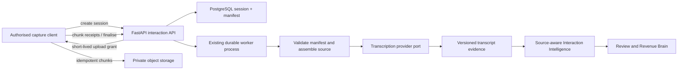
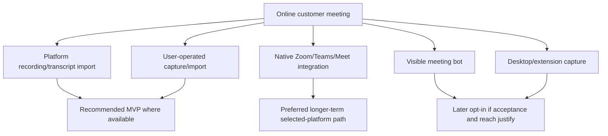

# Recording and transcription architecture

## WO-018 online-meeting import

Authorised online-meeting recordings use the WO-015 session, private-storage,
quota, worker and transcription lifecycle with `platform_recording` or
`user_uploaded_recording` provenance. Authorised TXT/VTT/SRT transcript import
creates the same immutable transcript versions/segments directly, plus Capture and
Evidence records; it does not create a second transcript or intelligence system.
The new online-meeting UI never offers browser microphone capture as platform/system
audio; the explicitly consented WO-015 foreground recording API remains compatible
for established Meeting flows. Native fetch and auto-ingestion are disabled pending
a selected, reviewed provider adapter.

## WO-016 Companion orchestration

The mobile browser Companion reuses this recording domain without changing its
server lifecycle or provider boundary. It adds stable client-side chunk
idempotency across bounded retry, online/microphone indicators, a page-leave
warning that includes queued bytes, best-effort Screen Wake Lock and a hard
interlock before Interaction completion. A tenant-scoped service rule rejects a
second active recording session for the same Interaction.

Phone calls and online meetings do not expose Companion recording controls.
The browser cannot claim same-device call capture or reliable meeting
system-audio capture. Unsent chunks remain only in the current tab's memory;
verified server chunks continue to use the durable lifecycle below.

WO-017 adds only an explicit import client for an already authorised phone-call
recording. It creates `imported_audio_recording` with a required controlled
`recording_source`, then reuses the same grants, chunks, finalisation, worker and
transcript versioning below. It does not add direct telephony capture or a second
pipeline.

- **Status:** WO-015 current implementation for browser-first recording, resumable
  private upload and batch transcription. Near-real-time, native and connector
  paths remain target architecture.
- **MVP posture:** Debrief remains first-class. Authorised recording uses finalised
  sessions and batch transcription, not real-time infrastructure.

## Decision summary

- Recording remains an optional Capture Session, never the only interaction path.
- Use direct-to-private-object-storage chunk upload with short-lived tenant-bound
  upload authorisation when binary capture is implemented.
- Keep session metadata/manifests and processing state in PostgreSQL.
- Reuse the existing durable PostgreSQL worker and provider abstraction for bounded
  asynchronous finalisation/transcription stages.
- Start with batch transcription and final transcript. Add near-real-time only after
  a validated product need; reserve streaming infrastructure for Live Interaction
  Intelligence.
- Use user-operated or platform-provided recording import before meeting bots.
- Do not assume browser or mobile-web background recording is reliable.

## Capture and processing flow

## Recording session model

The WO-015 Recording Capture Session records:

- tenant, Interaction, Capture Session, user and versioned consent snapshot;
- stable session ID and client-generated idempotency key;
- requested media kind, expected codec/container and supported limits;
- start/end, original timezone and monotonic client sequence;
- deterministic lifecycle, start/stop/finalisation and failure state;
- chunk count/bytes/duration and manifest version;
- opaque private storage references without a public URL; and
- retention/deletion state; and
- safe error/retry classification.

Each chunk has session/tenant ownership, sequence, SHA-256 checksum, byte count,
opaque storage key, upload receipt and state. A unique `(organisation_id, session_id, sequence)`
plus checksum makes retry idempotent. The server rejects a reused sequence with a
different checksum. Out-of-order arrival is accepted; finalisation identifies
missing or conflicting parts.

## Upload alternatives

| Approach                                   | Advantages                                            | Limits                                                                 | Recommendation                                            |
| ------------------------------------------ | ----------------------------------------------------- | ---------------------------------------------------------------------- | --------------------------------------------------------- |
| Server-mediated upload                     | Simple authorisation and scanning boundary            | API bandwidth, memory/timeouts and cost for large recordings           | Suitable only for small foreground journals/visuals       |
| Direct object-storage upload               | Scales bytes independently, supports multipart/resume | Requires careful signed grants, finalisation and orphan cleanup        | Preferred for recording chunks and large files            |
| Continuous streaming through API/WebSocket | Low latency                                           | Long connections, mobile/background failure and operational complexity | Not needed for batch MVP                                  |
| Provider-direct streaming                  | Potential live transcript latency                     | Vendor coupling, consent/data path and recovery complexity             | Consider only behind a port for justified live capability |

Upload grants must be short-lived, content/type/size constrained, scoped to an exact
tenant/session/chunk key and unusable for reads. Object keys include tenant and
session scope derived by the server, never freely supplied by the client.

## Finalisation and recovery

Finalisation is explicit and idempotent:

1. client declares the last sequence and capture outcome;
2. API locks the session and compares the manifest;
3. missing/duplicate/conflicting chunks produce a reviewable partial state;
4. complete manifests become immutable inputs;
5. the existing durable worker discovers finalised sessions and verifies/assembles
   media on bounded temporary disk without holding an HTTP request;
6. successful assembly records duration/checksum and queues transcription; and
7. device content is deleted only after verified receipt and policy permits.

An interrupted client can resume the same session. A second device or recreated
session cannot silently overwrite it. Operators can bound abandoned-session cleanup
and orphan-object reconciliation. Unknown upload results are reconciled before
retry.

## Encryption and storage

- TLS in transit and provider-managed encryption at rest are minimum controls.
- Use server-derived tenant storage paths and private buckets/containers.
- Evaluate per-object or envelope keys and customer-managed keys against enterprise
  requirements before beta claims.
- Local mobile buffering uses OS-protected keys and encrypted files.
- Object-store read access is mediated by the API and short-lived grants after
  authorisation.
- Region and provider processing must match organisation policy where supported.
- Raw media has an explicit, usually shorter retention class than validated
  intelligence.
- Backups and replicas follow documented retention/deletion behaviour.

## Current bounded implementation

- MIME allowlist: WebM/Opus and MP4/M4A (`audio/webm`, `audio/mp4`, `audio/m4a`).
- Maximum duration: 10,800 seconds (three hours).
- Maximum recording: 512 MiB; maximum chunk: 8 MiB; maximum chunks: 4,096.
- Session expiry: 24 hours; verified raw-audio retention: seven days by default.
- Browser: feature detection and foreground `MediaRecorder`; no background or
  screen-lock guarantee.
- Storage: the hardened private visual-storage port is reused under a neutral
  binary-object alias. Production requires S3-compatible private storage.
- Queueing: `recording_sessions.lifecycle_status='uploaded'` is the durable work
  record. No broker or second queue was introduced.
- Transcript: immutable `transcript_versions` plus ordered `transcript_segments`;
  the current Meeting `transcripts` row remains the compatibility read model.
- Non-live recording provenance: `customer_call_recording`,
  `business_phone_recording`, `user_uploaded_recording` or
  `external_provider_recording`; the source is required and does not by itself
  establish legality or speaker identity.

## Processing stages

The initial asynchronous pipeline can use the existing job pattern with explicit,
idempotent stage keys:

1. manifest validation;
2. media inspection/normalisation only if required;
3. batch transcription;
4. optional diarisation;
5. final transcript assembly;
6. strict source-alignment validation;
7. source-aware Interaction Intelligence; and
8. deletion/retention follow-up.

Completed stages remain reusable. Retry only the failed idempotent stage. Use bounded
leases/retries and typed transient, permanent, policy, unsupported-media,
incomplete-source and unknown-outcome errors. Long-running provider work must renew
leases without holding database transactions.

The existing worker/database architecture is sufficient for the first bounded
pipeline. A broker or specialised media service becomes justified only if measured
throughput, scheduling contention or provider callback patterns cannot meet the
service objectives.

## Transcription stages

| Stage               | Output                                 | Required when                                           | Product status                                     |
| ------------------- | -------------------------------------- | ------------------------------------------------------- | -------------------------------------------------- |
| Batch               | Transcript after final media receipt   | First recording MVP                                     | Final after validation; partial if source has gaps |
| Near-real-time      | Periodic provisional transcript chunks | Later experience needs faster post-meeting availability | Provisional until final pass                       |
| Real-time streaming | Low-latency partial segments           | Live signals prove valuable and consent/policy allow    | Always provisional during session                  |

Batch transcription is sufficient for recording foundation and normal post-meeting
Interaction Intelligence. Near-real-time is justified when processing delay harms
the immediate debrief/review experience. Real-time belongs with WO-018 after product,
cost and reliability evidence.

## Transcript model and correction

Transcript evidence records source recording/supplied source, language, provider
trace, provisional/final state, version and completeness. Segments carry time range,
text range, diarisation label, optional verified participant and quality flags.

- A provisional transcript can drive provisional live UI only.
- A final transcript is produced after complete-source reconciliation.
- User edits create a new version and preserve the provider version.
- Speaker correction changes identity mapping without rewriting raw audio.
- Reprocessing creates another derived version and records why/provider/config.
- Domain vocabulary is organisation- or capability-scoped input, not global training
  on customer content.
- Unsupported language yields an explicit state and retains the authorised source
  for allowed retry/provider choice.
- Partial transcription preserves available segments and gap locations.

Do not parse timestamps or speaker names from free-form prose when the provider can
return a typed structure. Do not infer person identity from a diarisation label
without matching evidence and review.

## Provider abstraction and cost control

Extend a typed `TranscriptionProvider` port behind the current adapter boundary.
Provider inputs include a minimal authorised source reference, language hint, mode,
diarisation request, timeout and region/policy. Outputs use normalised transcript
segments and typed usage/error data. Provider payloads and URLs remain internal.

Controls include:

- approved duration/file/chunk/format limits;
- per-organisation daily/monthly policy ceilings;
- preflight cost estimate bands where defensible;
- no duplicate processing of the same immutable source/configuration;
- maximum retry count and provider timeout;
- raw-media expiry after verified final output according to policy;
- model choice based on evaluated capability rather than maximum size; and
- safe cost/latency metrics by source type and duration band.

Pricing must be sourced and reviewed when implementation selects a provider; WO-010
does not assert current provider prices.

## Speaker diarisation

Diarisation is helpful for multiple speakers but is not required for the first
non-recording MVP. The first recording MVP may provide speaker labels without
identity. Identity assistance uses participant context and user review. Important
decisions, commitments and objections with uncertain attribution remain visibly
uncertain.

Advanced diarisation should be gated by measured room-audio accuracy, cost and user
correction burden. Attendance never implies a speaker made or agreed with a claim.

## Online meeting capture alternatives

| Option                                        | Reliability                                        | Complexity/maintenance                                   | Visibility and consent                              | Enterprise acceptance                   | Recommendation                                   |
| --------------------------------------------- | -------------------------------------------------- | -------------------------------------------------------- | --------------------------------------------------- | --------------------------------------- | ------------------------------------------------ |
| Platform-provided recording/transcript import | High after provider finalises; availability varies | Moderate adapter/webhook/polling work                    | Uses platform notice/controls plus RevenueOS policy | Usually strongest                       | First option for an approved target platform     |
| User-operated recording/import                | User-dependent but explicit and recoverable        | Lowest                                                   | Clear user control; notice still required           | Good as fallback                        | MVP fallback                                     |
| Native Zoom/Teams/Meet integration            | Good with supported APIs; platform differences     | High per platform, policy changes and regional behaviour | Native recording indicators/permissions             | Strong when approved by customer        | Select one based on design partners, then expand |
| Visible meeting bot                           | Join/admission/waiting-room/removal failures       | High cross-platform operations                           | Highly visible but can be rejected                  | Mixed; often restricted                 | Not first; later opt-in coverage path            |
| Desktop audio capture                         | OS/device dependent and hard to attribute          | High QA and permissions                                  | Local indicator/notice required                     | Security review can be difficult        | Later specialised fallback                       |
| Browser extension                             | Browser/platform-specific                          | High policy/compatibility maintenance                    | Extension and meeting notice required               | Requires enterprise deployment approval | Later selected workflows only                    |
| Calendar-triggered bot join                   | Adds timing convenience, not capture reliability   | High identity/admission/error surface                    | Risk of unexpected join                             | Often sensitive                         | Do not build first                               |

Platform-provided imports normally preserve the strongest platform speaker/attendance
metadata and avoid per-meeting bot operations, but their licence/API availability and
processing delay vary. Native integrations have the highest per-platform engineering
and policy-maintenance cost. Bots add admission operations and often per-minute media
processing cost; their speaker labels still require review. Desktop and extension
capture can have weak system-audio/speaker attribution and a broad device QA cost.
Provider selection must document current platform/API charges, recording ownership,
regional processing and speaker-attribution behaviour rather than assuming one
option is cheapest or most accurate.

The recommended online MVP is platform-provided recording/transcript import or
explicit user-operated import, chosen for the first design-partner platform. Build a
native selected-platform adapter next if adoption warrants. Do not start with a bot,
and do not claim browser-only system-audio capture is universally reliable.

Failure handling must cover waiting rooms, missing admission, bot removal, no
recording permission, platform processing delay, webhook duplication, region
mismatch, transcript-only sources, missing speaker identity and provider deletion.

## Live Interaction Intelligence

WO-020 implements the live intelligence aggregate over a deliberately supplied
`progressive`/`provisional` transcript version. It does not make the WO-015 batch
provider stream, does not pretend WO-018 imports are live and stores no duplicate
transcript window. Segment `speaker_role` is controlled and optional; a label remains
different from identity.

Live signals consume incomplete evidence and are labelled provisional with exact
segment ranges. They cannot update Revenue Brain, trigger external action or be
presented as validated post-interaction intelligence. After final transcript and
all sources arrive, the normal source-aware capability runs and the live aggregate
reconciles separately. The final result may remove or contradict a live signal.

Real-time transport becomes justified only when tests show that a specific
in-session decision benefits from low latency and the benefit outweighs attention,
privacy, cost and reliability risks. WebSockets/streaming are not architecture goals
by themselves; the current path uses bounded HTTP polling. Production progressive
transcription remains disabled until a provider and its consent/privacy/operational
controls are separately approved.

## Observability and failure UX

Track session/chunk state, duration/size bands, upload progress, gap count,
transcription stage, provider/error class, retry, latency and usage without content.
The user sees:

- recording active/stopped;
- locally saved versus uploaded;
- complete versus partial with gap explanation;
- processing stage and an honest time expectation band;
- retry/finalise/debrief alternatives; and
- deletion status.

Never log raw media, transcript text, provider payloads, signed URLs, prompts,
participant names or customer content.

## Deletion

Deletion begins at the trusted tenant service, revokes access immediately and walks
the source dependency graph through object storage, derived transcripts, fragments,
intelligence eligibility, approvals and provider copies where supported. Immutable
history keeps only policy-approved content-minimised tombstones. Provider and backup
expiry are reported honestly rather than called instantaneous deletion.

## Related documents

- [Mobile companion strategy](../02-design/mobile-companion-strategy.md)
- [Interaction domain architecture](interaction-domain-architecture.md)
- [Evidence and provenance model](evidence-and-provenance-model.md)
- [Interaction security, privacy and consent](interaction-security-privacy-and-consent.md)
