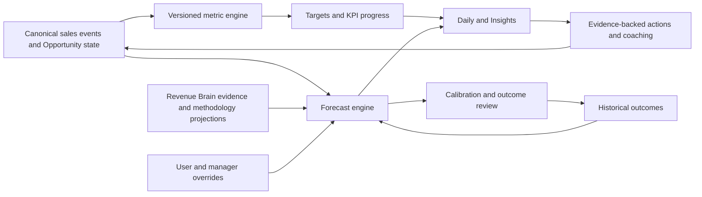

# Sales analytics, targets and forecast architecture

- **Status:** Analytics, explicit Targets and Transparent Forecasting implemented; Manager Intelligence remains proposed
- **Principle:** Explain what changed and what to do; do not create a wall of charts

## Intelligence boundaries

| Capability            | Question answered                    | Constraint                                         |
| --------------------- | ------------------------------------ | -------------------------------------------------- |
| Descriptive analytics | What happened?                       | Reproducible canonical metrics                     |
| Diagnostic analytics  | What factors are associated with it? | No unsupported causal language                     |
| Forecasting           | What range of outcomes is plausible? | Calibrated uncertainty and versioned assumptions   |
| Coaching              | What evidence-backed step may help?  | Human-readable basis; no surveillance or rep score |

RevenueOS Intelligence, including an evidence-based forecasting capability, belongs
in Core. Advanced governance or unusually costly features may be tiered later, but
essential personal and manager understanding must not become an artificial upsell.

## Canonical event and metric model

The source model uses versioned business events derived from authorised domain state,
not browser telemetry. Examples include Interaction completed, Opportunity created,
stage changed, proposal approved, Opportunity won/lost and commitment completed.
Each event carries organisation, subject, effective time, recorded time, provenance
and correction/supersession metadata.

A `MetricDefinition` concept defines unit, time window, inclusion, attribution and
version. A `MetricObservation` is a reproducible result for a subject and period.
Likely funnel views include calls → meetings → Opportunities → proposals → wins,
but they must not imply that every call caused a later outcome.

### Attribution rules

- Count from canonical lifecycle events, not UI activity or duplicated provider data.
- Require unambiguous organisation-scoped entity association; place unresolved items
  in an explicit unassociated bucket.
- Define conversion as movement between named populations within an explicit cohort
  and time window; do not divide loosely related totals.
- Preserve corrections, stage re-entry and reopened deals without double counting.
- Select one documented credit policy for multi-owner/team views; show it in context.
- Timestamp by effective business time with declared timezone and late-arrival policy.
- Version definitions so historical reports remain explainable after policy changes.
- Never equate send volume, screen time, clicks or keystrokes with seller quality.

## Targets and KPIs

WO-037 implements a narrower `SalesTarget`: exactly five allow-listed higher-is-better
metrics, personal or organisation scope, self-set or administrator-assigned origin,
an explicit monthly/quarterly/calendar-year period, optional pipeline, one currency
where required and an immutable metric/timezone binding. Append-only revisions own
the goal; live actuals come only from `SalesMetricService`.

There is no team hierarchy, manager roll-up, qualified-pipeline/proposal/rate target,
formula, FX, recurrence, persisted observation, pacing state or forecast. Activity
metrics are visibly supporting context. Insights owns progress through Overview and
Targets; Daily deliberately has no target integration in v1.

## Implemented Forecast MVP

WO-038 chooses a deliberately narrow transparent model. The primary range is the
seller's inclusive Commit/Likely/Possible cases. A separate reference applies the
observed final win rate from reliable same-tenant, same-Pipeline, exact-stage outcomes
over 730 days to current amount, only from a 10-outcome sample. Sparse data is
unavailable with no fallback.

Each seller edit appends a period-specific revision with current Opportunity/model
snapshot. Current live aggregates use current amount and disclose stale changes;
past periods are locked. Actual comes from `SalesMetricService`; matching Target goals
come through `SalesTargetService`. Category realization is count/rate calibration,
not ranking. See the [model specification](forecast-model-v1-specification.md).

## Future learned models

A learned model is considered only after stable definitions, sufficient representative
outcomes, leakage analysis, time-based evaluation, calibration measurement and bias
review exist. It must beat a simple baseline materially, support tenant-safe feature
construction, publish a model card and retain a safe fallback. No exact model family
is selected by WO-023.

## Manager Intelligence and coaching

Manager views use authorised team scope to surface target/coverage gaps, stalled or
at-risk deals, critical methodology gaps, missed customer commitments, stakeholder
weakness and important upcoming Interactions. Coaching may describe observed
association—for example, a team's successful evaluations often progress to a
workshop within a stated window—but must not claim causality without evidence.

Forbidden inputs include keystrokes, mouse movement, passive presence, private
messages outside authorised sources and a simplistic rep score. Individual details
follow least privilege; sensitive coaching views need access and audit policy.

## Architecture and operation

Keep this inside the API modular monolith. Domain repositories expose authorised
facts; a metrics module owns definitions/observations; target and forecast services
consume typed snapshots. WO-038 calculates synchronously with bounded set queries and
adds no background computation, broker or microservice.

Jobs must be idempotent, versioned and safe to retry. Observability records safe
counts, versions, durations, freshness and error codes without customer content.
Tests cover tenant isolation, cohort boundaries, currency/timezone handling, late
events, corrections, ambiguous attribution, overrides and deterministic replay.

## Explicitly out of scope

Generic BI, employee monitoring, arbitrary formula execution, contractual forecast
guarantees and unsupported causal coaching are not RevenueOS scope. WO-037 adds no
forecast model, team/manager hierarchy, target-triggered Action or AI output.

## WO-035 canonical lifecycle handoff

WO-035 now supplies the first implemented stage-history foundation: stable pipeline and
stage identity, exact entry transitions, prior reliable entry timestamp, explicit
migration baseline quality, current owner/amount/currency/expected close, actual close,
seller-reported outcome and reopen events. WO-036 must define cohorts, re-entry,
conversion, duration, currency and attribution policy before calculating metrics.

WO-035 deliberately supplies no probability, weighted amount, forecast category,
predicted close date, model run or deal score. WO-038 must not reinterpret a stage as a
likelihood; it remains dependent on transparent policy and sufficient clean outcomes.

## WO-036 implemented boundary

WO-036 implements the descriptive Core Insights slice: versioned canonical
metric definitions, tenant-scoped point-in-time calculation and the Overview,
Funnel, Activity and Win/Loss views. It adds no persisted metric facts, target
state, probability, weighting or forecast model. WO-037/038 consume this metric
contract rather than redefining it.

## WO-037 implemented boundary

WO-037 implements Core target configuration/history and read-time progress. It binds
the WO-036 metric ID/version, persists no actual and exposes no probability. Canonical
corrections, reopen and current-owner reassignment therefore update Target and
Insights consistently.

## WO-038 implemented boundary

WO-038 implements explicit seller cases, immutable period revisions, a separate
empirical exact-stage baseline and category realization. It adds no fixed probability,
manager view, AI/ML, FX or Evidence/Methodology/Revenue Brain numeric input. WO-039
must introduce authorised team/manager scope rather than treating the admin role as a
manager.
