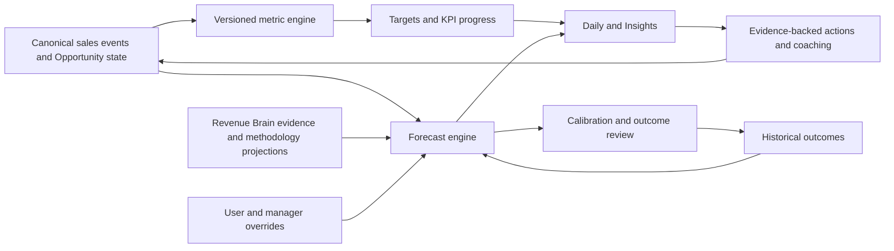

# Sales analytics, targets and forecast architecture

- **Status:** Proposed Core architecture; not implemented
- **Principle:** Explain what changed and what to do; do not create a wall of charts

## Intelligence boundaries

| Capability            | Question answered                    | Constraint                                         |
| --------------------- | ------------------------------------ | -------------------------------------------------- |
| Descriptive analytics | What happened?                       | Reproducible canonical metrics                     |
| Diagnostic analytics  | What factors are associated with it? | No unsupported causal language                     |
| Forecasting           | What range of outcomes is plausible? | Calibrated uncertainty and versioned assumptions   |
| Coaching              | What evidence-backed step may help?  | Human-readable basis; no surveillance or rep score |

RevenueOS Intelligence, including an evidence-based forecasting capability, belongs
in Core. Advanced governance or unusually costly features may be tiered later, but
essential personal and manager understanding must not become an artificial upsell.

## Canonical event and metric model

The source model uses versioned business events derived from authorised domain state,
not browser telemetry. Examples include Interaction completed, Opportunity created,
stage changed, proposal approved, Opportunity won/lost and commitment completed.
Each event carries organisation, subject, effective time, recorded time, provenance
and correction/supersession metadata.

A `MetricDefinition` concept defines unit, time window, inclusion, attribution and
version. A `MetricObservation` is a reproducible result for a subject and period.
Likely funnel views include calls → meetings → Opportunities → proposals → wins,
but they must not imply that every call caused a later outcome.

### Attribution rules

- Count from canonical lifecycle events, not UI activity or duplicated provider data.
- Require unambiguous organisation-scoped entity association; place unresolved items
  in an explicit unassociated bucket.
- Define conversion as movement between named populations within an explicit cohort
  and time window; do not divide loosely related totals.
- Preserve corrections, stage re-entry and reopened deals without double counting.
- Select one documented credit policy for multi-owner/team views; show it in context.
- Timestamp by effective business time with declared timezone and late-arrival policy.
- Version definitions so historical reports remain explainable after policy changes.
- Never equate send volume, screen time, clicks or keystrokes with seller quality.

## Targets and KPIs

`TargetDefinition` conceptually links a supported metric to an individual or team,
monthly/quarterly/annual period, value, unit, owner, source and version. Supported
starting metrics are revenue, qualified pipeline, Opportunities created, meetings,
calls, proposals and well-defined conversions. User-defined KPIs must select a
supported metric and filters; they cannot upload executable formulas.

Team roll-ups must avoid double counting and disclose their aggregation rule. Target
changes are effective-dated and audited. Activity metrics are context, not the
primary performance truth. Daily shows a small actionable summary; Insights provides
drill-down.

## Forecast MVP

The first forecast should use transparent deterministic/statistical policy rather
than premature machine learning. Candidate components are:

1. explicit open-pipeline amount, stage and close period;
2. historically observed stage conversion and cycle-duration distributions where
   the authorised cohort has enough comparable outcomes;
3. declared adjustments for close-date risk, inactivity, methodology gaps,
   stakeholder coverage, commitments, objections and procurement/legal/security;
4. scenario aggregation into a central estimate and a defensible range.

When history is insufficient, show a rules-based scenario or `unavailable`; never
manufacture precision. Categories such as commit, expected and upside may summarise
scenarios if their rules are visible. Avoid an unexplained “AI says 78%”.

Every result includes:

- forecast period, currency and scope;
- central estimate and range;
- important assumptions and Evidence-linked deal factors;
- data freshness and missing associations;
- engine, policy, cohort and input-snapshot versions;
- historical calibration where sample size is sufficient;
- seller and manager overrides, reason, actor and time;
- prior versions and eventual outcome.

Overrides do not erase the system result. A manager roll-up distinguishes model,
seller and manager views and maintains a metadata audit.

## Future learned models

A learned model is considered only after stable definitions, sufficient representative
outcomes, leakage analysis, time-based evaluation, calibration measurement and bias
review exist. It must beat a simple baseline materially, support tenant-safe feature
construction, publish a model card and retain a safe fallback. No exact model family
is selected by WO-023.

## Manager Intelligence and coaching

Manager views use authorised team scope to surface target/coverage gaps, stalled or
at-risk deals, critical methodology gaps, missed customer commitments, stakeholder
weakness and important upcoming Interactions. Coaching may describe observed
association—for example, a team's successful evaluations often progress to a
workshop within a stated window—but must not claim causality without evidence.

Forbidden inputs include keystrokes, mouse movement, passive presence, private
messages outside authorised sources and a simplistic rep score. Individual details
follow least privilege; sensitive coaching views need access and audit policy.

## Architecture and operation

Keep this inside the API modular monolith. Domain repositories expose authorised
facts; a metrics module owns definitions/observations; target and forecast services
consume typed snapshots. Background recomputation, if later needed, extends the
existing job lifecycle rather than introducing a broker or microservice by default.

Jobs must be idempotent, versioned and safe to retry. Observability records safe
counts, versions, durations, freshness and error codes without customer content.
Tests cover tenant isolation, cohort boundaries, currency/timezone handling, late
events, corrections, ambiguous attribution, overrides and deterministic replay.

## Explicitly out of scope

No analytics schema, target UI, forecast model or production computation is added in
WO-023. Generic BI, employee monitoring, arbitrary formula execution, contractual
forecast guarantees and unsupported causal coaching are not RevenueOS scope.

## WO-035 canonical lifecycle handoff

WO-035 now supplies the first implemented stage-history foundation: stable pipeline and
stage identity, exact entry transitions, prior reliable entry timestamp, explicit
migration baseline quality, current owner/amount/currency/expected close, actual close,
seller-reported outcome and reopen events. WO-036 must define cohorts, re-entry,
conversion, duration, currency and attribution policy before calculating metrics.

WO-035 deliberately supplies no probability, weighted amount, forecast category,
predicted close date, model run or deal score. WO-038 must not reinterpret a stage as a
likelihood; it remains dependent on transparent policy and sufficient clean outcomes.

## WO-036 implemented boundary

WO-036 implements the descriptive Core Insights slice: versioned canonical
metric definitions, tenant-scoped point-in-time calculation and the Overview,
Funnel, Activity and Win/Loss views. It adds no persisted metric facts, target
state, probability, weighting or forecast model. Targets remain WO-037 and
Forecast remains WO-038; both must consume this metric contract rather than
redefining it.
