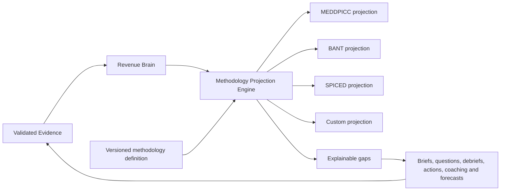

# Sales Methodology Engine architecture

> **WO-038 numeric boundary:** Forecast model v1 does not read or weight Methodology
> items, gaps, freshness, conflict or completion. Methodology may remain qualitative
> context, but it cannot alter seller cases or historical expected contribution.

## Prospect Person boundary

WO-027 buying-role hypotheses and public statements are excluded from Methodology
projection inputs and review evidence. Marking a Prospect role relevant or promoting
a Contact never confirms budget, authority, need, timing or any custom methodology
field. Such confirmation continues to require the existing eligible customer/seller
Evidence path.

- **Status:** Implemented Core architecture by WO-024
- **Decision owner:** WO-023 architecture, realised by WO-024
- **Depends on:** Evidence, Revenue Brain, Opportunity Workspace and organisation administration

## Purpose

RevenueOS supports multiple qualification and discovery methodologies without
creating a separate intelligence system for each one. Canonical, tenant-owned
Evidence remains the truth. A versioned Methodology Projection Engine interprets
that Evidence for MEDDIC, MEDDPICC, BANT, SPICED or a safe organisation-defined
methodology. Other named methodologies remain possible configuration work, not
implemented projections.

Switching methodology selects another projection; it never deletes or rewrites
historical Evidence.

## Conceptual model

| Concept                      | Responsibility                                                                  |
| ---------------------------- | ------------------------------------------------------------------------------- |
| `MethodologyDefinition`      | Organisation-scoped identity, family, status and immutable version              |
| `MethodologyFieldDefinition` | Stable key, display name, explanation, requirement, order and stage expectation |
| `EvidencePolicy`             | Allowed Evidence classes and support/conflict/staleness rules for a field       |
| `DiscoveryPrompt`            | Optional approved questions for an unresolved field                             |
| `MethodologyAssignment`      | Effective definition/version for an organisation, team or Opportunity           |
| `MethodologyProjection`      | Reproducible result for one Opportunity and definition version                  |
| `MethodologyItem`            | State, concise belief, support/conflict references and last-supported time      |
| `ProjectionReview`           | Human confirmation, correction or rejection with actor, reason and version      |

WO-024 implements the smallest coherent form as code-deployed standard definitions,
tenant-owned custom definition/version rows, an organisation setting, immutable
projection JSON and immutable review rows. All tenant-owned identifiers, uniqueness
constraints and reads are explicitly organisation-scoped. Definitions use stable
keys so historical projections remain explainable.

## Evidence-aware states

| State                 | Meaning                                                             | Presentation                                        |
| --------------------- | ------------------------------------------------------------------- | --------------------------------------------------- |
| `confirmed`           | Sufficient current Evidence supports the belief                     | Show belief, sources and last support               |
| `partially_supported` | Some Evidence exists but a material part is unresolved              | State the supported and missing parts               |
| `unknown`             | No admissible Evidence supports a conclusion                        | Suggest a natural discovery step                    |
| `conflicting`         | Admissible sources disagree                                         | Show both sides; require review where consequential |
| `stale`               | Prior support exceeds the field's time policy or conditions changed | Preserve history and request revalidation           |

Counts may summarise these states, but an arbitrary completion percentage must not
be the primary truth or a proxy for deal quality. A methodology projection is not a
forecast.

## Projection and feedback loop

1. Load the authorised Opportunity Evidence snapshot and effective definition.
2. Apply deterministic admissibility, recency and contradiction policies.
3. Apply the deterministic canonical-fact and support policy; v1 makes no provider call.
4. Validate every proposed belief against cited Evidence IDs.
5. Store the definition, policy/engine and Evidence-set versions needed to
   reproduce the result.
6. Present changed items for review; consequential changes remain provisional until
   the applicable policy is met.
7. Publish gaps to briefs, suggested questions, debrief review, Next Best Action,
   Manager Intelligence and forecast explanation.
8. Re-project when approved Evidence, a field review or the assigned version changes.

For example, an unknown economic buyer may yield a suggested question before the
next Interaction. The subsequent debrief may propose Evidence, but the underlying
Evidence lifecycle—not the methodology screen—decides whether it becomes trusted.

## Custom methodology builder

An organisation administrator may define a field key, display name, explanation,
required/optional flag, stage expectation, allowlisted Evidence/fact mappings,
suggested discovery questions, freshness and ordering. The guided builder validates
and creates immutable replacement versions.

It must not permit executable code, arbitrary database expressions, hidden model
prompts, cross-tenant sources, unbounded field counts or a general workflow language.
Published versions are immutable; corrections create a replacement version. Field
dependencies and general expressions are not supported in v1.

## Service boundaries and contracts

- The Evidence service owns source admissibility, provenance and trust state.
- Revenue Brain owns the longitudinal authorised Evidence view and contradictions.
- The methodology service owns definitions, assignments, projection policy and
  review history.
- Opportunity Workspace renders projection summaries and evidence drill-down.
- Brief, Action, forecast and coaching consumers receive typed projection outputs;
  they do not reinterpret raw methodology fields independently.

The API supports definition lifecycle, organisation selection, projection
read/recompute/history and review. The server derives organisation and effective permission
from verified auth context. Writes require optimistic concurrency or equivalent
version checks; audit content stores metadata, not customer Evidence text.

## Product behaviour

The Opportunity overview shows a compact state summary and the most important gaps.
Level 2 explains why; Level 3 shows the full definition and Evidence. Users can
correct a belief or association without editing dozens of CRM fields. Mobile shows
the summary, gaps and evidence review, while methodology administration remains
desktop-first.

## Safety, evaluation and observability

- Fail closed when tenant, membership, definition or Evidence access is unresolved.
- Treat AI output as a proposed structured projection, never as new source Evidence.
- Record run IDs, versions, durations, state counts and safe error codes; never log
  transcripts, prompts, beliefs or Evidence content.
- Evaluate citation validity, unsupported-claim rate, contradiction detection,
  correction rate, gap usefulness and cross-methodology consistency with synthetic
  fixtures before release.
- Regression-test cross-organisation isolation and methodology switching without
  Evidence loss.

## Explicitly out of scope

WO-024 does not implement a generic rules platform, an opaque qualification score,
a guaranteed sales process, stage blocking, employee surveillance, Daily, manager
analytics or a substitute for human judgement.
