# Checkpoint 2 — Prospect and Engage validation

- **Decision date:** 27 August 2026
- **Baseline:** `main` through WO-031; Alembic head `0040_event_intelligence`
- **Primary question:** Are Prospect and Engage coherent, useful and safe enough to
  proceed into WO-032 Create without another foundational work order?
- **Decision:** **GO**

## Executive decision

Proceed to WO-032 Create. Keep both **RevenueOS Prospect** and **RevenueOS Engage** in
the product and packaging model. Do not insert a Prospect or Engage re-architecture
before Create.

Roadmap choice: **C — keep Create next, and require provider activation before the
corresponding real design-partner phase**. Pull only the first partner-selected
mailbox delivery slice forward within WO-040/041 when external Engage testing is
ready; do not create WO-031A.

The connected product loop is credible and unusually disciplined:

```mermaid
flowchart LR
    T["Target Market"] --> A["Sourced Account Research"]
    A --> P["Professional Person Research"]
    P --> S["Explicit Company and Contact promotion"]
    S --> O["Reviewed Outreach"]
    O --> C["Bounded Campaign or Event follow-up"]
    C --> I["Deliberate Interaction"]
    I --> E["Customer Evidence"]
    E --> B["Revenue Brain and Methodology"]
```

The implementation consistently separates public/professional research, event-list
context, canonical relationship records, seller-prepared outreach and customer-direct
Evidence. That separation lets Create consume the right source classes without
mistaking a public hypothesis for customer truth.

The present limitation is provider reality, not domain coherence. Prospect uses a
deterministic mock provider and Engage uses Mock Email simulation. Those mocks prove
workflow, policy and failure boundaries; they do not prove data coverage, production
delivery, reply handling, deliverability or commercial economics. The limitations
block real provider-backed use, not WO-032.

## Review basis

This decision used four evidence types:

1. the current product, design, architecture, security, provider and roadmap contracts;
2. the completed WO-026 through WO-031 sprint records and migration head;
3. a desktop and 390-pixel mobile browser review against a disposable synthetic
   organisation with the API, web app and worker running; and
4. a current official-source market and Australian outreach-compliance comparison.

The browser review covered Find, Target Markets, Account Research, People research,
Company/Contact promotion, one-to-one outreach, exact simulation preview, Campaigns,
Campaign detail/builder and Events. No production provider or customer data was used.

## Connected-loop assessment

| Transition                        | Assessment | Reason                                                                                                                                                 |
| --------------------------------- | ---------- | ------------------------------------------------------------------------------------------------------------------------------------------------------ |
| Target Market → Account           | **STRONG** | Bounded versioned criteria, exclusions and categorical priority explain why a company appears; no opaque intent score is invented.                     |
| Account → Person                  | **STRONG** | Company-scoped, professional-only discovery prevents a free-floating person dossier and keeps sources visible.                                         |
| Prospect → canonical relationship | **READY**  | Explicit, duplicate-safe Company then Contact promotion preserves provenance and creates no Opportunity, Stakeholder, Evidence or Revenue Brain truth. |
| Contact → one-to-one outreach     | **STRONG** | The server resolves eligible source context, contactability, policy and seller-bound sender identity; users review exact content.                      |
| Outreach → Campaign               | **READY**  | A small immutable audience and sequence reuse the same source, suppression and approval rules without a second composer.                               |
| Event list → follow-up            | **STRONG** | Event-local identity, authority attestation, conservative matching and explicit promotion prevent attendance becoming permission or intent.            |
| Outreach/Event → Interaction      | **READY**  | Seller-reported activity remains seller context; deliberate interaction capture is the route to customer-direct Evidence.                              |
| Interaction → Brain               | **STRONG** | Existing Evidence, Revenue Brain and Methodology foundations receive accepted customer truth, not prospect research or outbound copy.                  |

The loop is not yet commercially proven end to end because its external research and
mail delivery edges are disabled in production. It is coherent enough to build Create
on the established source and Evidence contracts.

## Prospect validation

| Capability                            | Classification       | Checkpoint judgement                                                                                                                              |
| ------------------------------------- | -------------------- | ------------------------------------------------------------------------------------------------------------------------------------------------- |
| 1. Target Markets                     | **READY**            | The guided categorical model is useful without becoming a complex segment builder.                                                                |
| 2. Account discovery                  | **NEEDS REFINEMENT** | The workflow is sound, but useful real-world discovery and coverage require an approved live provider.                                            |
| 3. Explainable prioritisation         | **STRONG**           | Reasons, missing data and categorical priority are visible; priority is not buyer intent.                                                         |
| 4. Account Research                   | **READY**            | Verified, provider-supplied, inferred and unknown claims are separated and sourced.                                                               |
| 5. Sources and citations              | **STRONG**           | Current run-scoped citations, dates, canonical URLs and source authority constrain unsupported claims.                                            |
| 6. Trust-state clarity                | **STRONG**           | Trust is deterministic and distinct from confidence, permission and customer Evidence.                                                            |
| 7. Person research                    | **READY**            | Briefs are company-scoped, concise and limited to relevant professional information.                                                              |
| 8. Buying Committee Hypotheses        | **STRONG**           | Roles are explicitly hypotheses needing validation and never silently become Stakeholders.                                                        |
| 9. Business-contact provenance        | **STRONG**           | Field-level source, verification state, expiry and permission warnings prevent guessed or stale addresses appearing authoritative.                |
| 10. Explicit promotion                | **NEEDS REFINEMENT** | The boundary is correct; the UI needs direct recovery when a seller tries to promote a person before the Company.                                 |
| 11. Prospect-versus-customer Evidence | **STRONG**           | Public research never becomes customer-direct Evidence or Methodology truth.                                                                      |
| 12. Mobile usability                  | **NEEDS REFINEMENT** | Committed responsive evidence is usable, but the live review reproduced hard-navigation fetch failure and some dense/clipped Event controls.      |
| 13. Production provider readiness     | **BLOCKER**          | This blocks real provider-backed Prospect use, not Create. Contracts, legal approval, coverage, quality, cost and operating evidence remain open. |
| 14. Time to first useful result       | **NEEDS REFINEMENT** | Synthetic known-account research can complete in minutes; discovery status copy and live-provider latency/coverage still need measurement.        |

### Does Prospect feel like one workflow?

Yes. The user starts with either a known company or a Target Market, evaluates sourced
account context, researches relevant people and deliberately saves only the useful
Company and Contact. Navigation calls the entry point **Find**, while Prospect remains
the package name. That is understandable and avoids exposing the internal research
domain.

The most confusing current state is that Target Market results appear in Recent
research as **Research queued** before a research run has started. The detail page
then says research has not started. Use **Ready to research** until work is actually
queued.

### Is Prospect commercially useful?

Prospect can replace an ICP spreadsheet, repeated company/person web searches,
source-note copying, contact-quality guessing and duplicate checking. Its advantage
over a seller combining ChatGPT, LinkedIn and spreadsheets is not a larger database;
it is the governed transition from source-backed research to a canonical relationship
and then into the rest of the sales workflow.

That advantage is commercially credible but still theoretical with live data. Before
claiming provider-backed time savings, validate one provider against representative
Australian B2B target markets for coverage, freshness, false positives, source quality,
unit economics, correction and deletion.

## Engage validation

| Capability                              | Classification       | Checkpoint judgement                                                                                                                                                           |
| --------------------------------------- | -------------------- | ------------------------------------------------------------------------------------------------------------------------------------------------------------------------------ |
| 1. One-to-one outreach                  | **READY**            | Purpose-led drafting is simple, concise and visibly simulation-only.                                                                                                           |
| 2. Source-backed personalisation        | **STRONG**           | **Why this message?** shows the approved offering and eligible company/person sources.                                                                                         |
| 3. Seller/company context               | **READY**            | Approved offering, value and call-to-action fields constrain copy without a blank prompt.                                                                                      |
| 4. Exact send review                    | **STRONG**           | Recipient, sender, subject and body are frozen, previewed and separately confirmed.                                                                                            |
| 5. Contactability                       | **STRONG**           | Address trust, organisation policy, expiry and permission are separate server checks.                                                                                          |
| 6. Suppression                          | **STRONG**           | Durable organisation-scoped suppression survives Contact deletion and wins at execution.                                                                                       |
| 7. Opt-out handling                     | **NEEDS REFINEMENT** | Internal suppression exists; a live unsubscribe/reply intake and operating process do not.                                                                                     |
| 8. Campaigns                            | **READY**            | A 50-Contact cap, explicit snapshot and inspectable recipients keep the feature bounded.                                                                                       |
| 9. Sequences                            | **READY**            | Four ordered purposes and delays cover a useful first sales cadence without a workflow canvas.                                                                                 |
| 10. Scheduling                          | **NEEDS REFINEMENT** | Timezone/windows and revalidation are strong; the seeded review showed a next-send time outside its displayed window.                                                          |
| 11. Auto-send governance                | **READY**            | **With restrictions:** disabled by default, administrator-policy gated, launch-confirmed, capped and revalidated for every recipient/step. It is not live-provider ready.      |
| 12. Collision handling                  | **STRONG**           | Active Opportunity, Campaign collision, cooldown, quota, suppression and stop conditions fail closed.                                                                          |
| 13. Events                              | **READY**            | Manual Event setup and authorised CSV cover a useful first workflow without becoming an event platform.                                                                        |
| 14. Pre-event prep                      | **READY**            | Goal, attendee context, categorical priority, research and meeting planning are connected.                                                                                     |
| 15. Event-day capture                   | **READY**            | Fast plan/met/follow-up actions and Companion links work while seller notes remain non-Evidence.                                                                               |
| 16. Post-event follow-up                | **READY**            | Follow-up is person-specific and ordinary Contact/outreach policy still applies.                                                                                               |
| 17. Seller-activity provenance          | **STRONG**           | Planned, met and outcome states are explicitly seller-reported.                                                                                                                |
| 18. Customer Evidence separation        | **STRONG**           | Event attendance, seller notes and outbound messages cannot create customer-direct Evidence.                                                                                   |
| 19. Mobile usability                    | **NEEDS REFINEMENT** | The committed Event-day flow is practical, but a live mobile hard reload failed and the fourth Event tab clips at 390 px.                                                      |
| 20. Production email-provider readiness | **BLOCKER**          | This blocks external Engage sending, not Create. OAuth, sender proof, provider receipts, unknown-outcome reconciliation, unsubscribe, bounce/complaint and support are absent. |

### Auto-send decision

Keep bounded auto-send. Do not remove it and do not broaden it. Its architecture is
safe enough for deterministic simulation and later controlled use because approval
policy is organisation-owned, default-off, double-confirmed and revalidated at every
step. Live auto-send remains unavailable until the mailbox, opt-out, bounce/complaint,
legal and incident gates pass. The first live design-partner release should use
review-each-send even if auto-send is technically available.

### No open/click tracking decision

Keep the no-tracking stance. Outreach, Salesloft and similar platforms advertise
open/click analytics, but tracking pixels and redirected links create ambiguous
signals, privacy cost and deliverability risk. RevenueOS should measure outcomes that
matter: provider-accepted send, human reply, meeting booked, Opportunity created,
progression and revenue. Seller-reported reply/meeting is sufficient for synthetic and
early supervised workflows; the first mailbox slice should add reply-based stopping
with the smallest justified read/event scope, not open or click tracking.

### Is Engage commercially useful?

Engage can replace copy-and-paste prompting, manual personalisation notes, sequence
spreadsheets and separate suppression/collision checks. Its advantage is that exact
outreach remains connected to approved seller context, canonical Contacts, research
sources, suppression, later Interactions and Revenue Brain.

The copy reviewed was relevant and restrained, though still recognisably templated.
Real reply quality, edit rates, opt-outs, provider deliverability and support burden
must be measured before a commercial claim. Without a live mailbox, execution value
is intentionally unproven.

## Provider reality and sequence decision

| Question                                                   | Decision                                                                                                                                                                                                                                             |
| ---------------------------------------------------------- | ---------------------------------------------------------------------------------------------------------------------------------------------------------------------------------------------------------------------------------------------------- |
| A. Can WO-032 Create proceed without production providers? | **Yes.** Create depends on source classes, Evidence boundaries, seller context and secure file handling—not on live research or mail delivery.                                                                                                       |
| B. Can supervised real design-partner testing proceed?     | **Only in bounded slices.** Approved customer/event-list data may exercise manual workflows under launch policy; real Prospect research needs an approved provider; any external Engage send needs a production mailbox and outreach operating gate. |
| C. Can unsupervised commercial use proceed?                | **No.** Production identity/tenancy evidence, providers, compliance operations, reliability and support gates remain open.                                                                                                                           |

### Prospect provider recommendation

Do not insert a new foundation work order before Create. Run a provider activation
track in parallel with WO-032 planning:

1. choose one company/person provider only after representative design-partner market
   samples and contractual source/storage rights are reviewed;
2. prove source lineage, professional/sensitive-field allow-lists, correction,
   retention/erasure, rate/cost ceilings and production fail-closed behaviour;
3. validate useful-match rate, coverage and false positives with synthetic or approved
   non-customer samples first; and
4. enable it only for named supervised organisations before making availability or
   speed claims.

This is an activation and evidence gate, not permission to bypass the provider-neutral
architecture or scrape LinkedIn.

The current provider-neutral architecture is sufficient because RevenueOS owns the
typed source/trust/promotion contract and discards raw payloads. Candidate fit remains
unproven:

| Candidate        | Potential role                                           | Checkpoint decision                                                                                                                                                            |
| ---------------- | -------------------------------------------------------- | ------------------------------------------------------------------------------------------------------------------------------------------------------------------------------ |
| Apollo           | Broad company/person discovery and business-contact data | Evaluate for one-provider coverage and unit cost; do not configure until licensing, retention, attribution and representative quality pass.                                    |
| Hunter           | Domain-based email discovery and verification            | Consider only as a narrow contact-point capability; it does not replace account/person research and its discovery/verification semantics must map honestly to RevenueOS trust. |
| People Data Labs | Company/person search and enrichment                     | Evaluate source traceability, storage/export rights, expiry and commercial terms before any adapter.                                                                           |
| Crunchbase       | Company/funding/development context                      | Consider as a company-context source, not a complete person/contact provider; commercial API rights and coverage remain gates.                                                 |

Select a production provider before provider-backed design-partner research—not before
WO-032, and not as an unspecified beta-hardening task at the end. Route-to-market
requires the decision earlier only when a named partner is ready to validate Prospect
with real coverage. No trial, purchase or paid activation is authorised here.

### Mailbox recommendation

Engage is conceptually complete as a bounded product and provider-neutral execution
contract, but it is not operationally complete for external delivery. Real sending is
not required to begin Create; it is required before a design partner can validate the
full Engage promise rather than draft/review UX alone.

Keep WO-040 Microsoft 365 and WO-041 Google Workspace as competing ecosystem work
orders, but make their first deliverable the smallest provider-specific Engage slice
when a named design partner proves which ecosystem comes first. Do not implement both
and do not pull either ahead of WO-032 merely for roadmap symmetry.

The first slice must include seller-bound OAuth, exact mailbox identity, send-only
authority where possible, stable internal idempotency, provider receipt/unknown state,
reconciliation, revoke/re-auth, unsubscribe intake, suppression propagation and
bounce/complaint operations. Add least-privilege reply detection with the selected
provider if it can be delivered safely in the same slice; otherwise keep seller-
reported outcomes for the first supervised sends.

Official APIs support the provider-neutral direction: Gmail provides a send endpoint
and `gmail.send` scope, while Microsoft Graph provides delegated `Mail.Send`. Gmail
inbox read scopes are restricted, and Graph send acceptance still needs provider-
specific reconciliation. These facts reinforce selecting one ecosystem from partner
evidence, not pretending a generic adapter is operationally complete.

## Competitive benchmark

This is a positioning comparison, not a feature-parity claim.

| Category/example         | Current official emphasis                                                                                 | RevenueOS decision                                                                                                                    |
| ------------------------ | --------------------------------------------------------------------------------------------------------- | ------------------------------------------------------------------------------------------------------------------------------------- |
| Apollo / ZoomInfo        | Large business-contact datasets, filters, enrichment, intent and broad outbound execution                 | Do not compete on database size. Compete on visible source/trust/unknown states and responsible promotion into the relationship loop. |
| Clay                     | Flexible enrichment waterfalls, AI research and configurable outbound workflows                           | Keep RevenueOS guided and opinionated for relationship sellers; avoid becoming a spreadsheet/no-code GTM builder.                     |
| LinkedIn Sales Navigator | Professional network data, advanced search, relationship paths, alerts and AI account/lead summaries      | Complement rather than scrape or clone LinkedIn. RevenueOS connects permitted research to governed outreach and customer Evidence.    |
| Outreach / Salesloft     | Mature multichannel sequences, automation, tracking and engagement analytics                              | Remain deliberately narrower: email-first, small audiences, exact review, strong suppression and outcome-based measurement.           |
| HubSpot sequences        | CRM-native contact enrolment, connected inbox, timed emails/tasks and automatic reply/meeting unenrolment | RevenueOS is not a CRM replacement by default; its advantage is the research → Interaction → Evidence → Brain loop.                   |
| Gong                     | Captured customer interactions, revenue intelligence, coaching, pipeline and expanding engagement         | RevenueOS starts from deliberate Evidence and methodology while extending responsibly to pre-relationship research and action.        |

Official reference points reviewed include [Apollo Prospect & Enrich](https://www.apollo.io/product/prospect-and-enrich),
[Clay enrichment](https://www.clay.com/use-cases/data-enrichment),
[Clay Sequencer](https://www.clay.com/sequencer),
[LinkedIn Sales Navigator](https://business.linkedin.com/sales-solutions),
[Outreach Sales Engagement](https://support.outreach.io/support/solutions/articles/159000433237-sales-engagement-overview),
[Salesloft Cadence](https://www.salesloft.com/platform/cadence-automation),
[HubSpot sequences](https://knowledge.hubspot.com/sequences/create-and-edit-sequences)
and [Gong Revenue Intelligence](https://www.gong.io/revenue-intelligence).

The defensible RevenueOS claim is a connected trust architecture and seller workflow,
not that the current mock-backed product has more data, automation or production
integrations than those established platforms.

## Design-partner readiness

| Mode                                      | Status                      | Allowed boundary                                                                                                                                                                            |
| ----------------------------------------- | --------------------------- | ------------------------------------------------------------------------------------------------------------------------------------------------------------------------------------------- |
| A. Synthetic/demo use                     | **READY**                   | Full Prospect/Engage workflow, clearly labelled deterministic data and Mock Email only.                                                                                                     |
| B. Supervised use with real customer data | **READY WITH RESTRICTIONS** | Only after the existing target-environment launch gates and purpose/authority review. Provider-backed Prospect and external Engage sending remain disabled until their specific gates pass. |
| C. Unsupervised commercial use            | **NOT READY**               | Providers, production operations, legal/compliance evidence, reliability, support and product telemetry are incomplete.                                                                     |

For Australian commercial email, the operating gate must reflect current ACMA rules:
consent, accurate sender identification, contact details and a functional unsubscribe
that is honoured within five working days. A public business address can support
inferred consent only in limited role-relevant circumstances and is not a blanket
permission. OAIC guidance also supports simple opt-out, source transparency and
purpose limits. See [ACMA: Avoid sending spam](https://www.acma.gov.au/avoid-sending-spam)
and [OAIC: Direct marketing](https://www.oaic.gov.au/privacy/privacy-guidance-for-organisations-and-government-agencies/organisations/direct-marketing).
This product checkpoint is not legal advice; qualified launch-region review remains a
gate.

## Events and package boundary

Keep Events within Engage. Event setup, authorised attendee import, prioritisation,
meeting plans and outreach are pre-relationship engagement. Once a seller deliberately
captures an Interaction, accepted customer Evidence and Revenue Brain processing are
Core. This is a capability boundary inside one connected Event experience, not a
reason to split the Event aggregate or create another product.

An Engage-only user may plan and record seller activity without Prospect research.
A Prospect entitlement may add research links. A Core entitlement supplies the
Interaction/Evidence workflow. The UI should explain a relevant unavailable action
calmly without filling navigation with locked modules.

## Marketing-claim readiness

| Claim                                                         | Classification           | Safe current wording or reason                                                                                                  |
| ------------------------------------------------------------- | ------------------------ | ------------------------------------------------------------------------------------------------------------------------------- |
| “Find the companies you should target.”                       | **READY WITH QUALIFIER** | “Discover explainable target companies when an approved research provider is enabled; current demos use synthetic data.”        |
| “Know exactly why an account is worth researching.”           | **READY NOW**            | RevenueOS shows matched criteria, missing context and sourced reasons; “worth” means fit for research, not intent.              |
| “Find the people who may matter in the buying process.”       | **READY WITH QUALIFIER** | People are company-scoped professional hypotheses from approved provider data, not a definitive buying committee.               |
| “Research decision makers in seconds.”                        | **FUTURE**               | Live provider latency, coverage and decision-maker accuracy have not been measured.                                             |
| “Write genuinely personalised outreach.”                      | **READY WITH QUALIFIER** | RevenueOS creates editable source-backed drafts; quality requires seller review and current execution does not send externally. |
| “Run personalised campaigns without becoming a spam machine.” | **READY WITH QUALIFIER** | Bounded policy controls are implemented with Mock Email; lawful permission, live opt-out and provider operations remain gates.  |
| “Get more value from every sales event.”                      | **READY WITH QUALIFIER** | The authorised CSV/manual before-during-after workflow is ready; no event-platform integration or guaranteed outcome exists.    |
| “Research, engage and close from one platform.”               | **READY WITH QUALIFIER** | The connected domains and Core handoff are real; production research/mail edges are not.                                        |
| “RevenueOS does your prospecting for you.”                    | **FUTURE**               | The product supports seller-led research and promotion, not autonomous prospecting.                                             |
| “RevenueOS sends campaigns automatically.”                    | **FUTURE**               | Bounded auto-send exists only behind policy and Mock Email; no production mailbox is enabled.                                   |

Additional claims that are **READY NOW** are: public Prospect research remains
separate from customer Evidence; sellers can inspect the sources used for a synthetic
brief/draft; and Event attendance is not treated as permission or buyer intent.

A production Gmail, Microsoft 365, LinkedIn, event-platform or data-provider
integration remains a **FUTURE** claim until the named adapter and launch evidence
exist. Never claim verified buyer intent, guaranteed contact accuracy or guaranteed
meetings.

## Outcome analytics handoff

WO-036 should eventually measure the privacy-safe funnel as explicit transitions:

`Target result → Research started/completed → Company/Contact promoted → Outreach
approved/sent → Reply → Meeting → Opportunity → Won`

Report conversion counts/rates, elapsed time, source/provider cohort, seller edits,
unknown/blocked/suppressed/opt-out states and data-quality corrections. Attribute
replies, meetings and Opportunities conservatively and keep source/version definitions
reproducible. Do not introduce keystroke/activity scoring, rep league tables, tracking
pixels or claims that association proves causation.

The WO-029 approved offering, value proposition and call to action are useful inputs
for future Create content and WO-033 model explanation. They are organisation-approved
seller context, not ROI evidence. WO-033 numbers must remain deterministic, sourced,
versioned and separately approved.

## Create dependency handoff

WO-032 can rely on the following current interfaces without owning Prospect or Engage:

| Create input                               | Required treatment                                                                            |
| ------------------------------------------ | --------------------------------------------------------------------------------------------- |
| Customer-direct Evidence and Revenue Brain | May support customer/account claims subject to existing authority, correction and provenance. |
| Public Prospect research                   | May provide separately labelled public context; it cannot be rewritten as customer truth.     |
| Event-list and seller-reported context     | May guide audience/purpose only; it remains source-labelled and non-Evidence.                 |
| Approved organisation offering/content     | May support value, capability and brand statements under versioned organisation approval.     |
| User-confirmed inputs                      | Must identify actor, time and source class; material commercial facts require review.         |
| Deterministic numbers                      | Must come from WO-033's versioned formula/input model, never model invention.                 |

WO-032 still needs its own secure template/content ingestion, private object storage,
bounded parser/renderer, source manifest, tenant/access controls, retention/export/
erasure, hostile-file tests and visual/accessibility review. Nothing in Prospect or
Engage removes those gates.

## Gap classification and roadmap action

Every material gap is classified exactly once below.

### A. BLOCKER BEFORE CREATE

| Gap  | Customer impact                                           | Commercial impact                                   | Reason                                                     | Timing                                     |
| ---- | --------------------------------------------------------- | --------------------------------------------------- | ---------------------------------------------------------- | ------------------------------------------ |
| None | Create can use current source/Evidence boundaries safely. | No additional Prospect/Engage work order is needed. | Missing providers block live edges, not the Create domain. | Proceed to WO-032 after separate approval. |

### B. MUST FIX BEFORE REAL DESIGN PARTNER

| Gap                                                                                                      | Customer and commercial impact                                                                                                                                        | Reason                                                                                       | Timing                                                                                          |
| -------------------------------------------------------------------------------------------------------- | --------------------------------------------------------------------------------------------------------------------------------------------------------------------- | -------------------------------------------------------------------------------------------- | ----------------------------------------------------------------------------------------------- |
| Production research provider approval/activation                                                         | **Customer:** real Prospect cannot deliver current market data or prove time saved. **Commercial:** Prospect value and retention cannot be tested with real coverage. | Mock data validates contracts, not coverage, rights, freshness or cost.                      | In parallel with Create; before provider-backed design-partner research.                        |
| One selected mailbox delivery slice                                                                      | **Customer:** Engage cannot send externally or stop from real provider state. **Commercial:** reply/deliverability value and support cost remain untestable.          | Exact review without OAuth, receipts, reconciliation and revoke is not production execution. | Before any external design-partner send; owner is the first evidence-selected WO-040/041 slice. |
| Live opt-out, suppression intake and bounce/complaint process                                            | **Customer:** a recipient may continue receiving unwanted mail. **Commercial:** enforcement, brand and deliverability exposure remain.                                | Internal suppression alone cannot operate a live channel.                                    | Same release gate as the first mailbox slice.                                                   |
| Target-environment identity, PostgreSQL/RLS, privacy, retention, backup/restore and operations checklist | **Customer:** real content could be exposed, lost or handled inaccurately. **Commercial:** launch and trust risk make paid/supervised use unacceptable.               | Repository controls are not deployment evidence.                                             | Before any real customer-data use.                                                              |
| Australian and launch-region outreach review                                                             | **Customer:** recipients may receive mail without applicable permission or opt-out. **Commercial:** legal/enforcement and partner reputation risk remain.             | Address availability does not itself prove consent or permission.                            | Before external outreach in each launch region.                                                 |
| Intermittent hard-navigation fetch/navigation failure                                                    | **Customer:** a partner can land on an empty/error page. **Commercial:** first-session failure can invalidate product learning and confidence.                        | First-use reliability matters more than architectural completeness.                          | Diagnose and fix before a live partner session.                                                 |

### C. IMPORTANT BEFORE COMMERCIAL BETA

| Gap                                                | Customer and commercial impact                                                                                                     | Reason                                                                                  | Timing                                                                    |
| -------------------------------------------------- | ---------------------------------------------------------------------------------------------------------------------------------- | --------------------------------------------------------------------------------------- | ------------------------------------------------------------------------- |
| Representative provider quality and unit economics | **Customer:** poor or stale matches waste seller time. **Commercial:** coverage/cost may invalidate packaging and margin.          | Synthetic fixtures cannot establish coverage, freshness or willingness to pay.          | During provider pilot, before Prospect pricing/availability claims.       |
| Reply-based stop with smallest justified scope     | **Customer:** reporting lag can allow an inappropriate follow-up. **Commercial:** avoidable opt-outs constrain safe scale.         | A connected inbox can stop safely without adding open/click surveillance.               | With or shortly after the first mailbox adapter, before scaled auto-send. |
| Deliverability and uncertain-send operations       | **Customer:** mail may duplicate, fail or remain ambiguous. **Commercial:** support and sender-reputation costs are unpredictable. | Provider acceptance is not delivery; unknown outcomes need runbooks and reconciliation. | Before commercial external sending.                                       |
| Prospect promotion recovery                        | **Customer:** sellers hit a dead end before Contact save. **Commercial:** onboarding drop-off weakens Prospect activation.         | The domain order is correct but the recovery action is missing.                         | Before broad Prospect onboarding.                                         |
| Research status copy and time-to-value telemetry   | **Customer:** staged targets look like active work. **Commercial:** activation and latency evidence become unreliable.             | **Research queued** currently appears before a run exists.                              | Before measuring activation and provider latency.                         |
| Campaign/demo scheduling consistency               | **Customer:** a time outside policy weakens confidence. **Commercial:** synthetic demos lose safety credibility.                   | Synthetic demonstrations must model safety rules accurately.                            | Before partner/commercial demos.                                          |
| 390 px Event tab/layout polish                     | **Customer:** Event-day navigation clips under pressure. **Commercial:** a differentiated field workflow feels unfinished.         | The mobile job is high-value and should remain fast under pressure.                     | Before field beta.                                                        |
| Outcome and safety telemetry                       | **Customer:** teams cannot quantify useful conversations/friction. **Commercial:** product/abuse decisions rely on anecdote.       | Need privacy-safe reply, meeting, Opportunity, opt-out, edit and halt metrics.          | During supervised beta, before commercial checkpoint.                     |

### D. LATER ROADMAP WORK

| Work                                           | Customer impact                         | Commercial impact                                           | Reason                                                           | Timing                                             |
| ---------------------------------------------- | --------------------------------------- | ----------------------------------------------------------- | ---------------------------------------------------------------- | -------------------------------------------------- |
| Second mailbox ecosystem                       | Supports more customer stacks.          | Adds reach but duplicates security/support cost.            | First prove demand and operations in one ecosystem.              | After first-adapter evidence; WO-040/041 sequence. |
| Additional research providers/waterfalls       | May improve coverage/freshness.         | Adds variable cost and provider complexity.                 | One provider must first prove the product loop.                  | After measured provider gaps.                      |
| Event-platform connectors                      | Reduces manual CSV work.                | May improve event-heavy segment adoption.                   | Manual authorised import is sufficient for initial validation.   | After repeat customer demand.                      |
| Broader inbound mail/calendar and CRM context  | Reduces context switching.              | Supports retention/expansion but widens OAuth/sync support. | Not needed for Create or the first outreach send.                | Stage D, customer-led.                             |
| Advanced outcome reporting/deeper intelligence | Improves team learning and convenience. | May support manager/package value.                          | Requires reliable outcome associations and separate checkpoints. | WO-036 and later.                                  |

### E. SUFFICIENTLY COVERED

| Foundation                                 | Customer impact                                  | Commercial impact                                       | Reason                                                                       | Timing                                          |
| ------------------------------------------ | ------------------------------------------------ | ------------------------------------------------------- | ---------------------------------------------------------------------------- | ----------------------------------------------- |
| Tenant isolation and scoped relationships  | Protects organisation data.                      | Avoids a foundational rewrite before Create.            | Explicit predicates, composite keys and forced RLS are consistent.           | Preserve and regression-test every work order.  |
| Source/trust/unknown/sensitive exclusions  | Makes research inspectable and correctable.      | Creates a defensible trust position.                    | Versioned run-scoped sources and bounded professional fields exist.          | Preserve for live provider and Create manifest. |
| Promotion and Evidence separation          | Prevents public guesses becoming customer truth. | Supports the connected platform claim safely.           | Company/Contact promotion is explicit and downstream truth is not created.   | Reuse in Create.                                |
| Outreach approval/execution contract       | Gives sellers exact control.                     | Supports a safe future mailbox adapter.                 | Immutable approval, seller-bound sender, confirmation and idempotency exist. | Reuse unchanged in first adapter.               |
| Contactability/suppression/Campaign safety | Reduces unwanted or conflicting outreach.        | Keeps Engage intentionally bounded.                     | Caps, scheduling, collision, stop and execution-time checks exist.           | Preserve; add live intake/operations.           |
| Event authority and identity boundary      | Prevents attendee-list overreach.                | Enables Event value without suite sprawl.               | Conservative matching, explicit promotion and seller provenance exist.       | Preserve through beta.                          |
| Contextual entitlements                    | Leaves ordinary Core work available.             | Supports tasteful expansion rather than forced bundles. | Server availability and calm contextual gates exist.                         | Preserve; do not add aggressive upsells.        |

### F. DELIBERATE DIFFERENT APPROACH

| Approach                                     | Customer impact                                               | Commercial impact                                         | Reason                                                               | Timing                                        |
| -------------------------------------------- | ------------------------------------------------------------- | --------------------------------------------------------- | -------------------------------------------------------------------- | --------------------------------------------- |
| Categorical priority, no opaque intent score | Sellers can explain why work is suggested.                    | Trades feature theatre for trust.                         | Fit/missing data are more honest than invented purchase probability. | Keep.                                         |
| Company-scoped professional briefs           | Enables useful preparation without a personal dossier.        | Narrows data breadth while improving acceptability.       | Legitimate selling does not require sensitive/private profiling.     | Keep.                                         |
| Explicit canonical promotion                 | Sellers decide what enters relationship records.              | Adds one step but improves data quality.                  | Research identity is not canonical truth.                            | Keep; improve recovery UX.                    |
| Small immutable Campaigns                    | Sellers understand audience, steps and risk.                  | Limits volume claims but lowers abuse/support exposure.   | Relationship teams need a cadence, not generic automation.           | Keep initial caps.                            |
| No open/click tracking                       | Recipients avoid pixels/redirects; sellers focus on outcomes. | Gives up vanity metrics for privacy/deliverability trust. | Opens/clicks are ambiguous and not buyer intent.                     | Keep; add reply/meeting/Opportunity outcomes. |
| Seller-reported outcomes initially           | Preserves honest state without broad inbox access.            | Adds manual work but avoids premature OAuth/support cost. | No selected mailbox/read boundary exists.                            | Keep until safe reply detection.              |
| Manual authorised Event lists                | Customers control purpose/source explicitly.                  | Slower than connectors but sufficient for value proof.    | Connector breadth is not yet justified.                              | Keep until repeat demand.                     |

### G. DO NOT BUILD

| Rejected work                                                           | Customer impact                                                | Commercial impact                                      | Reason                                                          | Timing                            |
| ----------------------------------------------------------------------- | -------------------------------------------------------------- | ------------------------------------------------------ | --------------------------------------------------------------- | --------------------------------- |
| Prohibited-source/LinkedIn scraping or purchased-list resale            | Exposes people to unauthorised collection.                     | Legal, platform and reputation risk overwhelms value.  | Conflicts with the responsible-research contract.               | Never.                            |
| Sensitive/private/personality/vulnerability/facial profiling            | Creates invasive or discriminatory experiences.                | Unacceptable trust and compliance exposure.            | Not required for legitimate professional preparation.           | Never.                            |
| Guessed email labelled verified or address trust treated as permission  | Produces wrong/unwanted contact.                               | Complaint, enforcement and deliverability risk.        | Verification and permission are different facts.                | Never.                            |
| Automatic promotion to Contact/Opportunity/Stakeholder/Evidence/Brain   | Pollutes relationship/customer truth.                          | Undermines the platform’s core differentiation.        | Research, attendance and outbound are not customer Evidence.    | Never.                            |
| Tracking pixels, click redirects or deceptive familiarity               | Invades recipients and misleads sellers.                       | Privacy, security and sender-reputation cost.          | These signals do not prove intent or relationship.              | Never.                            |
| Sender rotation, opt-out evasion, warm-up gaming or unbounded auto-send | Increases unwanted outreach.                                   | Converts Engage into a spam platform.                  | Violates the explicit product/safety boundary.                  | Never.                            |
| Generic no-code campaign canvas or autonomous AI SDR                    | Adds complexity and removes human control.                     | Product sprawl/support burden exceeds validated value. | RevenueOS is a relationship teammate, not an automation engine. | Never.                            |
| Second ecosystem for parity alone                                       | Adds duplicate OAuth/provider operations without user benefit. | Raises cost and slows learning.                        | Customer evidence must select sequence.                         | Never without incremental demand. |

## Next authorised planning step

Draft WO-032 against the current Create product, experience and template architecture.
Keep the work order narrow: upload and safely parse an approved branded template,
select an Opportunity and purpose, generate a customer-specific presentation from a
versioned source manifest, inspect/edit the result and export only an approved version.
WO-033 owns deterministic ROI/business-case numbers. This checkpoint recommends the
next work order; it does not authorise implementation, customer-data use or provider
activation by itself.

GO
