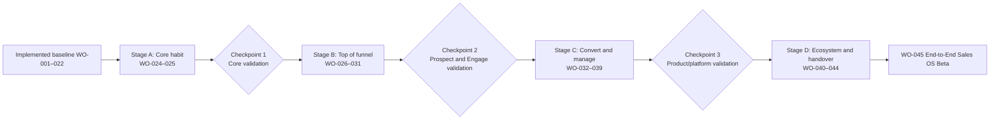

# End-to-end Sales Platform roadmap

- **Status:** Proposed sequence after WO-023; no listed work order is authorised by this document
- **Baseline:** Through WO-022 is implemented; WO-023 is documentation only
- **Decision rule:** Validate each loop before funding the next layer

## Outcome and sequencing principles

The roadmap extends the current interaction-centred Sales Brain into a coherent Sales
OS. Each capability must improve, feed or act on Revenue Brain; create qualified
pipeline for it; or help manage and forecast its represented revenue. Keep the API
and web application as a modular monolith unless measured evidence justifies a later
architecture decision.

The numbered work orders describe traceable planning units, not an unconditional
build queue. A checkpoint can keep, modify, defer or remove any later item. Provider
selection, legal review, user evidence and operational readiness can change sequence.

Microsoft 365 and Google Workspace discovery starts before Engage, but implementation
is pulled forward only for the ecosystem most used by design partners. Do not build
both merely for roadmap symmetry. CRM connector discovery begins before native CRM;
write execution waits for the Action/Execution and source-authority controls.

## Common gate for every future work order

Every work order must:

- declare current versus future behaviour and avoid claiming a stub as an integration;
- pass the [simplicity and discoverability gate](../02-design/simplicity-and-discoverability-principles.md);
- preserve Core with every add-on disabled and protect stable routes/contracts;
- specify tenant/RLS, auth, permission, privacy, retention, audit and safe-log tests;
- use deterministic mocks for normal development/CI and separately gate live providers;
- update product, design, domain, security, operational and decision documentation;
- run affected checks and the complete repository gate before hand-off;
- include feature-specific product usage and trust measures, not arbitrary coverage or
  vanity activity.

## Stage A — Strengthen Core

### WO-024 — Sales Methodology Engine

- **Objective/value/package:** Project canonical Evidence into explainable MEDDIC,
  MEDDPICC, BANT, SPICED and a bounded custom methodology so sellers see gaps without
  form-filling. **Core**.
- **Dependencies/checkpoint:** Evidence provenance, Revenue Brain, Opportunity
  Workspace; validated before WO-025 and at Checkpoint 1.
- **Experience:** Opportunity summary → gaps → full methodology → cited Evidence;
  organisation-admin definition/version flow; compact mobile review.
- **Domain/data:** Versioned definition, field/evidence policy, assignment, projection,
  item and review concepts; no Evidence duplication or destructive switching.
- **Backend/frontend/AI:** Tenant-safe definition/projection services and explicit
  lifecycle endpoints; progressive UI; bounded structured projection with citation
  validation and deterministic fallback.
- **Integrations:** None required; external CRM mapping remains future.
- **Security/privacy/operations:** Least-privilege admin, content-free audit/logs,
  idempotent reprojection, version metrics and correction/unsupported-claim alerts.
- **Acceptance:** Switching methodology preserves Evidence/history; all items use the
  five trust states; every belief explains source/date/conflict; cross-tenant and
  adversarial citation tests pass; arbitrary completion percentage is not primary.
- **Out of scope:** Executable rules, scoring theatre, generic workflow builder and
  automated forecast.
- **Validate:** Observe whether sellers understand/correct gaps and whether suggested
  questions help preparation before proceeding.

### WO-025 — RevenueOS Daily

- **Objective/value/package:** Make “What matters today?” the useful signed-in habit,
  combining Interactions, Actions, deal attention and concise target/forecast state.
  **Core**.
- **Dependencies/checkpoint:** Current dashboard, Meetings/Interactions, Action Layer,
  Revenue Brain and WO-024; concludes at Checkpoint 1.
- **Experience:** Responsive Daily with one top priority, upcoming Interactions,
  attention groups and natural next actions; three levels of explanation; no chart wall.
- **Domain/data:** Prefer read projections over new canonical entities; define
  deterministic priority reason/dismissal/correction and freshness contract.
- **Backend/frontend/AI:** Authorised aggregation/read model; accessible desktop/mobile
  layout and loading/empty/error states; AI may summarise cited reasons but cannot own
  ranking policy or invent missing target/forecast data.
- **Integrations:** Calendar data stays unavailable until a selected ecosystem work
  order; manually supplied/current RevenueOS data must still make Daily useful.
- **Security/privacy/operations:** Role-aware personal/team scope, no sensitive preview
  leaks, content-free ranking telemetry, freshness/dependency health.
- **Acceptance:** A new seller identifies and opens the top task/next Interaction
  within 30 seconds; each priority explains why; keyboard/mobile tests pass; add-on
  absence leaves a complete Core page.
- **Out of scope:** Hundred-chart analytics, background surveillance, free-form chat and
  autonomous execution.
- **Validate:** Check repeated use, action usefulness, dismissal/correction reasons and
  preparation/debrief completion with real Core users.

## Checkpoint 1 — Core product user validation

Decide **keep, modify, defer or remove** for each proposed Stage B item. Proceed only
if users can navigate unaided, trust Evidence/methodology explanations, use Daily to
start meaningful work and still value Core without an add-on. Revisit navigation,
ranking, methodology burden, missing-data handling and willingness to adopt—not just
stated interest.

## Stage B — Create qualified pipeline safely

### WO-026 — Account & Lead Research

- **Objective/value/package:** Source attributable business account/person candidates
  and promote accepted records without polluting the canonical domain. **Prospect**.
- **Dependencies/checkpoint:** Checkpoint 1, provider/legal/source discovery, Evidence
  model, Company/Contact CRUD and entitlement projection.
- **Experience:** Find search/discovery, result reasons/sources, detail, duplicate review
  and Save to Sell; clear prospect/lead/contact/account language.
- **Domain/data:** Research subject/source/finding/run, contact observation, promotion
  review and minimal Lead concepts with provenance, freshness and trust states.
- **Backend/frontend/AI:** Provider adapters, policy/normalisation/promotion services;
  source-rich results; AI only for bounded cited extraction/inference.
- **Integrations:** Select one approved research provider or permitted search path
  after source, coverage, cost, privacy and terms evaluation.
- **Security/privacy/operations:** Purpose limitation, prohibited traits/sources,
  retention/correction/deletion, bulk limits, provider kill switch and quality metrics.
- **Acceptance:** Every claim/source/time/trust state is visible; duplicate promotion
  is safe/idempotent; unknown is not verified; tenant and abuse tests pass.
- **Out of scope:** Scraping prohibited sources, sensitive profiling, guessed verified
  contacts, outreach and purchased-list resale.
- **Validate:** Test source trust, useful match rate, duplicate burden and willingness
  to save researched accounts before deeper person intelligence.

### WO-027 — Prospect Intelligence

- **Objective/value/package:** Explain relevant people, likely business roles and
  buying-committee hypotheses from sourced professional context. **Prospect**.
- **Dependencies/checkpoint:** WO-026 research/provenance and accepted Company/Contact
  boundaries.
- **Experience:** Person results and research detail show professional relevance,
  source links, contact-verification state, uncertainty and correction.
- **Domain/data:** Person findings and relationship/buying-role hypotheses remain
  versioned projections; canonical Contact stores only reviewed accepted facts.
- **Backend/frontend/AI:** Evidence-linked hypothesis generation and contradiction
  handling; accessible source drill-down and explicit save/link actions.
- **Integrations:** Reuse the approved WO-026 provider boundary; add no provider merely
  for feature count.
- **Security/privacy/operations:** Exclude private/sensitive traits and manipulative
  rapport; expiry, correction, provider quality and unsupported-claim monitoring.
- **Acceptance:** Hypotheses are labelled, sourced and correctable; contact status is
  separate from permission; protected-trait tests and cross-tenant tests pass.
- **Out of scope:** Personality scoring, private-life dossiers, facial recognition and
  automatic enrolment.
- **Validate:** Confirm that sourced context improves legitimate preparation rather
  than feeling invasive or adding noise.

### WO-028 — Territory & ICP Intelligence

- **Objective/value/package:** Let teams define, discover and prioritise a permitted
  target market with explainable fit and whitespace. **Prospect**.
- **Dependencies/checkpoint:** WO-026–027, organisation/team permissions and enough
  representative provider coverage.
- **Experience:** Guided ICP builder, territory view, exclusions, result explanations
  and save-to-Sell; advanced criteria disclosed progressively.
- **Domain/data:** Versioned ICP/territory definitions, assignments, criteria/exclusions
  and priority factors; no arbitrary person score.
- **Backend/frontend/AI:** Typed criteria validation, reproducible matching and safe
  prioritisation; AI can translate user intent into proposed supported filters for review.
- **Integrations:** Selected research provider capabilities and optional approved
  geographic/firmographic datasets.
- **Security/privacy/operations:** Territory access, discriminatory-proxy review,
  provider coverage/freshness and reproducible run monitoring.
- **Acceptance:** Users can explain every inclusion/exclusion; versioned reruns are
  reproducible; unsupported/sensitive criteria are rejected; assignment isolation holds.
- **Out of scope:** Consumer segmentation, opaque lookalike models and compensation
  planning.
- **Validate:** Measure whether target lists are actionable and fairly scoped before
  authorising outreach work.

### WO-029 — Personalised Outreach

- **Objective/value/package:** Create relevant, person-specific outreach with exact
  human review and safe provider execution. **Engage**.
- **Dependencies/checkpoint:** WO-026–028 validation, Action/Execution Foundation,
  suppression policy and one chosen mail ecosystem from WO-040 or WO-041 discovery.
- **Experience:** From Find/Sell, choose purpose → draft → inspect sources/content/
  recipient/channel → approve → see receipt; clear pause/stop and unavailable states.
- **Domain/data:** Outreach message, suppression and delivery-attempt concepts linked
  to canonical Contact/Lead and immutable Action proposal inputs.
- **Backend/frontend/AI:** Policy/preflight plus idempotent adapter; exact review UI;
  bounded drafting that cannot self-approve or invent personal facts.
- **Integrations:** Implement one mail provider first based on customer evidence;
  scopes, sender identity, sandbox/test and reconciliation are explicit.
- **Security/privacy/operations:** Lawful basis, jurisdiction, unsubscribe, do-not-contact,
  frequency/quiet-hour/reputation limits, kill switch and provider incident runbook.
- **Acceptance:** Recipient/content mutations invalidate approval; suppression wins at
  dispatch; retries cannot duplicate; every personal fact is sourced; live readiness
  is separate from mock contract tests.
- **Out of scope:** Autonomous campaigns, consumer messaging, deceptive familiarity
  and voice calls.
- **Validate:** Review reply quality, trust, edit/rejection reasons, opt-outs and
  operational safety before sequences.

### WO-030 — Campaigns & Sequences

- **Objective/value/package:** Coordinate bounded multi-step outreach while preserving
  message-level control and recipient safety. **Engage**.
- **Dependencies/checkpoint:** Proven safe WO-029 execution, suppression and provider
  health; sufficient legitimate repeat use.
- **Experience:** Four-stage campaign builder (goal/audience, steps, review, launch),
  inspectable person messages, schedule, progress, pause/stop and simple exceptions.
- **Domain/data:** Campaign, immutable SequenceVersion, steps, enrolment and terminal
  reason; no copied identity records.
- **Backend/frontend/AI:** Lifecycle services, scheduler using existing durable job
  patterns, versioned preview and exception UI; AI personalisation stays schema-bound.
- **Integrations:** Same proven provider first; additional channels need separate
  policy and connector work orders.
- **Security/privacy/operations:** Batch limits, revalidation at every step, global
  suppression propagation, bounce/complaint stops, concurrency and queue-drain runbooks.
- **Acceptance:** Pause/stop wins races; replies/unsubscribes end enrolment; published
  versions are immutable; exact batch approval policy is demonstrably bounded.
- **Out of scope:** General marketing automation, arbitrary branching/workflows,
  growth hacking and unbounded auto-send.
- **Validate:** Customer review after limited pilots; progress only if safe controls
  remain understandable and legitimate conversations improve.

### WO-031 — Event Intelligence

- **Objective/value/package:** Prepare for, capture and follow up authorised business
  events without treating attendance as consent. **Engage**.
- **Dependencies/checkpoint:** WO-026–030 foundations, current Interaction/Evidence
  lifecycle and documented attendee authority.
- **Experience:** Before-event attendee/link review and goals; during-event quick capture;
  after-event person-specific review, follow-up and Lead/Opportunity proposal.
- **Domain/data:** Sales event, attendee association, authority/provenance, retention
  and follow-up status linked to canonical identities.
- **Backend/frontend/AI:** Secure bounded import, duplicate/link service and event
  projections; mobile capture; AI prepares sourced context and drafts only.
- **Integrations:** CSV first if authorised; event platform adapters only after customer
  and provider evidence.
- **Security/privacy/operations:** Authority, minimisation, deletion, no blanket consent,
  lost-device/mobile risk, import limits and bulk-operation monitoring.
- **Acceptance:** No attendee is silently promoted/enrolled; every import has authority
  and expiry; follow-up passes ordinary outreach policy; deletion propagates.
- **Out of scope:** Event ticketing, attendee surveillance, badge tracking and event
  marketing suite.
- **Validate:** Concludes at Checkpoint 2; assess whether event workflows produce
  trusted follow-up and qualified Opportunities rather than more contact volume.

## Checkpoint 2 — Top-of-funnel validation

Review Prospect and Engage separately and together. Decide **keep, modify, defer or
remove** using source trust/correction, target-list usefulness, qualified Opportunity
creation, legitimate response, opt-out/complaint, provider cost and support burden.
Stop or narrow Engage if safe human control degrades at campaign scale. Do not make
Create or CRM dependent on purchasing Prospect/Engage.

## Stage C — Convert, manage and understand revenue

### WO-032 — Sales Content Studio

- **Objective/value/package:** Generate evidence-grounded presentations and proposals
  inside approved organisation templates and content. **Create**.
- **Dependencies/checkpoint:** Checkpoint 2, Revenue Brain Evidence, Workspace file
  policy, secure object storage/processing decision and entitlement contract.
- **Experience:** Guided Create → type → Opportunity → purpose → audience → template →
  review; version history, source inspection and accessible previews.
- **Domain/data:** Template/version, layout, brand rules, approved content item,
  generation request/plan, asset and provenance manifest.
- **Backend/frontend/AI:** Isolated bounded PPTX/DOCX parse, structured planner,
  deterministic renderer and validation; guided responsive UI; AI suggestions remain
  citation- and schema-constrained.
- **Integrations:** Private object storage is required; Office/Google editing export is
  evaluated later, not assumed.
- **Security/privacy/operations:** Malware/active-content/resource controls, scoped
  object access, retention/erasure, queue limits, render diagnostics and kill switch.
- **Acceptance:** Hostile files fail safely; every material claim has a source class;
  layouts pass visual/accessibility checks; users approve a version before export;
  cross-tenant file access is denied.
- **Out of scope:** Generic design tool, DAM/SharePoint clone, free-form document AI,
  CPQ and electronic signature.
- **Validate:** Test time-to-useful first draft, factual correction and template/render
  success before extending content types.

### WO-033 — ROI & Business Case Builder

- **Objective/value/package:** Produce transparent, customer-specific business cases
  with reproducible numbers and assumptions. **Create**.
- **Dependencies/checkpoint:** WO-032 generation/provenance; approved commercial inputs
  and Revenue Brain Evidence.
- **Experience:** Guided model selection, labelled inputs/sources, sensitivity, review
  and proposal/presentation insertion; no blank prompt.
- **Domain/data:** Versioned ROI model, typed inputs/units/formulas, run, scenarios and
  provenance; outputs link to generated assets without becoming canonical Evidence.
- **Backend/frontend/AI:** Deterministic calculation service and validation; accessible
  tables/charts; AI can explain or flag missing inputs but cannot generate numbers.
- **Integrations:** Optional approved product/pricing source later; manual confirmed
  input is sufficient for first use.
- **Security/privacy/operations:** Commercial-access policy, formula review, currency/
  rounding rules, audit/versioning and deterministic replay monitoring.
- **Acceptance:** Same version/inputs yield the same result; assumptions and sources
  travel with the output; missing inputs cannot be silently filled; sensitivity is clear.
- **Out of scope:** Financial advice, guaranteed returns, full CPQ/pricing engine and
  contract approval.
- **Validate:** Customer and finance/legal review of comprehensibility, credibility and
  workflow value before adding formula flexibility.

### WO-034 — Native CRM Foundation

- **Objective/value/package:** Let selected smaller teams manage the minimum canonical
  relationship/pipeline state natively, without a parallel CRM silo. **CRM**.
- **Dependencies/checkpoint:** Stable Company/Contact/Opportunity/Task/Interaction,
  Evidence/Action foundations, entitlement service and source-authority decision.
- **Experience:** CRM capabilities appear inside Sell/Pipeline; simple Lead review,
  bounded stages, canonical edits, CSV dry-run/import and Settings configuration.
- **Domain/data:** Lead, Product, OpportunityProduct, StageDefinition/History, typed
  custom fields and ImportJob; reuse every existing canonical entity.
- **Backend/frontend/AI:** Tenant/RLS repositories, lifecycle/import/dedupe services;
  progressive forms/list/board; AI proposes reviewed updates from accepted Evidence.
- **Integrations:** None required for native mode; external CRM coexistence policy is
  documented before connector work.
- **Security/privacy/operations:** Import isolation/limits/recovery, role permissions,
  source metadata, migration/backup readiness and content-safe observability.
- **Acceptance:** Core still works without CRM; no duplicate Company/Contact/Opportunity
  model; imports dry-run and retry safely; typed-field limits hold; tenant tests use
  real PostgreSQL/RLS.
- **Out of scope:** Salesforce parity, marketing/service/billing, arbitrary objects,
  page builders and general workflow engine.
- **Validate:** Observe whether the minimum scope replaces spreadsheet/lightweight CRM
  work for target teams before expanding it.

### WO-035 — Pipeline & Deal Management

- **Objective/value/package:** Make Pipeline and the Opportunity Deal Room the simple
  operating view for progressing revenue. **Core experience enriched by CRM**; canonical
  Brain/workspace/action views stay Core, native stage administration/editing is CRM.
- **Dependencies/checkpoint:** WO-024–025 and WO-034 where native CRM controls apply.
- **Experience:** List/board, filters and concise value/close date/owner/methodology/
  risk/next action/Brain change; Opportunity sections Overview, People, Activity, Deal,
  Actions, Files and Insights.
- **Domain/data:** Stage history/read projections and Opportunity workspace associations;
  avoid new copies of Brain, Evidence or files.
- **Backend/frontend/AI:** Authorised pipeline query/projection, optimistic updates and
  URL-shareable filters; responsive list first on mobile; AI explains change/risk and
  proposes reviewable updates.
- **Integrations:** External CRM values remain read-only/unavailable until WO-042 or an
  explicit provider-specific precursor.
- **Security/privacy/operations:** Field/team access, bulk action limits, concurrency,
  stale-source labels and query performance/error monitoring.
- **Acceptance:** Sellers answer “Where are my deals?” and “How do I win this deal?”
  without navigating entity sprawl; source authority is visible; board/list agree;
  Core-only path remains complete.
- **Out of scope:** General project management, gantt/resource planning, separate CRM
  top nav and opaque health scores.
- **Validate:** Test deal-review speed, next-action discovery and information density
  with sellers/managers before analytics expansion.

### WO-036 — Sales Analytics

- **Objective/value/package:** Deliver reproducible funnel, pipeline, activity,
  conversion, velocity, cycle and win/loss understanding. **Core**.
- **Dependencies/checkpoint:** Stable lifecycle events and stage history, explicit
  metric/attribution definitions and enough representative history.
- **Experience:** Home/Insights surface what changed and needs action; charts/tables are
  secondary drill-down with scope, cohort, freshness and definition visible.
- **Domain/data:** Versioned business event, MetricDefinition and MetricObservation;
  corrections, ambiguity and late events are first-class.
- **Backend/frontend/AI:** Deterministic metrics/read models; accessible charts/tables;
  AI summarises computed observations and cannot invent or imply causality.
- **Integrations:** Internal canonical state first; connector data is accepted only
  through mapped authoritative events.
- **Security/privacy/operations:** Individual/team scope, no surveillance telemetry,
  currency/timezone/attribution tests, replay and freshness monitoring.
- **Acceptance:** Fixture outcomes reconcile exactly; conversion cohorts are explicit;
  ambiguous associations are not counted silently; definitions are versioned and linked.
- **Out of scope:** Generic BI, arbitrary SQL/formulas, vanity dashboards and rep scoring.
- **Validate:** Confirm users can answer why pipeline changed and act without analyst
  training before adding targets.

### WO-037 — Targets & KPI Engine

- **Objective/value/package:** Compare supported individual/team outcomes with clear
  monthly, quarterly and annual goals. **Core**.
- **Dependencies/checkpoint:** WO-036 metric definitions and team permission model.
- **Experience:** Concise Daily/Insights progress and gap explanation; Settings/admin
  target configuration; activity remains supporting context.
- **Domain/data:** Effective-dated TargetDefinition, assignment, supported KPI mapping
  and progress projection with aggregation/credit policy.
- **Backend/frontend/AI:** Typed validation and deterministic calculation; accessible
  progress/drill-down; AI may phrase the gap and suggest evidence-backed next steps.
- **Integrations:** Optional authoritative target import later; manual/admin entry first.
- **Security/privacy/operations:** Manager scope, history/audit, currency/period policy,
  double-count prevention and recalculation monitoring.
- **Acceptance:** Individual/team totals reconcile; target changes preserve history;
  the unit/window/credit rule is visible; unsupported formulas fail clearly.
- **Out of scope:** Compensation, commission calculation, performance ranking and
  surveillance.
- **Validate:** Check goal clarity, behaviour effects and whether targets make Daily
  more useful rather than anxiety-producing.

### WO-038 — Forecasting

- **Objective/value/package:** Produce an evidence-based estimate and range with clear
  drivers, missing data and calibration. **Core**.
- **Dependencies/checkpoint:** WO-024, WO-035–037, sufficient clean historical outcomes
  and agreed deterministic/statistical MVP policy.
- **Experience:** Daily headline, Pipeline deal factors and Insights scenario drill-down;
  distinguish model, seller and manager views and show changes over time.
- **Domain/data:** Versioned forecast run/snapshot, scenario/range, assumptions,
  deal contributions, calibration and override history.
- **Backend/frontend/AI:** Reproducible deterministic/statistical engine and scheduled/
  on-change computation; uncertainty-first UI; AI explains cited factors only.
- **Integrations:** Internal canonical data first; external CRM histories only after
  authority/mapping quality is proven.
- **Security/privacy/operations:** Access and override audit, sparse-cohort/bias review,
  backtesting, drift/freshness alerts and safe unavailable fallback.
- **Acceptance:** Every result has range, versions, assumptions and factor explanation;
  overrides preserve both views; backtests/calibration meet a predeclared baseline;
  sparse data never yields false precision.
- **Out of scope:** Unexplained probability scores, premature learned model, contractual
  guarantee and auto-changing Opportunity truth.
- **Validate:** Compare usefulness, calibration and override reasons across real cycles
  before using forecast in manager recommendations.

### WO-039 — Manager Intelligence

- **Objective/value/package:** Answer “Where does my team need help?” with authorised,
  evidence-backed coaching and deal attention. **Core**.
- **Dependencies/checkpoint:** WO-024, WO-035–038 and manager/team access policy;
  concludes at Checkpoint 3.
- **Experience:** Role-aware Home/Pipeline/Insights, team target/forecast/coverage,
  critical deal gaps, upcoming interactions and coaching; no separate manager product.
- **Domain/data:** Prefer projections over employee-profile entities; store recommendation
  version, cited factors, review/dismissal and safe outcome association.
- **Backend/frontend/AI:** Team-scoped aggregation/recommendation service; progressive
  list-to-evidence UX; AI language constrained to observed association, not causation.
- **Integrations:** No new integration; external sources must already be authorised and
  mapped into canonical state.
- **Security/privacy/operations:** Least-privilege team visibility, no private-source or
  presence telemetry, safe audit, recommendation quality/correction monitoring.
- **Acceptance:** Managers identify a high-value coaching action and explain its basis;
  users never receive a rep score; permission boundaries and sparse-data states pass;
  every suggestion is correctable/dismissible.
- **Out of scope:** Workforce surveillance, HR performance management, compensation,
  causal claims and autonomous manager messaging.
- **Validate:** Manager and seller trust study at Checkpoint 3; remove signals that do
  not create fair, useful coaching.

## Checkpoint 3 — Product/platform validation

Assess Core, Create and CRM as separate commercial propositions and as a connected
system. Decide **keep, modify, defer or remove** using activation, Core retention,
forecast calibration/trust, content quality, native-CRM replacement evidence,
permission/support burden and willingness to pay. Revisit whether integration breadth,
Deal Rooms or handover is the highest-leverage next investment. Do not call the result
an end-to-end beta until operational and privacy gates pass.

## Stage D — Ecosystem, extended workspace and beta

WO-040 and WO-041 are discovery competitors as well as roadmap items. Implement the
first ecosystem demanded by validated customers; the other may follow only when its
incremental reach justifies duplicate provider/security/operations work.

### WO-040 — Microsoft 365

- **Objective/value/package:** Connect the first validated Microsoft ecosystem data and
  actions needed for Daily, Interactions and Engage. **Core integration foundation;
  add-on execution capabilities follow their module**.
- **Dependencies/checkpoint:** OAuth/provider security design, current Action/Execution
  Foundation and customer evidence that Microsoft is the first ecosystem.
- **Experience:** Settings connection/health; calendar/email context in natural pages;
  reviewed send/calendar actions with source/authority state.
- **Domain/data:** External account/binding, consented scope, sync cursor/receipt and
  canonical association; provider payload is not the domain.
- **Backend/frontend/AI:** Microsoft adapter(s), verified OAuth lifecycle, incremental
  sync/reconciliation; connection UI and failure recovery; AI only consumes mapped
  authorised canonical context.
- **Integrations:** Choose the minimum Graph calendar/mail scopes and functions; do not
  claim Teams/SharePoint support unless separately delivered.
- **Security/privacy/operations:** State/PKCE/redirect validation, encrypted secrets,
  least scopes, webhook verification, revoke/rotate, throttling and provider runbooks.
- **Acceptance:** Mock/contract tests never require credentials; live readiness proves
  connect/revoke/sync/execute/reconcile safely; disconnect stops access and explains
  retained canonical data.
- **Out of scope:** Full Microsoft 365 client, mailbox backup, SharePoint clone and
  unrestricted tenant-wide access.
- **Validate:** Provider pilot and support/cost review before widening scopes or making
  the integration a commercial dependency.

### WO-041 — Google Workspace

- **Objective/value/package:** Connect the first validated Google calendar/mail data
  and actions needed for Daily, Interactions and Engage. **Core integration foundation;
  add-on execution capabilities follow their module**.
- **Dependencies/checkpoint:** Same platform controls as WO-040 and customer evidence
  that Google is first or sufficiently incremental.
- **Experience:** Parallel connection/health and contextual calendar/email workflows;
  no second product navigation pattern.
- **Domain/data:** Reuse provider-neutral account/binding/cursor/receipt and canonical
  association contracts.
- **Backend/frontend/AI:** Google adapter(s), verified OAuth, incremental sync and
  reconciliation; shared provider-neutral UI; mapped context only.
- **Integrations:** Minimum Gmail/Calendar scopes/functions; Drive/Docs are not implied.
- **Security/privacy/operations:** Consent verification, secure tokens, least scopes,
  webhook/channel renewal, quotas, revoke and incident runbooks.
- **Acceptance:** Provider-neutral contract remains intact; live pilot proves safe
  connect/revoke/sync/execute/reconcile; cross-account and cross-tenant tests pass.
- **Out of scope:** Full Google Workspace replacement, mailbox archiving, Drive clone
  and broad domain delegation.
- **Validate:** Compare adoption, support and cost with Microsoft; defer the second
  ecosystem if demand is weak.

### WO-042 — CRM Connectors

- **Objective/value/package:** Let customers retain an external CRM while RevenueOS
  supplies interaction intelligence, Brain context and reviewed updates. **Core read
  foundation with provider/update availability commercially determined later**.
- **Dependencies/checkpoint:** Native CRM source-authority model, Action/Execution
  Foundation, selected CRM demand and provider/security review.
- **Experience:** Settings mapping/health/conflicts; source authority visible inside
  Sell/Pipeline; exact reviewed outbound updates and actionable sync errors.
- **Domain/data:** Provider-neutral SyncBinding, field mapping/authority, cursor,
  tombstone, conflict and reconciliation state linked to canonical entities.
- **Backend/frontend/AI:** One connector first, incremental idempotent sync and mapping;
  conflict UI; AI never bypasses the reviewed Action boundary.
- **Integrations:** Select by design-partner stack, API quality, scopes, sandbox and cost;
  do not promise a connector matrix in advance.
- **Security/privacy/operations:** Secret/scopes, webhook signatures, field allow-lists,
  deletion policy, replay/backfill limits, provider outage/runbooks and safe telemetry.
- **Acceptance:** Authority conflicts cannot silently overwrite; retries are idempotent;
  disconnect/reconnect/reconciliation are tested; Core remains readable during outage.
- **Out of scope:** Universal ETL, arbitrary object sync and recreating every external
  CRM automation.
- **Validate:** Field-mapping/support burden and actual reduction in CRM administration
  before adding providers or bidirectionality.

### WO-043 — Deal Rooms / Extended Workspace

- **Objective/value/package:** Organise the evidence and working assets needed to win a
  specific Opportunity. **Core Deal Room; unusually large storage/governance may be
  Enterprise**, without crippling ordinary use.
- **Dependencies/checkpoint:** Opportunity Workspace, WO-032 files/templates, secure
  storage/search and customer evidence of document friction.
- **Experience:** Opportunity Files/Deal section with grouped proposals, presentations,
  business cases, pricing, RFP/security/contract material and timeline associations;
  simple upload/find/review first.
- **Domain/data:** Reuse Workspace asset/provenance/version concepts and typed Opportunity
  associations; no generic folder/content graph by default.
- **Backend/frontend/AI:** Secure upload/version/preview/search; accessible file states;
  AI may classify/summarise authorised content with citations and review.
- **Integrations:** Optional OneDrive/Drive/SharePoint links only through explicitly
  scoped work; no implicit import.
- **Security/privacy/operations:** Malware/active-content, object access, customer
  sharing, retention/legal hold/export/erasure, storage quotas and restoration tests.
- **Acceptance:** Users find the current approved asset from Opportunity context;
  source/version/access is clear; cross-tenant URL and deletion tests pass.
- **Out of scope:** SharePoint/DAM replacement, generic collaborative docs, records
  management and public customer portal unless separately validated.
- **Validate:** Measure findability and duplication reduction; defer enterprise file
  expansion if Opportunity-centred storage is sufficient.

### WO-044 — Closed-Won Handover

- **Objective/value/package:** Turn reviewed Sales Brain knowledge into a concise,
  authorised Customer Success handover package. **Core handover proposal; future
  Customer Success product remains separate**.
- **Dependencies/checkpoint:** Reliable Revenue Brain/Workspace, closed-won lifecycle,
  recipient permissions, export/sharing and privacy policy.
- **Experience:** Opportunity Close → proposed objectives, success criteria,
  stakeholders, sponsor, implementation needs, risks, promises, commitments, outcomes
  and actions → review/redact → choose recipients → approve/share.
- **Domain/data:** Versioned purpose-bound handover manifest with Evidence references,
  recipient/approval and delivery receipt; no Customer Brain entity yet.
- **Backend/frontend/AI:** Structured proposal and export/delivery through Action/
  Execution; review UI; AI summarises only cited authorised Evidence.
- **Integrations:** Internal export first; selected customer-success destination only
  after demand and access review.
- **Security/privacy/operations:** Minimise raw transcripts/research, explicit recipients,
  retention/revoke where possible, content-safe audit and delivery reconciliation.
- **Acceptance:** Every claim is cited or user-supplied; seller can redact/correct;
  recipient and exact version are recorded; unrelated sensitive Evidence is excluded.
- **Out of scope:** Customer Success Brain, renewal/health scoring, onboarding project
  management and autonomous customer communication.
- **Validate:** Joint seller/CS review for completeness, accuracy and oversharing before
  any destination automation.

### WO-045 — End-to-End Sales OS Beta

- **Objective/value/package:** Harden only the validated module set into a supportable,
  secure commercial beta; a customer need not purchase every module. **Release work
  across Core and approved module betas**.
- **Dependencies/checkpoint:** Checkpoint 3 decisions plus release gates for the selected
  WO-040–044 capabilities; unresolved high risks have owners and rollback plans.
- **Experience:** Coherent six-area desktop IA, simple mobile Today/Interactions/Actions/
  Search, first-run onboarding, module-safe states, feedback/support and consistent copy.
- **Domain/data:** Schema/contract inventory, migration/rollback, retention/export/
  erasure and source-authority consistency across included modules.
- **Backend/frontend/AI:** Performance/reliability/accessibility hardening, evaluation
  gates and safe fallbacks; no new speculative feature; providers remain behind adapters.
- **Integrations:** Only live-ready selected providers, with customer-visible capability
  and health; mocks/stubs remain clearly labelled and production-prohibited.
- **Security/privacy/operations:** Threat/privacy assessments, penetration testing as
  appropriate, support/admin controls, incident/DR/backup restore, quotas/cost controls,
  legal/commercial terms and production identity readiness.
- **Acceptance:** Release definitions below are met for each advertised beta; complete
  validation passes; no Critical/High unowned risk; rollback/kill switch and customer
  support procedures are rehearsed; all claims match real capability.
- **Out of scope:** General availability, unlimited scale, every connector/module,
  Recruitment Brain, Customer Success Brain and autonomous AI SDR.
- **Validate:** Cohort launch with explicit success/stop criteria; iterate before any
  general-availability commitment.

## Release definitions

| Release                     | Minimum credible boundary                                                                                                                                                                                        |
| --------------------------- | ---------------------------------------------------------------------------------------------------------------------------------------------------------------------------------------------------------------- |
| **Sales Brain Beta**        | Deliberate Interaction input/capture path, reviewable debrief and Evidence, longitudinal Revenue Brain/Opportunity Workspace, safe Action proposals and production-ready identity/privacy for the offered cohort |
| **End-to-End Core Beta**    | Sales Brain Beta plus methodology, Daily, Workspace, actionable Intelligence/analytics/targets and an honest evidence-based forecast or explicit unavailable state                                               |
| **Prospect Beta**           | Approved sourced research, trust/contact states, ICP/territory and safe promotion into Sell, with provider/privacy operations                                                                                    |
| **Engage Beta**             | Person-specific reviewed outreach and only the validated campaign/event subset, with suppression, provider execution and incident controls                                                                       |
| **Create Beta**             | Secure template/content ingestion, evidence-grounded presentation/proposal generation and deterministic ROI where offered                                                                                        |
| **CRM Beta**                | Minimum lovable native mode inside Sell/Pipeline, safe import and clear authority; connectors only if separately live-ready                                                                                      |
| **RevenueOS Complete Beta** | End-to-End Core plus only module betas that independently meet their gates; one coherent entitlement/navigation/support experience                                                                               |

Sales Brain Beta can be the first commercial product. No release requires every future
module, both productivity ecosystems or every connector.

## Commercial learning and natural expansion

Land with Core because Sales Brain, methodology, Daily, Intelligence and Workspace
must be enough to love. Expand only at a genuine workflow boundary: a pipeline gap can
make Prospect relevant; selected targets can make Engage relevant; an active deal can
make Create relevant; a team seeking a lighter system of record can evaluate CRM.
Complete is convenience, not forced dependency. Discovery is contextual, infrequent
and honest; no blocked Core workflow or aggressive pop-up acts as an advertisement.

Evaluate seats/team scope, research/contact credits, AI use, storage and execution
volume, but set no price before customer and cost research. Enterprise may add SSO,
SCIM, governance, residency, retention, advanced permission/integration/support and
audit controls where genuinely implemented.

## Category and messaging guardrails

Core message: **RevenueOS Sales Brain understands every customer interaction,
remembers the entire Opportunity and helps you know what matters and what to do next.**

Platform message: **RevenueOS helps salespeople find the right customers, understand
the right people, win better conversations, progress every Opportunity and know what
to do next.**

Against CRM, conversation-intelligence, engagement, prospecting/data, forecasting,
enablement and proposal-tool categories, position the connected Evidence → Brain →
Action workflow—not an unsupported feature-count or competitor claim.

## Explicitly not RevenueOS scope

- generic project management, document management or SharePoint replacement;
- a full Salesforce clone, generic marketing automation or generic BI platform;
- unrestricted automation/no-code/workflow engines or arbitrary executable fields;
- a social network, generic AI chatbot on every page or infinite customisation;
- employee surveillance, manipulative research or uncontrolled outreach;
- near-term Customer Success Brain, Recruitment Brain or autonomous AI SDR/cold calling.

Any proposed exception needs customer evidence, an architecture decision, security/
privacy review and a clear link to the Sales OS loop.

## Roadmap governance

At each checkpoint record the customer cohort, evidence, decision, changed assumptions,
risks, package impact and next smallest experiment. A work order is complete only when
code, contracts, schema, UI states, documentation, security behaviour, observability
and validation agree. This roadmap should be updated when evidence changes; preserving
the numbering is less important than preserving trust and simplicity.
