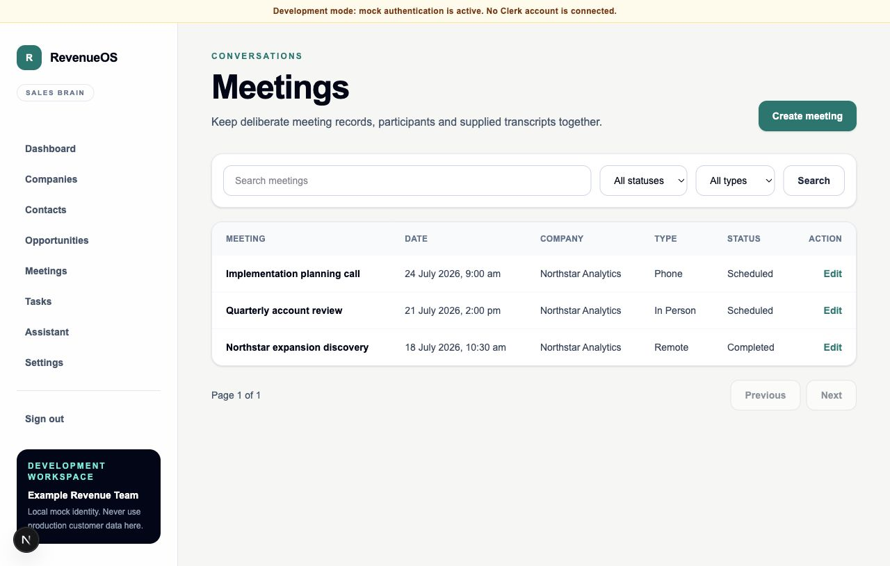
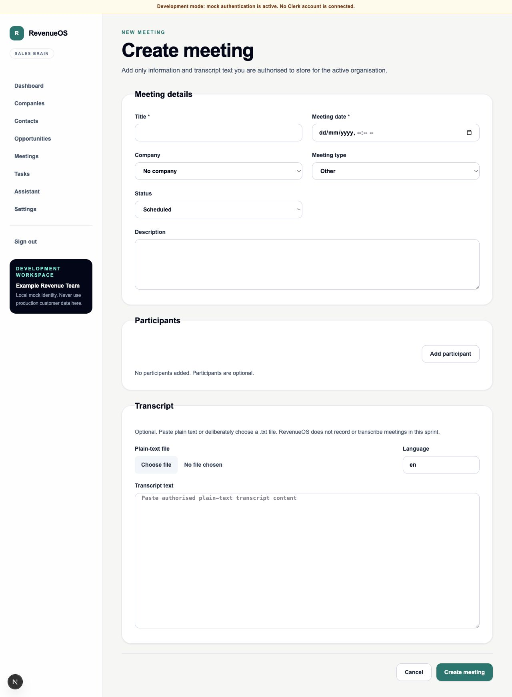
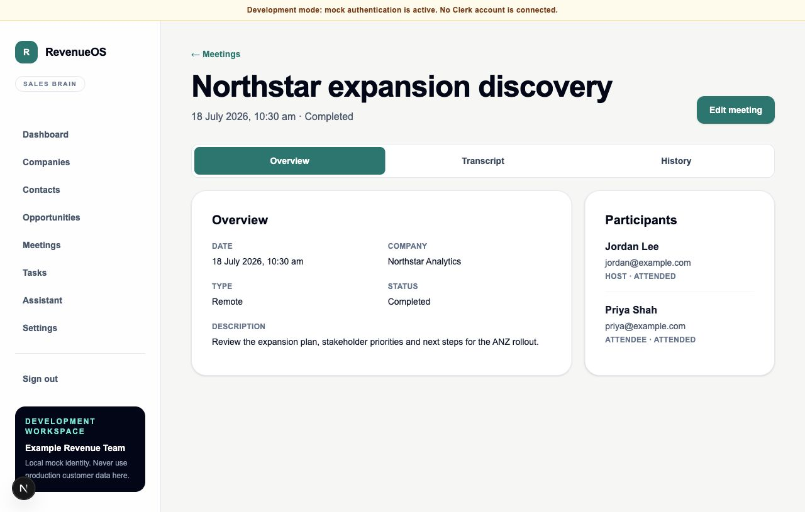
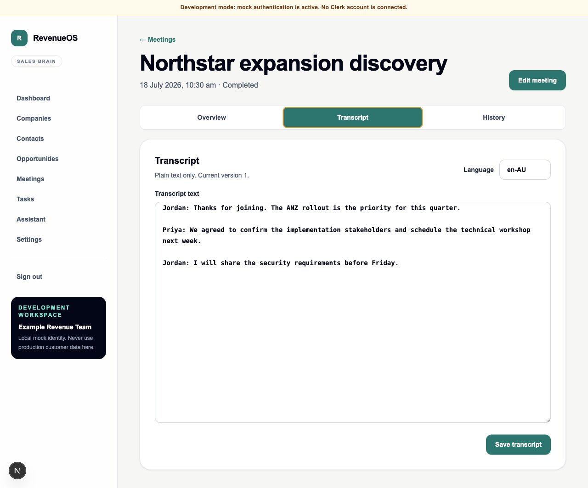
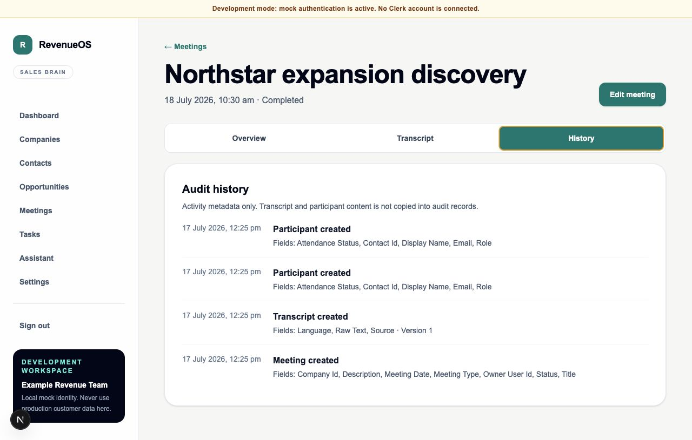
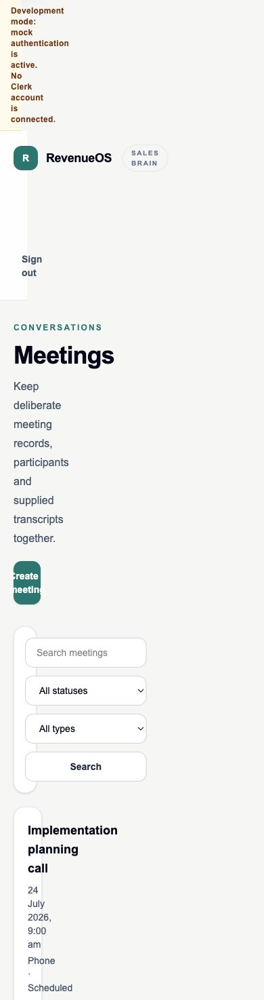

# Sprint 03 — Meeting Domain Foundation

## Objective

Deliver complete non-AI, tenant-isolated support for meetings, participants, deliberately supplied plain-text transcripts and meeting audit activity without adding recording, transcription, integrations or automation.

## Delivered scope

- SQLAlchemy models and Alembic migration for Meeting, MeetingParticipant, Transcript and MeetingAuditEvent.
- Explicit meeting type/status, attendance, participant role, transcript source and audit enums.
- Organisation-scoped composite relationships and active-membership ownership constraints.
- Enabled and forced PostgreSQL RLS on all four Meeting Domain tables.
- Pydantic create, patch and response contracts with camel-case JSON and bounded inputs.
- Meeting, Participant and Transcript services using the existing repository architecture.
- Versioned `/api/v1/meetings` routes with list search, filters, sorting and pagination.
- Soft deletion for meetings, participants and transcripts.
- Optimistic transcript correction through a required integer version.
- Content-minimised audit history containing changed field names, never raw transcript content.
- Responsive meeting list, create/edit form and detail experience with Overview, Transcript and History tabs.
- Deliberate browser-side `.txt` reading and plain-text editing; no media upload or processing.
- API, validation, migration, PostgreSQL RLS, component and browser tests.

## Release notes

**Release identifier:** Sprint 3 / API `0.3.0`

User-visible changes:

- Users can search, filter and page through organisation-scoped meeting records.
- Users can create and edit meeting metadata, associate an optional company and manage participants.
- Users can deliberately paste transcript text or select a local `.txt` file for browser-side reading.
- Users can review meeting details, correct plain-text transcripts with optimistic version protection and inspect content-minimised audit activity.
- Desktop table and mobile card layouts preserve the same meeting actions and states.

Deployment notes:

- Apply Alembic revision `0003_meeting_domain` before serving API `0.3.0`.
- The application database role must remain subject to forced RLS and receive a transaction-local organisation context.
- Downgrade removes the four Sprint 3 tables and their data while preserving Sprint 2 tables; take an environment-appropriate backup before rollback.
- No existing Sprint 2 endpoint is removed or renamed.
- Do not use production customer data until production identity, consent, retention/export/erasure and operational controls are complete.

## Data and migration

Migration `0003_meeting_domain` creates:

- `meetings`, including optional same-tenant company, member ownership/provenance, lifecycle enums and `deleted_at`;
- `meeting_participants`, including optional same-tenant contact, validated display/email identity and `deleted_at`;
- `transcripts`, including one row per meeting, raw plain text, language, source, optimistic version and `deleted_at`; and
- `meeting_audit_events`, including actor, action, entity, changed field names and optional transcript version.

Each table has non-null organisation ownership, tenant-oriented indexes and forced RLS. Composite foreign keys prevent cross-tenant meeting, company, contact and member attachment. Downgrade drops only the four Sprint 3 tables in dependency order and leaves Sprint 2 intact.

## Assumptions

- The work order's direct transcript CRUD requirement supersedes the earlier roadmap proposal that deferred transcript content.
- Every tenant-owned child and audit row includes `organisation_id`, even where the abbreviated work-order field list omitted it, because repository predicates, RLS and composite foreign keys require it.
- All active organisation members may manage meetings until a finer role matrix is approved.
- A meeting has at most one active or soft-deleted transcript row. Correction increments a version counter; this is not historical transcript snapshot storage.
- Selecting a `.txt` file means reading it locally into the plain-text field. Object storage, media ingestion and transcription remain out of scope.

## Security notes

The organisation never appears in write contracts. Meeting dependencies derive tenant context from authentication and fail closed when local membership is absent. Repositories scope every operation, PostgreSQL receives a transaction-local tenant setting, RLS is forced, composite tenant foreign keys block cross-tenant relationships, and tests cover cross-tenant reads and mutations.

Transcript text is confidential untrusted customer content. It is bounded, excluded from logs and audit events, rendered only as plain text and never sent to a model. Meeting deletion is soft-only and is not a complete privacy erasure workflow.

Do not use production customer data. Verified production authentication, consent evidence, retention/export/erasure, production database-role provisioning and operational controls remain incomplete.

## Known limitations

- Clerk production session verification is not connected.
- The role model does not yet restrict transcript visibility below organisation membership.
- The edit UI updates meeting metadata, participants and transcript through their separate REST resources; a child request failure can leave earlier successful edits applied.
- Transcript versions are optimistic counters, not immutable content snapshots or segment history.
- Soft deletion hides application records but does not implement hard erasure, backup expiry or legal hold policy.
- Audit history is meeting-local and has no organisation export, retention policy or integrity seal.
- Only `.txt` selection and pasted plain text are supported; there is no recording, media storage, transcription or format conversion.

## Screenshots

## Future Meeting Intelligence extension points

A separately authorised Meeting Intelligence sprint can:

- attach a new versioned AI artefact to `Meeting.id` and the exact source `Transcript.version`;
- use provider ports and durable background execution outside the HTTP request;
- store generated output separately from the user-supplied transcript;
- validate structured output and citations against the source version;
- add review/accept/reject state without granting a model write authority over meetings, tasks or external systems; and
- preserve existing tenant predicates, RLS, deletion propagation and content-safe observability.

These are extension seams only. Sprint 3 contains no AI provider, prompt, worker, job, embedding, vector store or generated artefact.

## Acceptance checks

- Meeting, participant and transcript CRUD works under `/api/v1`.
- Meeting creation is atomic across optional initial participants/transcript and audit metadata.
- Search, filters, sorting and pagination are deterministic.
- Required title/date, timezone, email, language and participant identity validation fail safely.
- Missing and cross-tenant records return safe not-found responses without existence disclosure.
- Soft-deleted records disappear from ordinary reads and child rows are also soft-deleted.
- Stale transcript corrections return `409`.
- Migration upgrades, drift check and downgrade are covered.
- PostgreSQL RLS integration includes all tenant-owned tables.
- Web experiences cover loading, empty, error, create, edit, detail tabs and mobile layouts.

## Validation results

- Web formatting, ESLint and strict TypeScript: passed.
- Vitest/React Testing Library: 21 tests passed.
- Playwright Chromium: 6 journeys passed.
- Next.js production build: passed.
- Ruff formatting/lint and mypy strict: passed.
- Pytest: 42 tests passed locally; the PostgreSQL-only RLS test skipped under local SQLite and runs in CI against PostgreSQL 16.
- Alembic upgrade/downgrade test and migration drift check: passed.
- API source distribution and wheel build: passed.
- Repository secret and Sprint 3 scope scan: passed.

## Explicitly not delivered

No OpenAI, summaries, action extraction, relationship memory, CRM/calendar/email/meeting-platform integration, recording, media upload/storage, transcription, notifications, automation, embeddings, vector database or workflow engine.
