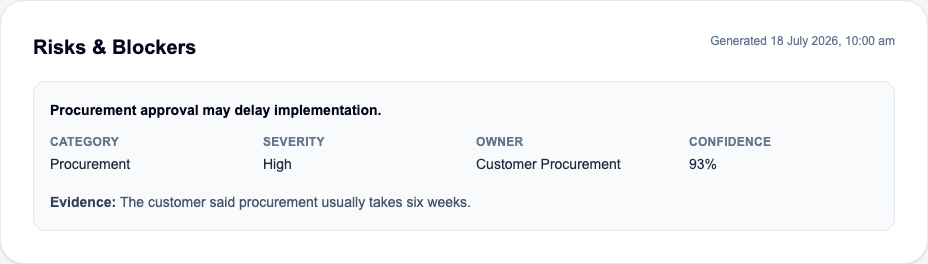

# WO-004C4 — Meeting Risks & Blockers Intelligence

## Delivered scope

WO-004C4 adds the fourth current-transcript Meeting Intelligence capability:

- strict immutable `risks_blockers` schema v1 with at most 25 risks;
- normalised category and qualitative severity enums, nullable supported owner,
  finite confidence and short paraphrased evidence;
- prompt v1 that distinguishes risks from Decisions, Action Items and Open
  Questions, rejects probability/mitigation output and treats transcript
  instructions as untrusted data;
- deterministic no-network mock and explicit OpenAI allowlist support;
- durable worker execution, bounded structured-output retry and versioned
  append-only artefact persistence;
- tenant-scoped idempotent POST and safe lifecycle/result GET endpoints;
- accessible Intelligence panel with terminal three-second polling; and
- schema, provider, executor, API, persistence, migration, UI and Playwright
  regression tests.

Migration `0010_risks_blockers` was required only to widen the existing job and
artefact type checks. No table, column, datastore or RLS policy was introduced.

## Security and data handling

The active organisation remains derived from trusted authentication. Worker
loads and persistence run under transaction-local tenant context with forced
RLS and composite tenant traces. Transcript, rendered prompt, raw provider
output, risk/owner/evidence text and secrets do not enter logs or audit
metadata. OpenAI receives the transcript only when explicitly configured;
automated tests never call it.

## Explicitly excluded

Open Questions, follow-up email, mitigation planning, probability, risk
editing, task creation, CRM suggestions/integrations, deal scoring, MEDDICC,
BANT, memory, recording, transcription, streaming, WebSockets, automation and
new infrastructure remain out of scope.

See [Meeting Risks & Blockers intelligence](../03-engineering/meeting-risks-blockers-intelligence.md)
and [ADR 0014](../08-decisions/0014-current-transcript-risks-blockers.md).
