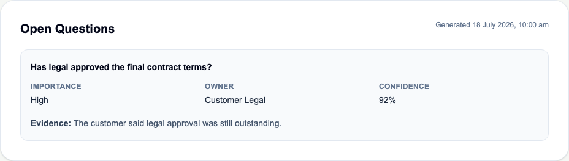

# WO-004C5 — Meeting Open Questions Intelligence

## Outcome

Complete. RevenueOS now supports the fifth independent Meeting Intelligence
capability: transcript-grounded Open Questions through the deterministic mock
or explicitly configured OpenAI Responses provider.

An authorised user can request generation from Meeting Detail, observe
queued/running state, and view persisted questions or a successful empty result.
Each result includes a concise question, nullable evidence-supported owner,
normalised importance, confidence and brief paraphrased evidence.

## Delivered

- `open_questions` job and artefact types;
- strict frozen Open Questions schema v1 with a 25-item cap;
- Open Questions prompt v1 with whole-transcript inspection and injection-as-
  data instructions;
- deterministic mock extraction and malformed/schema-invalid fixtures;
- explicit OpenAI allowlist support using registry-derived strict JSON Schema;
- transcript-pinned executor and durable-worker integration;
- append-only artefact persistence with metadata-only counts;
- meeting-scoped POST/GET endpoints;
- accessible Intelligence panel and non-overlapping three-second polling;
- migration `0011_open_questions`;
- backend, frontend, browser, migration and existing regression coverage;
- product, engineering, API, security, operations and decision documentation.

## UI evidence

## Security and tenant impact

The active organisation remains trusted server context. Meeting, transcript,
job and artefact access retains explicit organisation predicates and forced
PostgreSQL RLS. Transcript, prompt, raw provider output and question/owner/
evidence content are excluded from logs and audit metadata. The browser receives
only product-safe lifecycle/result fields. OpenAI receives transcript content
only under explicit `AI_PROVIDER=openai` configuration; automated tests use
mocked SDK calls and make no real API request.

## Migration and rollback

`0011_open_questions` widens existing job/artefact type check constraints and
adds no table, column or policy. Downgrade deletes Open Questions artefacts/jobs
before restoring the prior allowlist, so application rollback should precede
database downgrade and any required data export must occur first.

## Deliberate exclusions

No generated or suggested answers, resolution workflow, assignment, reminder,
task creation, Follow-up Email, CRM field/change, scoring framework, memory,
recording, transcription, integration, streaming, WebSocket, automation or
additional infrastructure was introduced.

## Known limitations

Extraction is limited to current transcript evidence; owner may be null; no
question-answering or resolution state exists; prompts/schemas are code-
deployed; the mock is deliberately narrow; OpenAI use sends content externally;
cost uses the existing integer convention; historical transcript bodies are not
retained; and production customer data remains prohibited.
