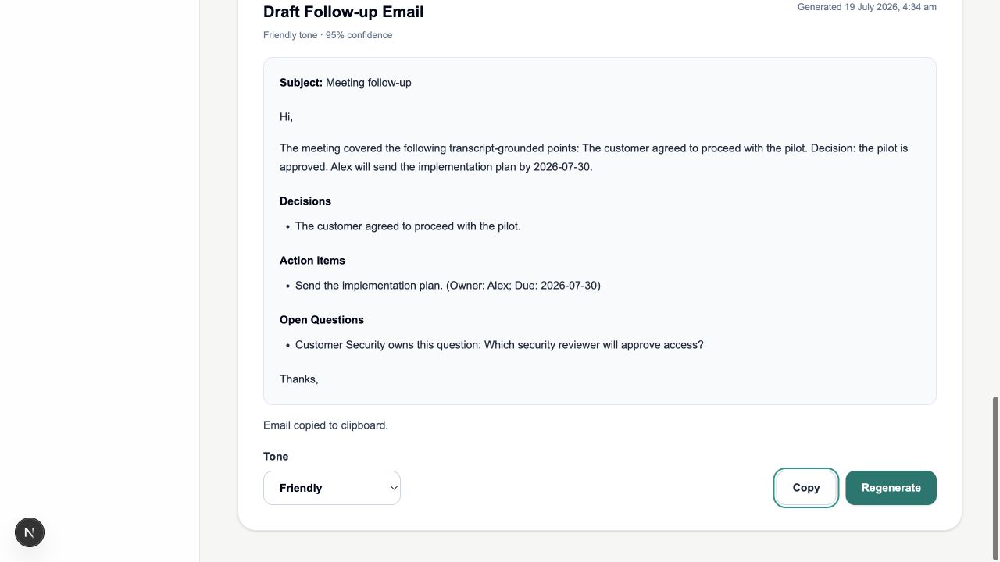

# WO-004C6 — Follow-up Email Composer

## Outcome

Complete. RevenueOS now supports its first customer-ready intelligence
composer. An authorised user can draft a professional, friendly or executive
Follow-up Email from validated Executive Summary, Decisions, Action Items and
Open Questions artefacts, then copy or deliberately regenerate the result.

The composer never queries or transmits transcript text and never consumes
Risks & Blockers. It drafts only; no external message is sent.

## Delivered

- `follow_up_email` job and artefact types with persisted immutable tone;
- strict frozen Follow-up Email schema v1 and output registry entry;
- prompt v1 with only four validated source artefacts plus tone;
- customer-safe source projection and post-provider exact-fact grounding;
- typed provider input with no transcript field;
- deterministic mock support for all three tones and explicit OpenAI allowlist;
- durable worker, retry, cancellation, append-only persistence and metadata-
  only observability integration;
- meeting-scoped POST/GET endpoints with active-job idempotency and completed-
  draft regeneration;
- accessible Draft Follow-up Email panel, terminating polling and plain-text
  clipboard copy;
- migration `0012_follow_up_email`;
- backend, frontend, OpenAI-boundary, API, migration and regression coverage;
  and
- current architecture, API, AI, operations and decision documentation.

## UI evidence

## Security and tenant impact

The active organisation remains trusted server context. Every source artefact,
job and result is loaded with explicit organisation scope and existing forced
PostgreSQL RLS. Request and worker paths use transcript audit version metadata
only; neither reads transcript content. Provider input cannot carry a
transcript. Risks & Blockers and internal evidence fields are excluded.

Email content, source content, prompts and raw provider output are absent from
logs/audits. OpenAI selection transmits only the four validated customer-safe
source projections and requested tone. Automated tests use mock/fake providers
and make no real OpenAI request.

## Migration and rollback

`0012_follow_up_email` widens job/artefact checks and adds the nullable
`composition_tone` job column with a type-dependent check. Existing tenant
keys, RLS policies and indexes remain unchanged. Downgrade deletes Follow-up
Email artefacts/jobs before restoring the prior constraints and dropping the
column. Roll back the application first and export any required drafts before
database downgrade.

## Deliberate exclusions

No transcript re-reading, Risks & Blockers input, invented meeting fact,
recipient inference, editing workflow, send button, Gmail/Outlook integration,
CRM activity creation, task creation, approval workflow, streaming, WebSocket,
automation or additional infrastructure was introduced.

## Known limitations

All four current validated source artefacts must exist; generic greeting and
closing text are used; exact fact preservation limits stylistic rewriting;
empty sections are omitted only by the copy/display renderer; prompts/schemas
remain code-deployed; the mock is deliberately narrow; and production customer
data remains prohibited while identity, consent, retention/export/erasure and
operational controls are incomplete.
