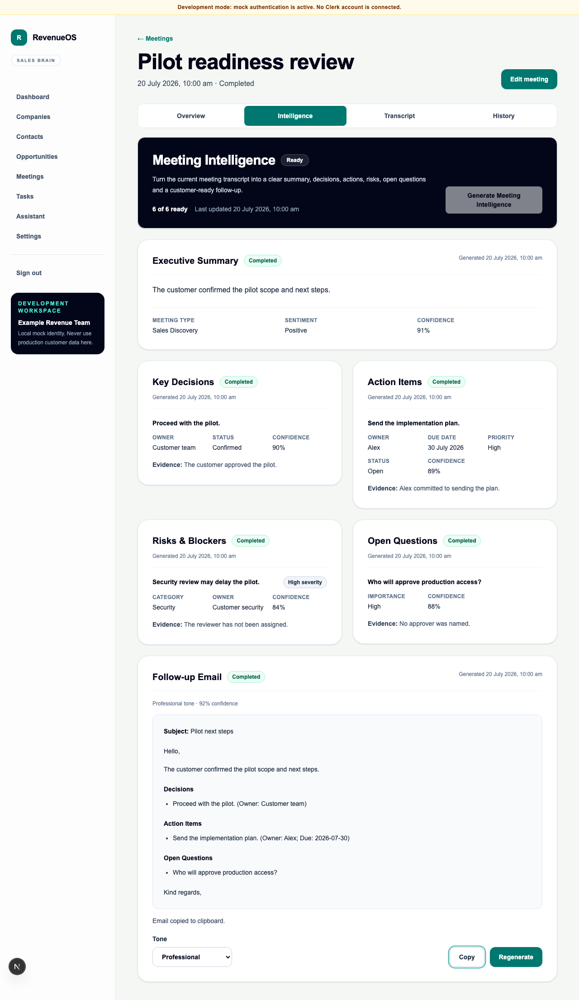

# WO-005 — Unified Meeting Intelligence workspace

## Outcome

WO-005 unifies Executive Summary, Key Decisions, Action Items, Risks & Blockers,
Open Questions and Follow-up Email in one Meeting Detail workspace without adding
a new intelligence capability or combined AI artefact.

## Delivered scope

- product-safe aggregate `GET /api/v1/meetings/{meetingId}/intelligence`;
- idempotent `POST /api/v1/meetings/{meetingId}/intelligence/generate`;
- deterministic derived overall state and six-section progress counts;
- dependency-gated professional Follow-up Email creation after Executive Summary,
  Decisions, Action Items and Open Questions complete;
- current prompt/schema/transcript validation for composer source artefacts, with
  Risks & Blockers and transcript text excluded;
- a responsive, accessible workspace with one polling chain, safe retries,
  completed-content preservation, valid-empty-result labels, Copy and Regenerate;
- metadata-only orchestration and aggregate-state observability;
- backend, frontend and deterministic mock-only browser coverage; and
- no database migration.

The architecture and rules are documented in
[Unified Meeting Intelligence](../03-engineering/unified-meeting-intelligence.md)
and [ADR 0017](../08-decisions/0017-derived-meeting-intelligence-workspace.md).

## Explicitly out of scope

No new extractor, combined artefact, editing/approval, email sending, Gmail,
Outlook, CRM/task/calendar integration, cross-meeting memory, streaming,
WebSockets, message broker or autonomous agent was introduced.

## Rollback

Revert the aggregate routes/service/contracts and restore the prior six-panel
Meeting Detail composition. Individual endpoints and existing persisted jobs and
artefacts remain valid, so no schema or data rollback is required.

## Limitations

The workspace uses only the current transcript version. Historical transcript
bodies are not retained, prompts/schemas remain code deployed, production data is
prohibited, and OpenAI receives content only when the server-side provider is
explicitly enabled. There is no sending, editing, approval, integration,
streaming or cross-meeting intelligence.
