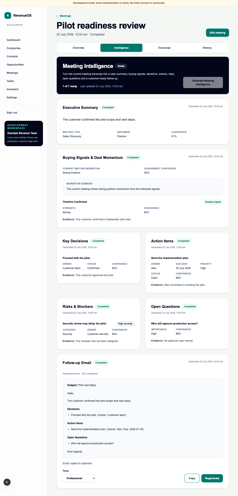

# WO-006A — Buying Signals and Deal Momentum Intelligence

## Status

Complete in the feature branch. Draft pull-request publication is a delivery
step and does not change implementation status.

## Delivered scope

- strict immutable Buying Signals schema v1 with 25 normalised signal types,
  polarity, strength, evidence and transcript-support confidence;
- qualitative momentum with explicit insufficient-evidence handling and no
  close probability or arbitrary deal score;
- deterministic application-level consistency validation without a scoring
  model;
- Buying Signals prompt v1, schema registry entry, mock fixtures and explicit
  OpenAI allowlist;
- transcript-pinned idempotent job, durable executor/worker path and append-only
  artefact with metadata-only telemetry/audit;
- individual POST/GET endpoints, aggregate API inclusion and unified generation;
- seven-capability workspace progress, Buying Signals UI section and unchanged
  single-chain three-second polling;
- migration `0013_buying_signals`, downgrade/re-upgrade coverage and aligned
  tenant/RLS boundaries; and
- backend, frontend and deterministic mock-only browser regression coverage.

## Product model

Buying Signals is the sixth independent transcript extraction. Follow-up Email
remains a seventh composed output and does not consume Buying Signals. This
keeps the existing composer prerequisite contract stable while making aggregate
progress explicit.

## Security and privacy result

The current transcript is loaded only under the trusted organisation context and
exact meeting/version trace. No transcript, rendered prompt, signal evidence,
momentum summary or raw provider output is logged or added to audit metadata.
OpenAI receives transcript text only when explicitly configured. Automated tests
make no real OpenAI request.

## Out of scope retained

No close probability, deal score, forecast, MEDDICC/BANT, CRM context,
cross-meeting comparison, objection taxonomy, stakeholder map, next-best action,
memory, external action, provider UI, streaming, WebSocket or new queue system was
introduced.

## Rollback

Deploy the prior application. If data removal is approved, downgrade migration
`0013_buying_signals`; it deletes only Buying Signals jobs/artefacts and restores
the prior type constraints. Do not downgrade before the prior application is
ready.

## Detailed reference

See [Buying Signals and Deal Momentum intelligence](../03-engineering/buying-signals-intelligence.md)
and [ADR 0018](../08-decisions/0018-current-meeting-qualitative-deal-momentum.md).

