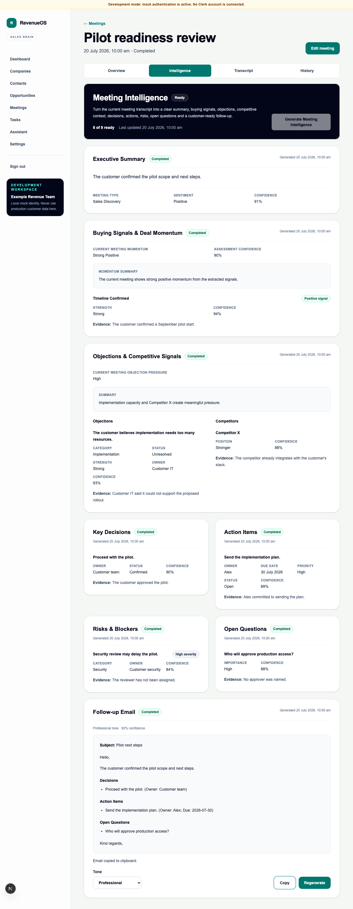

# WO-006B — Objections & Competitive Signals

## Status

Complete in the feature branch. Draft pull-request publication is a delivery
step and does not change implementation status.

## Delivered scope

- strict immutable schema v1 with bounded objections and competitors, closed
  category/status/strength/position taxonomies and transcript evidence;
- qualitative current-meeting objection pressure with deterministic
  consistency validation and no predictive score;
- prompt/schema registry entries, deterministic mock fixtures and an explicit
  OpenAI allowlist extension;
- transcript-pinned idempotent job, executor/durable-worker path, append-only
  artefact and metadata-only telemetry/audit;
- individual POST/GET endpoints plus aggregate API and unified generation;
- eight-capability progress with unchanged Follow-up Email prerequisites;
- accessible Objections & Competitive Signals UI after Buying Signals and the
  unchanged single aggregate polling chain;
- migration `0014_objections` with upgrade/downgrade/re-upgrade and drift
  coverage; and
- backend, frontend and deterministic mock-only browser regression coverage.

## Product model

Objections & Competitive Signals is the seventh independent transcript
extraction. Follow-up Email remains the eighth composed output and does not
consume this artefact. The result describes resistance and competitive context
supported by the current meeting only. It neither predicts deal outcomes nor
duplicates every question, risk or buying signal.

## Security and privacy result

The current transcript is loaded only under the trusted organisation context
and exact meeting/version trace. No transcript, rendered prompt, objection,
competitor, summary, evidence or raw provider output is logged or audited.
OpenAI receives transcript text only when explicitly configured. Automated
tests use fakes and make no real OpenAI request.

## Out of scope retained

No close probability, deal score, forecast, MEDDICC/BANT, next-best action,
stakeholder map, cross-meeting trend, memory, CRM or external action, editing or
approval, provider UI, streaming, WebSocket, recording, transcription,
automation or new queue system was introduced.

## Rollback

Deploy the prior application and stop WO-006B work. If data removal is approved,
downgrade migration `0014_objections`; it deletes only Objections & Competitive
Signals jobs/artefacts and restores the WO-006A type constraints. Do not
downgrade before the prior application is ready.

## Detailed reference

See [Objections & Competitive Signals intelligence](../03-engineering/objections-competitive-signals-intelligence.md)
and [ADR 0019](../08-decisions/0019-current-meeting-qualitative-objection-pressure.md).

