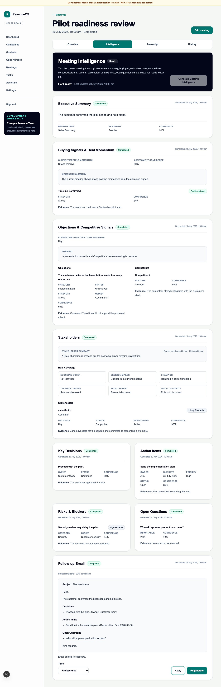

# WO-006C — Stakeholder Intelligence

## Status

Complete in the feature branch. Draft pull-request publication is a delivery
step and does not change implementation status.

## Delivered scope

- strict immutable schema v1 for bounded people, one primary role, influence,
  stance, meeting engagement, evidence confidence and fixed role coverage;
- cautious current-meeting uncertainty rules with anonymous labels and no
  relationship graph, CRM identity match, MEDDICC/BANT or predictive score;
- prompt/schema registry entries, deterministic offline mock fixtures and an
  explicit strict-schema OpenAI allowlist extension;
- transcript-pinned idempotent job, executor/durable-worker path, append-only
  artefact and metadata-only telemetry/audit;
- individual POST/GET endpoints plus aggregate API and unified generation;
- nine-capability progress with unchanged Follow-up Email prerequisites/input;
- accessible Stakeholders UI after Objections & Competitive Signals with the
  unchanged single aggregate polling chain;
- migration `0015_stakeholders` with upgrade/downgrade/re-upgrade and drift
  coverage; and
- backend, frontend and deterministic mock-only browser regression coverage.

## Product model

Stakeholder Intelligence is the eighth independent transcript extraction.
Follow-up Email remains the ninth composed output and does not consume this
artefact. The result describes roles supported by the current meeting only. A
champion advocates internally, an influencer shapes evaluation, a decision
maker controls selection, an economic buyer controls financial approval and a
blocker explicitly resists or can prevent progress.

## Security and privacy result

The source is loaded only under trusted organisation context and the exact
meeting/transcript/version trace. Transcripts, rendered prompts, stakeholder
names, organisations, summaries, evidence and raw provider output remain out of
logs and audits. OpenAI receives transcript text only when explicitly enabled;
automated tests use fakes and make no real OpenAI request.

## Out of scope retained

No relationship or organisation graph, stakeholder history, cross-meeting or
account memory, contact enrichment, CRM identity resolution/mutation, outreach
recommendation, MEDDICC/BANT, score/forecast, editing/approval workflow,
provider UI, streaming/WebSocket, recording, transcription, integration,
automation or new queue system was introduced.

## Rollback

Deploy the WO-006B application and stop WO-006C work. If data removal is
approved, downgrade `0015_stakeholders`; it deletes only Stakeholder Intelligence
jobs/artefacts and restores the WO-006B type constraints. Do not downgrade
before the prior application and workers are ready.

## Detailed reference

See [Stakeholder Intelligence](../03-engineering/stakeholder-intelligence.md)
and [ADR 0020](../08-decisions/0020-current-meeting-stakeholder-intelligence.md).

