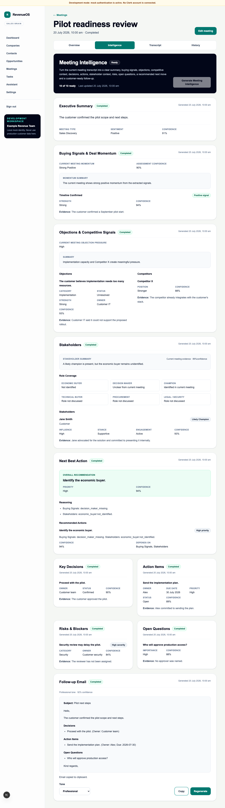

# WO-006D — Next Best Action Intelligence

## Status

Complete in the feature branch. Draft pull-request publication is a delivery
step and does not change implementation status.

## Delivered scope

- strict immutable schema v1 for one overall recommendation and at most five
  ordered, prioritised, confidence-bearing actions;
- exact-reference grounding and constrained dependencies across Buying
  Signals, Stakeholders, Risks, Open Questions and Action Items;
- composition from all eight validated current-version intelligence artefacts,
  with Follow-up Email and transcript text excluded;
- prompt/schema registry entries, deterministic mock scenarios and an explicit
  strict-schema OpenAI allowlist extension;
- tenant-scoped, idempotent request/read service, durable worker execution,
  append-only artefact persistence and metadata-only audit/telemetry;
- individual meeting-scoped POST/GET endpoints and integration into the
  ten-capability aggregate generation/read flow;
- accessible Next Best Action presentation after Stakeholders using the
  unchanged single polling chain and no operational controls;
- migration `0016_next_best_action` with upgrade/downgrade/re-upgrade and
  constraint coverage; and
- backend, frontend and deterministic mock-only browser regression coverage.

## Security and privacy result

Both request and worker paths validate the exact organisation, meeting,
transcript-version and eight-source artefact trace. The provider input has no
transcript field. Transcripts, source content, recommendations, reasoning,
rendered prompts and provider output remain out of logs and audits. OpenAI
receives only the eight validated artefacts when explicitly configured;
automated tests use fakes and make no real request.

## Out of scope retained

No CRM write, email composition/send, task creation, automation, integration,
approval workflow, account/cross-meeting memory, relationship graph,
enrichment, forecast, predictive score, recording, transcription, provider UI
or new workflow/queue system was introduced.

## Rollback

Deploy the WO-006C application and workers first. If deletion is approved,
downgrade `0016_next_best_action`; it removes only Next Best Action
jobs/artefacts and restores the WO-006C type constraints.

## Detailed reference

See [Next Best Action Intelligence](../03-engineering/next-best-action-intelligence.md)
and [ADR 0021](../08-decisions/0021-validated-intelligence-next-best-action.md).

