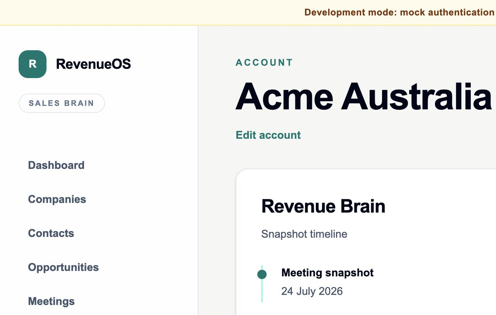

# WO-008A — Revenue Brain Foundation

## Status

Complete in the feature branch. Publication of a draft pull request is
best-effort and does not change implementation status.

## Delivered scope

- tenant-owned immutable `RevenueBrainSnapshot` composition records;
- one idempotent snapshot per completed meeting transcript revision;
- references to all nine validated intelligence artefacts with no duplicated
  artefact or transcript content;
- final-readiness composition inside the existing worker completion transaction
  with no queue, prompt, provider call or transcript analysis;
- strict exclusion for incomplete/cancelled meetings and missing, failed,
  cancelled, stale, superseded, wrong-schema or invalid artefacts;
- deterministic transcript-revision identity and append-only later-version
  snapshots;
- preservation of a meeting's explicit WO-007 opportunity association without
  account-level inference;
- composite tenant foreign keys, forced RLS, explicit organisation predicates,
  unique idempotency enforcement and update/delete prevention triggers;
- reference-only `GET /api/v1/accounts/{accountId}/brain`, ordered by meeting
  date;
- a small account Revenue Brain snapshot timeline showing meeting dates only;
  and
- backend, migration, worker, API, RLS, shared-contract and accessible web
  regression coverage.

## Security and privacy result

Snapshots store ownership and reference metadata only. They contain no
transcript, artefact JSON, prompt, provider response, model payload or generated
reasoning. Every relationship is tenant-constrained and PostgreSQL applies
forced RLS. The API is fail-closed and exposes only composition IDs and the
meeting date needed for the timeline.

## Account timeline

## Out of scope retained

No Revenue Brain reasoning, summary, comparison, prediction, forecast, trend
detection, opportunity health, CRM behaviour, automation, relationship graph,
embedding, vector search, prompt, provider operation or transcript analysis was
introduced.

## Rollback

Deploy the WO-007 application and worker first, then downgrade migration
`0018_revenue_brain`. The downgrade drops only the snapshot table and its
immutability/RLS objects. Because snapshots are deliberately append-only,
rollback discards their composition history and requires explicit approval in a
real environment.

## Detailed reference

See [Revenue Brain foundation](../03-engineering/revenue-brain-foundation.md)
and [ADR 0023](../08-decisions/0023-immutable-revenue-brain-compositions.md).
