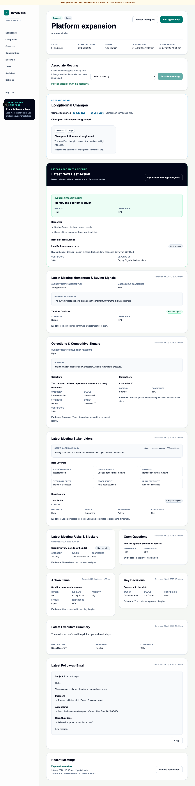

# WO-008B — Revenue Brain Longitudinal Reasoning

## Status

Complete in the feature branch. The draft pull request is not merged.

## Delivered scope

- deterministic account and opportunity comparisons over immutable Revenue
  Brain snapshots and their nine referenced validated artefacts;
- latest-pair and bounded recent-history modes with stable selection order;
- strict controlled change, evidence and response contracts;
- conservative entity matching and regression-tested no-negative-inference
  rules;
- immutable, idempotent `RevenueBrainInsight` persistence in migration
  `0019_revenue_brain_reasoning`;
- composite tenant foreign keys, explicit organisation predicates, forced RLS
  and database update/delete guards;
- account and opportunity POST/GET reasoning APIs;
- a Longitudinal Changes section in Opportunity Workspace and an adjacent
  change summary in the account Revenue Brain timeline;
- safe insufficient, not-generated, completed, no-material-change and error
  states;
- metadata-only telemetry and audit events; and
- backend, migration, RLS, API, shared-contract, component and browser
  regression coverage.

## Source and safety result

Reasoning loads no transcript row or raw text, performs no extraction and makes
no provider call. It accepts only same-tenant, same-scope, completed,
non-deleted snapshot compositions whose exact referenced artefacts still pass
their strict deployed schemas. Follow-up Email is excluded.

Evidence is structured and must belong to one of the two selected snapshots.
The UI renders source capability labels but not raw artefact IDs or evidence
keys. Missing later content never establishes resolution, disappearance,
completion or deterioration.

## Product result

Opportunity Workspace can explicitly generate and retain the latest supported
changes. The account page can create a bounded adjacent history and shows each
comparison alongside its meeting links. Both remain qualitative and
explainable: there is no deal score, win probability, forecast, graph, chat or
automatic external action.

## Opportunity Workspace

## Rollback

Deploy the WO-008A application first, then downgrade migration
`0019_revenue_brain_reasoning` to `0018_revenue_brain`. The downgrade drops the
insight table and its immutable history but leaves Revenue Brain snapshots and
all source artefacts intact.

## Detailed references

See [Revenue Brain longitudinal reasoning](../03-engineering/revenue-brain-reasoning.md)
and [ADR 0024](../08-decisions/0024-deterministic-revenue-brain-longitudinal-reasoning.md).
