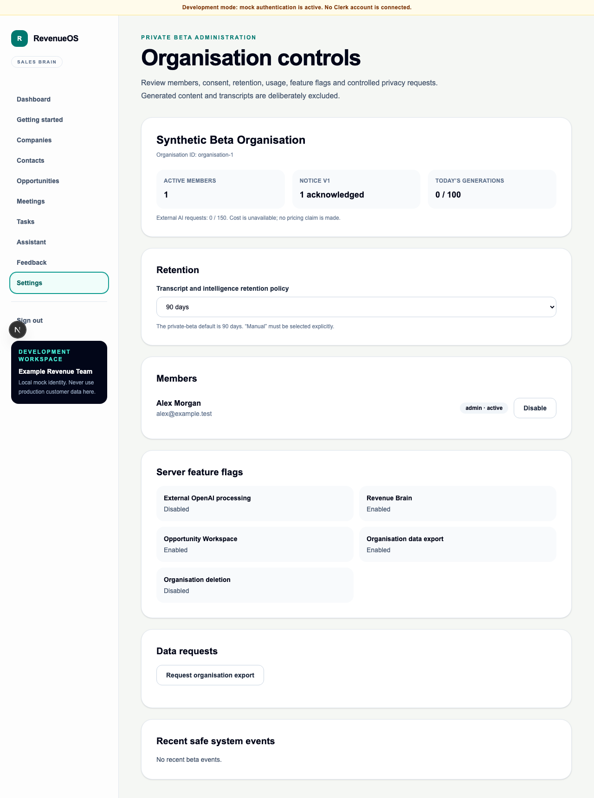

# WO-009 — Private Beta Readiness

## Status

Implemented on `feature/epic-7-wo-009-private-beta-readiness`. This work order
hardens the completed product through WO-008B for a controlled private beta. It
does not authorise production customer data or any later feature scope.

## Delivered

- Production Clerk session/JWT verification with deterministic organisation
  provisioning, active-state checks and admin/member roles; mock auth remains
  explicitly development/test-only.
- Versioned metadata-only data-notice acknowledgement enforced by the API for
  transcript writes and intelligence requests.
- Organisation retention settings and tenant-scoped bounded dry-run/execution,
  with approved deletion of dependent append-only Revenue Brain records.
- Admin-queued deterministic JSON export, restricted download/expiry/purge, and
  explicit confirmed organisation deletion maintenance workflow.
- Bounded liveness/readiness, content-redacted request telemetry and safe beta
  system events.
- Atomic UTC-date generation/provider request counters, transcript bound,
  existing structured-output/retry bounds and admin usage view.
- Server feature flags for OpenAI, Revenue Brain, Opportunity Workspace, export
  and deletion, including API and UI fail-closed gates.
- Persisted skippable onboarding, explicit consent UI, feedback flow, member
  status controls and responsive beta admin view.
- Deterministic tenant-scoped synthetic seed/reset using the existing mock
  Meeting Intelligence/Revenue Brain path and zero seed-time provider calls.
- Migration `0020_private_beta_readiness` with focused tables, constraints,
  indexes, composite tenant references and forced RLS.
- Deployment/recovery guidance, twelve operational runbooks, security review,
  ADR 0025 and an environment-specific unchecked launch checklist.

## Verification boundary

The deterministic suites never use a real OpenAI request. PostgreSQL CI owns
the migration/RLS integration evidence; local SQLite tests cover round trips,
contracts and destructive ordering. The browser smoke journey covers consent,
onboarding, feedback, admin retention/usage and the existing synthetic Meeting
Intelligence, Opportunity Workspace and Revenue Brain paths.

## Admin view

## Explicit exclusions

No new AI prompt, output schema, provider, job type, reasoning engine or major
product feature. No SSO/SCIM, legal hold, billing, CRM/email/calendar/Slack
integration, recording/transcription, mobile, predictive forecasting,
embeddings, autonomous agents, Redis or additional service.

## Release note

Production deployment remains blocked until every item in the
[private-beta launch checklist](../03-engineering/private-beta-launch-checklist.md)
is verified against the target environment. Do not use production customer
data unless a separate approval changes the documented prohibition.
