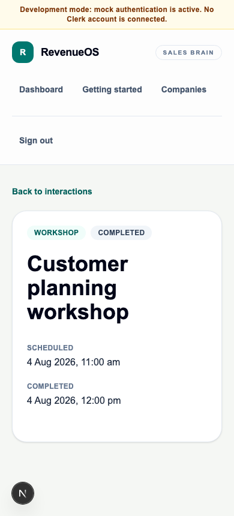

# WO-011 — Interaction Domain Foundation

## Outcome

WO-011 implements the first source-neutral customer Interaction foundation while
preserving the existing Meeting product. It adds tenant-owned Interaction,
Capture Session, Evidence and Interaction audit metadata, a deterministic
one-to-one Meeting compatibility link, a minimal authenticated API, and a small
responsive Interaction list/create/detail surface.

This work introduces no new intelligence, prompt, job type, provider call,
recording, upload, transcription, connector or mobile capability. Existing
Meeting IDs, URLs, request bodies, Meeting Intelligence artefacts, Opportunity
Workspace reads and historical Revenue Brain rows remain stable.

## Implemented scope

- `Interaction` is the authoritative source for shared type, lifecycle, title,
  company, opportunity and scheduled time metadata.
- Existing Meeting writes continue through the same routes and update the linked
  Interaction in the same transaction. Interaction writes update the Meeting
  compatibility projection in the same transaction.
- Meeting-specific participants, description, supplied transcript, audit history
  and all ten Meeting Intelligence capabilities remain Meeting-owned.
- The controlled lifecycle is `planned → in_progress → completed|cancelled`, with
  direct `planned → completed|cancelled`; completed and cancelled are terminal.
- Capture Session and Evidence are metadata-only persistence foundations. No
  public capture/evidence mutation API is exposed in this work order.
- Interaction audit events contain actor, action, changed field names and time;
  no customer body, transcript, evidence body or generated content is copied.
- Tenant-scoped retention, organisation deletion and export version 2 include the
  four new tables.
- Synthetic demo data now includes the two linked Meeting interactions and one
  standalone completed presentation, all with deterministic IDs and zero seed-time
  provider calls.

## Migration

Alembic revision `0021_interaction_foundation` follows
`0020_private_beta_readiness` and is the single head. It creates `interactions`,
`capture_sessions`, `evidence` and `interaction_audit_events`; adds the required
`meetings.interaction_id`; backfills historical meetings in deterministic batches
of 500 using UUIDv5 over organisation and Meeting ID; and then makes the link
non-null and tenant-unique.

All four new tenant tables enable and force PostgreSQL RLS with the trusted
transaction-local `app.organisation_id` setting. Composite foreign keys bind every
Interaction, Meeting, Capture Session, Evidence and audit relationship to one
organisation. Downgrade preserves Meetings, Meeting Intelligence and Revenue Brain
data but permanently removes Interaction-only records and metadata; obtain an
explicit data-loss decision before downgrade.

See [migration and compatibility notes](../03-engineering/interaction-migration-and-compatibility.md).

## API and web surface

The authenticated tenant-scoped API adds:

- `POST /api/v1/interactions`
- `GET /api/v1/interactions`
- `GET /api/v1/interactions/{interactionId}`
- `PATCH /api/v1/interactions/{interactionId}`
- `POST /api/v1/interactions/{interactionId}/complete`

Meeting responses add backward-compatible `interactionId`. Meeting route paths and
Meeting IDs are unchanged. The web app adds `/interactions`,
`/interactions/new` and `/interactions/{interactionId}`. Linked records offer
explicit navigation in both directions without replacing Meeting Intelligence.

## Security, privacy and compatibility

- Active verified membership and server-authoritative organisation context are
  required; request bodies cannot set an organisation.
- Repositories use explicit organisation predicates and the database provides
  forced RLS defence in depth.
- Cross-tenant parent/child and creator/actor links are rejected by composite
  constraints.
- Logs contain only safe event names, opaque tenant/Interaction IDs, type and
  lifecycle status.
- Evidence origin, support and validation are separate controlled fields.
  Verification never changes origin, and no arbitrary confidence percentage exists.
- No raw content or storage locator is present on Interaction, Capture Session or
  Evidence.

The detailed review is in the
[Interaction domain security review](../03-engineering/interaction-domain-security-review.md).

## Validation contract

Regression coverage includes Interaction CRUD/filter/lifecycle behaviour,
same-transaction Meeting projection in both directions, stable Meeting IDs,
cross-tenant denial, composite constraints, forced RLS, metadata-only evidence,
export/retention/deletion, deterministic demo data, migration
upgrade/downgrade/re-upgrade, accessible loading/empty/error states and a mocked
Playwright create/associate/complete flow. All default tests use the deterministic
mock and make no real OpenAI request.

## Known limitations and future boundary

WO-011 does not expose Capture Session or Evidence APIs, evidence bodies,
participant generalisation, generic Interaction Intelligence, Opportunity
`latestInteraction`, Revenue Brain Interaction snapshots or a generic delete API.
Meeting remains the compatibility owner of its mature transcript and intelligence
journey. WO-012 and later roadmap entries remain unauthorised until separately
approved.
