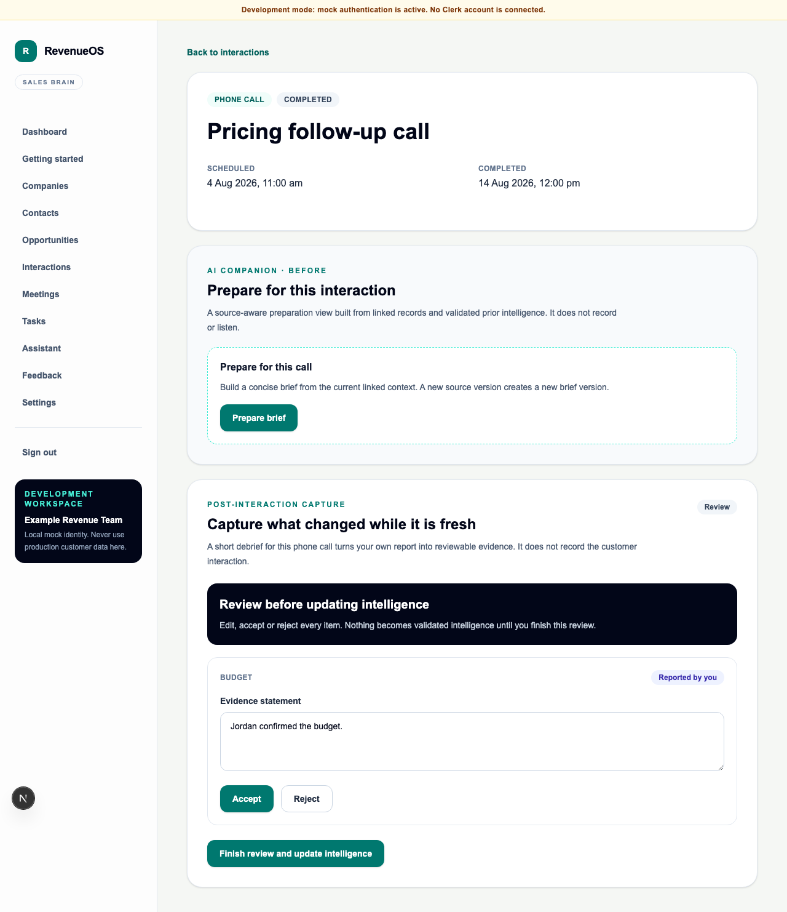

# WO-013 — AI Debrief and Voice Journal

**Status:** Implemented on the WO-013 feature branch; merge remains a human decision.

## Outcome

Salespeople can complete an unrecorded Interaction, capture fresh recollection through
a bounded guided debrief or foreground Voice Journal, review source-aware candidates,
and append validated reported Interaction Intelligence to the existing Opportunity
Workspace and Revenue Brain.

## Delivered

- six tenant-isolated debrief/evidence/intelligence tables with forced RLS, composite
  tenant constraints, immutable snapshots and reviewed-candidate guards;
- unified idempotent session API, deterministic lifecycle, quotas, consent/feature
  gates, safe errors and private-user restoration;
- versioned `ai_debrief_question` and `ai_debrief_evidence` prompts/schemas through
  the existing mock/OpenAI structured-output abstraction;
- separate bounded mock/OpenAI transcription boundary with no raw-audio persistence;
- accessible responsive browser flow with permission detection, pause/resume/stop/
  cancel, elapsed time, typed fallback, refresh recovery and complete candidate review;
- additive source-aware Opportunity Workspace and Revenue Brain compositions;
- retention, export, deletion, demo data, API/shared contracts, migration/RLS and
  backend/web/E2E coverage.

Migration head is `0023_ai_debrief_voice_journal`; export format is version 4.

## User interface

## Security and tenant impact

All new rows are organisation-owned, repositories are explicitly scoped, cross-tenant
attachment fails closed and PostgreSQL RLS is forced. Audio is ephemeral. Answers,
fragments, prompts and provider payloads are excluded from telemetry. Accepted content
remains `salesperson_reported`/`reported` and visibly “Reported by you”.

## Out of scope

Long/background/customer recording, meeting bots, call interception, live
transcription/intelligence, diarisation, visual/email/document ingestion, CRM
automation, predictive scoring and native mobile are not implemented.

## Rollback

Disable `API_FEATURE_AI_DEBRIEF_ENABLED` and
`API_FEATURE_VOICE_JOURNAL_ENABLED`, then deploy the previous application. If schema
rollback is required and data has been exported/approved for deletion, downgrade
Alembic from 0023 to 0022. Existing Meeting Intelligence is unchanged.
