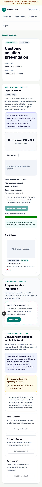

# WO-014 — Visual Evidence & Presentation Mode

## Status

Implemented on `feature/epic-8-wo-014-visual-evidence-presentation-mode` for review. Migration head: `0024_visual_evidence`.

## Delivered

- Browser camera hint, file picker, drag-and-drop and local preview before confirmation.
- Tenant-isolated private local/S3-compatible storage with short-lived grants.
- JPEG/PNG checksum, structural, MIME, size, dimension, pixel, metadata and polyglot controls.
- Strict deterministic mock and optional OpenAI visual-analysis adapters.
- Mandatory accept/edit/reject review and immutable source-aware provenance.
- Presentation-specific capture/debrief with seller-content signal suppression.
- Conservative business-card and site-photo handling.
- Reviewed visual sections in Opportunity Workspace and Revenue Brain.
- Object-first retention and organisation deletion, export version 5 and storage reconciliation.
- Feature flags, quotas, bounded retries and metadata-only telemetry.

## Explicitly out of scope

Native mobile apps, live/background capture, recording, video, general document ingestion, contact auto-save, slide authoring, PowerPoint/Keynote integration, live presentation coaching and autonomous actions remain unimplemented.

## Validation evidence

The implementation includes API, migration, image-safety, tenant-isolation, lifecycle, React accessibility and flagship Playwright coverage. Final command results belong in the pull request because they describe the exact reviewed commit.

## Rollback

Disable `visualEvidence` and `presentationMode` first. Preserve or export authorised objects, then downgrade from `0024_visual_evidence` only after accepting that visual metadata, candidates and lineage will be removed. Object storage must be reconciled separately; the database downgrade cannot safely delete external objects.
