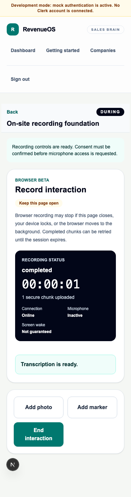
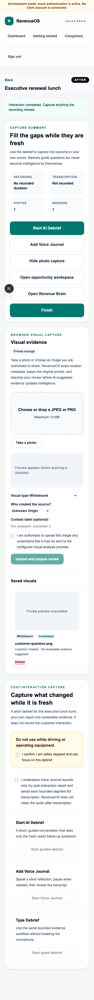

# WO-016: Browser Face-to-Face Companion

- **Status:** Implemented; complete validation recorded at hand-off
- **Branch:** `feature/epic-8-wo-016-browser-face-to-face-companion`
- **Date:** 2026-08-15

## Outcome

WO-016 delivers the mobile-first browser Companion across BEFORE, DURING and
AFTER without introducing a native app or background capture claim. The route
reuses the existing brief, recording, Visual Evidence and AI Debrief surfaces;
adds tenant-isolated metadata-only markers; provides gap-fill debrief context;
and exposes the latest Interaction capture state in the Opportunity Workspace.

## Delivered scope

- `/interactions/{id}/companion` with lifecycle-derived phase rendering;
- concise 30-second brief and idempotent Interaction start;
- deliberate recording/passive choice with phone/online exclusions;
- foreground recording status, wake-lock attempt, bounded stable-idempotency
  retry, connection/microphone state and completion interlock;
- large passive controls for photo, marker and end;
- controlled immutable quick markers with RLS, export and deletion coverage;
- capture summary without live transcript scrolling;
- transcript-coverage and marker-aware gap-fill debrief targeting;
- latest linked Interaction capture status in Opportunity Workspace;
- migration `0026_face_to_face_companion`; and
- unit, tenant, migration, component and two flagship Playwright paths.

## Screenshots

## Security and tenant impact

All new persistence is organisation-scoped and protected by explicit predicates,
composite tenant relationships and forced RLS. Markers contain no notes and do
not produce intelligence automatically. Existing consent, storage, provenance,
review, export, retention and erasure controls remain authoritative.

## Out of scope

Native mobile apps, background recording, same-device phone capture,
online-meeting system audio, meeting bots, live coaching, automatic intelligence,
durable offline audio, new provider integrations and autonomous external actions.

## Validation

The complete root gate was run on 2026-08-15:

- `pnpm format` — passed;
- `pnpm lint` — passed;
- `pnpm typecheck` — passed;
- `pnpm test` — 31 files and 114 tests passed;
- `pnpm test:e2e` — 14 Chromium paths passed, including both flagship Companion
  journeys and refreshed mobile screenshots;
- `pnpm build:web` — passed after granting Turbopack permission to open its local
  internal build port;
- `pnpm api:lint` — passed;
- `pnpm api:format` — 175 files formatted;
- `pnpm api:typecheck` — 108 source files passed strict mypy;
- `pnpm api:test` — 686 passed, 4 PostgreSQL-only tests skipped because no local
  PostgreSQL service was available, with the existing Starlette deprecation warning;
- `pnpm api:migrate` — the configured PostgreSQL attempt correctly failed closed
  because localhost port 5432 was unavailable; the complete chain through `0026`
  then passed against a fresh temporary SQLite database;
- `pnpm api:migration:check` — no new upgrade operations detected on that fresh
  migrated database (with the existing cyclic-FK sort warning); and
- `pnpm build:api` — source distribution and wheel built successfully.

The flagship browser paths cover:

1. BEFORE → consented record/pause/resume → temporary upload failure/recovery →
   stop/transcription → marker/photo → AFTER → reviewed gap-fill debrief →
   Opportunity Workspace and Revenue Brain;
2. BEFORE → passive Companion → marker/photo → AFTER → reviewed typed debrief and
   downstream update, with no recording request.
