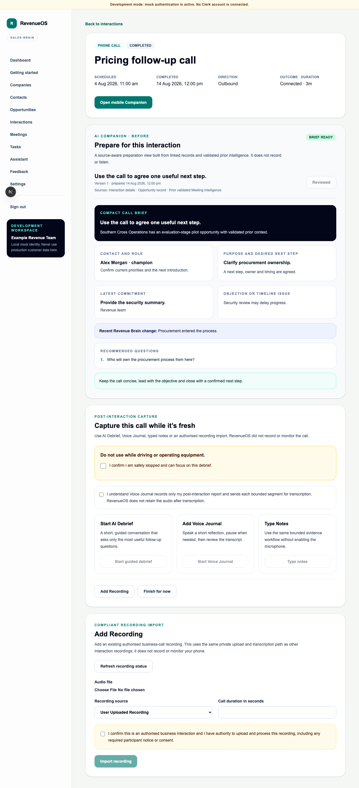

# WO-017 — Phone Call Intelligence

- **Status:** Implemented on `feature/epic-8-wo-017-phone-call-intelligence`; merge
  remains a human decision.
- **Date:** 2026-08-15

## Outcome

Phone calls are now a complete browser-first Interaction path: compact preparation,
manual start/end and controlled outcome, immediate adaptive debrief, Voice Journal,
typed notes, authorised recording import, evidence review and source-aware
Opportunity Workspace/Revenue Brain updates. The browser never claims cellular call
capture.

## Delivered

- additive migration `0027_phone_call_intelligence` after WO-016 head `0026`;
- tenant-safe Contact association, controlled direction/outcome and derived duration,
  capture-method, recording-availability and intelligence-readiness projections;
- compact Contact-first phone brief and deliberate normal-phone lifecycle controls;
- exact post-call prompt and AI Debrief, Voice Journal, Type Notes, Add Recording and
  Finish actions;
- one-question missed-call handling and duration-aware two/four/five-question caps;
- compliant WebM/MP4/M4A import through WO-015 with explicit authority and controlled
  recording provenance;
- deterministic transcript/debrief conflict, unresolved and corroboration labels;
- metadata-only audits/export v8, existing retention/deletion and synthetic demo
  coverage; and
- API, migration, tenant, component, Playwright and regression validation.

## Architectural decision

No new ADR was required. The implementation reuses the approved Interaction,
Capture Session, Evidence, Recording/Transcript, Opportunity Workspace and Revenue
Brain architecture. The future telephony adapter remains documentation-only because
there is no selected provider contract.

## Browser evidence

The screenshot uses deterministic development fixtures and visibly labelled mock
authentication. It shows the standard-phone boundary: the call is completed outside
RevenueOS, then the user chooses a bounded post-call capture path.

## Security boundary

There is no cellular interception, device call-log ingestion, hidden/background
microphone, phone-number telemetry, Contact enrichment, public audio URL, native
application or real external provider call. Imported recordings require explicit
business authority and remain subject to server flags, quotas and private-beta
launch gates.

## Rollback

Disable existing AI Debrief, Voice Journal, recording and transcription feature
flags. Deploy the previous application. After an approved export/data-loss decision,
downgrade Alembic from `0027_phone_call_intelligence` to
`0026_face_to_face_companion`; phone association/direction/outcome, recording-source
labels and reconciliation-state columns are removed.
