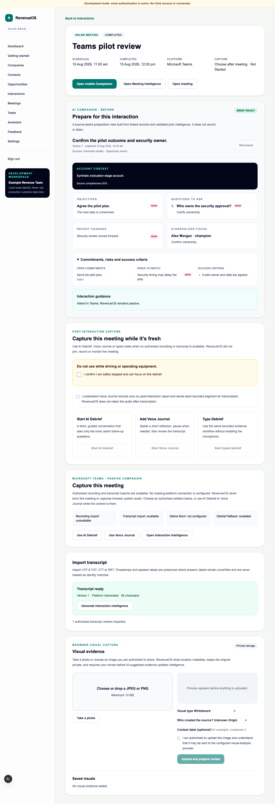

# WO-018 — Online Meeting Capture

- **Status:** Implemented on `feature/epic-8-wo-018-online-meeting-capture`; merge
  remains a human decision.
- **Date:** 2026-08-15

## Outcome

Microsoft Teams, Zoom, Google Meet and other online meetings now use one browser-first
Interaction lifecycle: existing preparation, safe meeting navigation, passive
Companion timing and post-meeting authorised recording/transcript import or AI
Debrief/Voice Journal fallback. There is no native connector, meeting bot, system-
audio interception or real provider call.

## Delivered

- additive migration `0028_online_meeting_capture` with normalised tenant-owned
  metadata/import rows, composite tenant keys, forced RLS and safe downgrade;
- HTTPS meeting-reference normalisation without query/fragment storage or server
  fetch;
- product-safe capabilities with native and auto-ingestion off by default;
- UTF-8 TXT/VTT/SRT import, immutable transcript versions/segments, provenance,
  authority attestations, byte limits and retry/content deduplication;
- WO-015 recording import reuse with online provenance and live browser audio blocked;
- provider-neutral adapter contract plus deterministic no-network fake;
- responsive Before/During/After UI and passive Companion;
- export v9, deletion/retention coverage, deterministic Teams/Zoom/Meet demo paths;
  and
- API, migration, RLS, component and browser regression coverage.

## Provider and bot decision

No production provider is selected without first-five-company evidence. Google Meet
v2 is the conditional first technical-spike recommendation; Teams or Zoom can take
priority when the pilot cohort demonstrates that need. Bot infrastructure is
deferred until import/native paths are validated.

## Browser evidence

The screenshot is generated by the deterministic Playwright flow. It uses mock
authentication and synthetic content, performs no provider call, and shows the
server-negotiated lack of native fetch/recording import alongside Debrief and Voice
Journal fallbacks.

## Security boundary

Authority and external-processing acknowledgement are required. Raw URLs, attendee
emails, transcript/recording content, tokens and provider payloads are not logged.
Speaker labels do not become identities. RevenueOS deletion removes local copies and
derived data but not upstream platform artefacts.

## Rollback

Disable the online capture/import flags and leave native/auto-ingest disabled. Deploy
the previous application. After an approved export/data-loss decision, downgrade
Alembic from `0028_online_meeting_capture` to `0027_phone_call_intelligence`; imported
transcript metadata and online meeting metadata are removed, while pre-existing
Interaction/Meeting data remains compatible.
